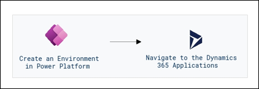
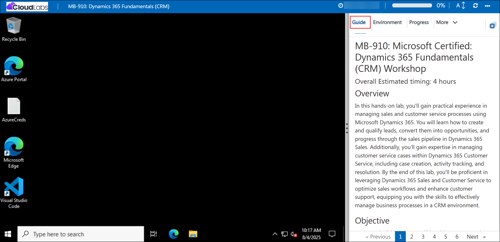
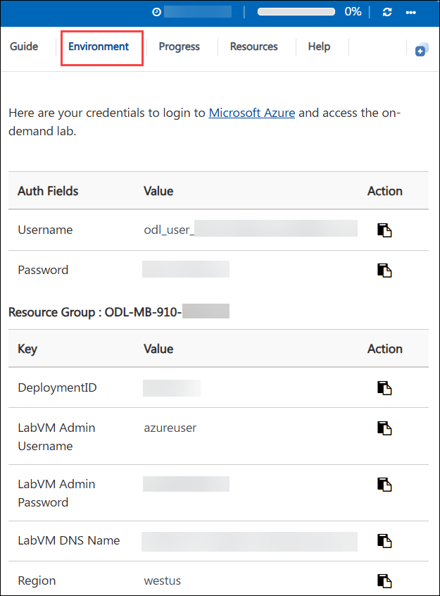
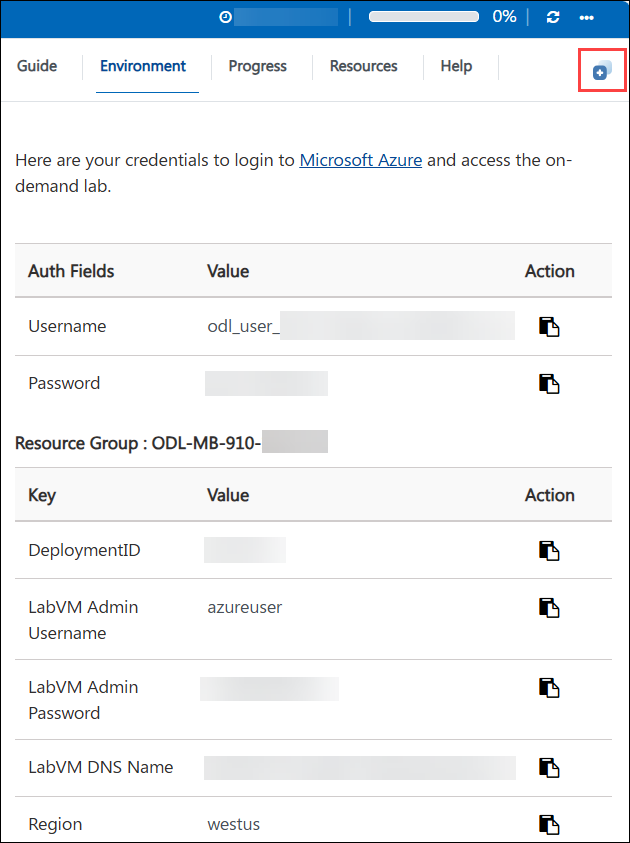
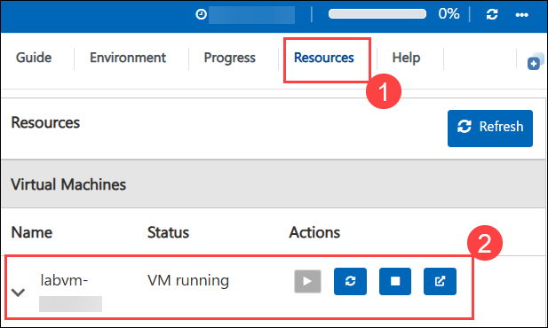
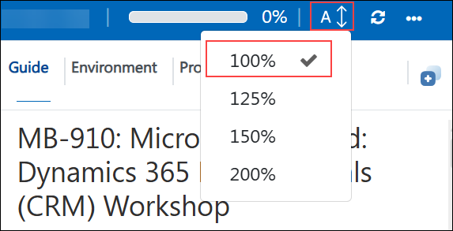
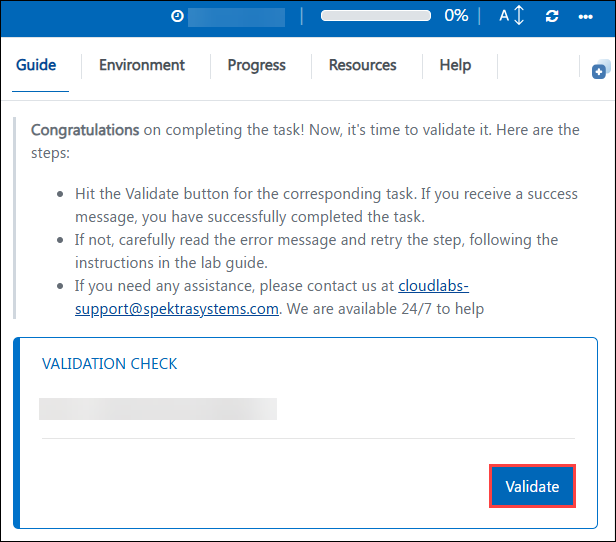

#  MB-910: Microsoft Certified: Dynamics 365 Fundamentals (CRM) Workshop

### Overall Estimated timing: 4 Hours

## Overview

In this hands-on lab, you'll gain practical experience in managing sales and customer service processes using Microsoft Dynamics 365. You will learn how to create and qualify leads, convert them into opportunities, and progress through the sales pipeline in Dynamics 365 Sales. Additionally, you’ll gain expertise in managing customer service cases within Dynamics 365 Customer Service, including case creation, activity tracking, and resolution. By the end of this lab, you'll be proficient in leveraging Dynamics 365 Sales and Customer Service to optimize sales workflows and enhance customer support, equipping you with the skills to effectively manage business processes in a CRM environment. 

## Objective

By the end of this lab, you will be able to create and manage leads in Dynamics 365 Sales, qualify them as opportunities, and progress them through the sales pipeline to closure. Additionally, you will learn to create and manage customer service cases in Dynamics 365 Customer Service, following the complete case lifecycle from case creation to resolution using the Phone to Case business process flow.

1. **Describe the foundations of Dynamics 365 customer engagement apps**: You will learn about the core capabilities of Dynamics 365 customer engagement applications, including Sales and Customer Service. This includes understanding lead and opportunity management in Dynamics 365 Sales, as well as case management and resolution processes in Dynamics 365 Customer Service, enabling businesses to streamline customer interactions and improve operational efficiency.

1. **Describe shared activities and integration options in Dynamics 365 customer engagement apps**: You will learn how Dynamics 365 customer engagement apps support shared activities such as managing leads, opportunities, and cases across teams. Additionally, you will explore integration options with Microsoft 365, Power Platform, and third-party applications to enhance collaboration, automate workflows, and extend functionality within the Dynamics 365 ecosystem.

1. **Explore Dynamics 365 Customer Insights - Journeys**: You will learn how to leverage Dynamics 365 Customer Insights - Journeys to create personalized customer experiences, automate marketing campaigns, and track engagement. Additionally, you will explore segmentation, journey orchestration, and analytics capabilities to optimize customer interactions and improve marketing effectiveness.

1. **Explore Dynamics 365 Sales**: You will learn how to create and manage sales leads, qualify opportunities, and track the sales process using Dynamics 365 Sales. Additionally, you will explore tools for sales forecasting, pipeline management, and customer relationship tracking to improve sales efficiency and decision-making.

1. **Explore Dynamics 365 Customer Service**: You will learn how to create and manage customer service cases, track interactions, and resolve issues efficiently using Dynamics 365 Customer Service. Additionally, you will explore case management workflows, business process flows, and activity tracking to enhance customer support and service delivery.

## Pre-requisites for this Lab

Before starting this lab, you should have:  

- A basic understanding of customer relationship management (CRM) concepts.  
- Familiarity with Microsoft Dynamics 365 environment and navigation.  
- Access to a Dynamics 365 Customer Service instance with the necessary permissions.  
- An active Microsoft account to sign in to Dynamics 365.  

## Architecture

In this hands-on lab, the architecture flow includes several essential components.

1. **Describe the foundations of Dynamics 365 customer engagement apps**: Understanding how to create a new environment in the Power Platform Admin Center, including configuring Dataverse for data storage and enabling Dynamics 365 applications such as Sales Hub and Customer Service Hub. This involves selecting environment settings, assigning security permissions, and ensuring seamless integration for customer engagement workflows.

1. **Describe shared activities and integration options in Dynamics 365 customer engagement apps**: Understanding how to create, manage, and link customer records in Dynamics 365 Sales Hub, including configuring accounts, contacts, and appointments. This involves structuring parent-child relationships between accounts, associating contacts with businesses, and scheduling activities to streamline customer engagement and relationship management.

1. **Explore Dynamics 365 Customer Insights - Journeys**: Gaining insights into navigating and configuring customer journeys by integrating email campaigns, segment creation, and automated marketing actions to deliver personalized customer engagement experiences.

1. **Explore Dynamics 365 Sales**: Understanding how to set up a new sales process in Dynamics 365 Sales, including configuring resources to support lead management and opportunity tracking. This involves capturing lead details, qualifying them into opportunities, adding stakeholders and competitors, and progressing through structured sales stages (qualify, develop, propose, and close). It ensures that opportunities are properly managed, deals are closed efficiently, and sales insights are leveraged for performance optimization.

1. **Explore Dynamics 365 Customer Service**: Learning how to set up a new case management process in Dynamics 365 Customer Service, including configuring resources to support case creation, activity tracking, and resolution. This involves logging customer issues, managing interactions through the Phone to Case business process flow, advancing cases through structured stages (identify, research, and resolve), and finalizing resolutions using knowledge articles. It ensures efficient case handling, improves customer satisfaction, and optimizes support workflows.

## Architecture Diagram

## Explanation of Components

1. **Power Platform**: A low-code/no-code platform by Microsoft that enables users to create business applications, automate workflows, analyze data, and build virtual agents. It provides tools like Power Apps, Power Automate, Power BI, and Power Virtual Agents to streamline business processes and enhance productivity. 

1. **Dynamics 365 Applications**: A suite of intelligent business applications from Microsoft that help organizations manage customer relationships, finance, operations, and more. It includes solutions for sales, marketing, customer service, supply chain management, and human resources, enabling businesses to streamline operations and improve decision-making.

1. **Sales Hub Application**: A module within Microsoft Dynamics 365 that provides sales teams with tools to manage leads, opportunities, customer interactions, and sales pipelines. It offers AI-driven insights, automation, and collaboration features to enhance productivity, improve customer relationships, and drive revenue growth.

1. **Case**: A case in Microsoft Dynamics 365 Customer Service (Customer Hub) represents a customer inquiry, issue, or request that needs resolution. It helps service teams track, manage, and resolve customer concerns efficiently by providing tools for case assignment, escalation, knowledge base integration, and automated workflows to improve customer support.

## Getting Started with lab
 
Welcome to your MB-910:Microsoft Certified: Dynamics 365 Fundamentals workshop! We've prepared a seamless environment for you to explore and learn Dynamics 365 Application Services. Let's begin by making the most of this experience:
 
## Accessing Your Lab Environment
 
Once you're ready to dive in, your virtual machine and lab guide will be right at your fingertips within your web browser.
 

## Virtual Machine & Lab Guide
 
Your virtual machine is your workhorse throughout the workshop. The lab guide is your roadmap to success.

## Exploring Your Lab Resources
 
To get a better understanding of your lab resources and credentials, navigate to the **Environment** tab.
 

## Utilizing the Split Window Feature
 
For convenience, you can open the lab guide in a separate window by selecting the **Split Window** button from the top right corner.
 

## Managing Your Virtual Machine
 
Feel free to **start, stop, or restart (2)** your virtual machine as needed from the **Resources (1)** tab. Your experience is in your hands!
 

## Lab Guide Zoom In/Zoom Out
 
To adjust the zoom level for the environment page, click the **A↕** icon located next to the progress bar in the lab environment.

 
## Lab Validation

1. After completing the task, hit the **Validate** button under the Validation tab integrated into your lab guide. You can proceed to the next task if you receive a success message. If not, carefully read the error message and retry the step, following the instructions in the lab guide.

   

1. If you need any assistance, please contact us at cloudlabs-support@spektrasystems.com.

## Support Contact
 
The CloudLabs support team is available 24/7, 365 days a year, via email and live chat to ensure seamless assistance at any time. We offer dedicated support channels tailored specifically for both learners and instructors, ensuring that all your needs are promptly and efficiently addressed.
 
Learner Support Contacts:
 
- Email Support: cloudlabs-support@spektrasystems.com
- Live Chat Support: https://cloudlabs.ai/labs-support

Now, click on **Next >>** from the lower right corner to move on to the next page.

   

## Happy Learning !!
