# Module 1: Describe the foundations of Dynamics 365 customer engagement apps

## Objectives

In this module, you will become familiar with how to access and navigate through different Dynamics 365 customer engagement applications. 

## Estimated Time: 30 minutes

## Architecture Diagram

   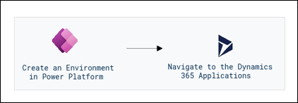

## Task 1: Introduction to Microsoft 365 Dynamic Applications

1.  In the lab VM open Microsoft Edge and navigate to this web URL in a new private window -> <https://admin.powerplatform.microsoft.com/> 

1. In the lab environment, provide the following username and password:

    - **Email/Username:** <inject key="AzureAdUserEmail"></inject>
    - **Password:** <inject key="AzureAdUserPassword"></inject>

1. In the **Action Required** window that appears,click on **Ask Later**.

    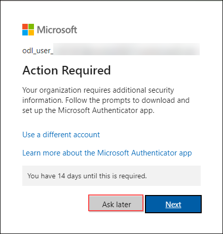

1. Once you have logged in, let us first create an environment. Click on **Environments**  from the left navigation pane and click on **+ New**

   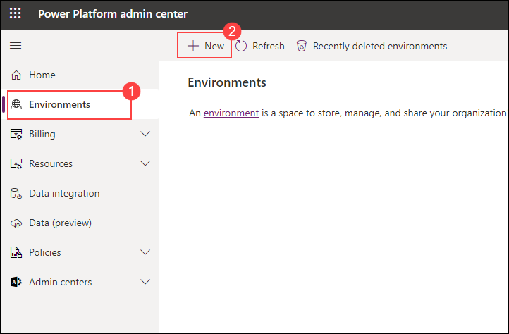

1. On the right tab enter the following details and leave the others as default:

    - Name - **Sales-<inject key="DeploymentID" enableCopy="false" />** (1)
    - Add a Dataverse data store - **Yes** (2)
    - Click **Next** (3)

      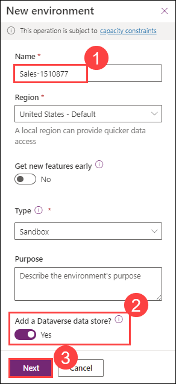
    
1. Under Security Group click on the **+ Select** icon and in the new window that appears, select **None** and subsequently click on **Done**.

   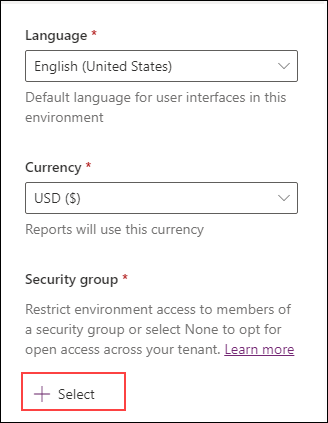

   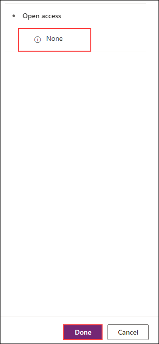
   
1. Next  towards the middle of the window, toggle  **Yes** for  **Enable Dynamics 365 apps** leave the others as default and click on **Save**.

   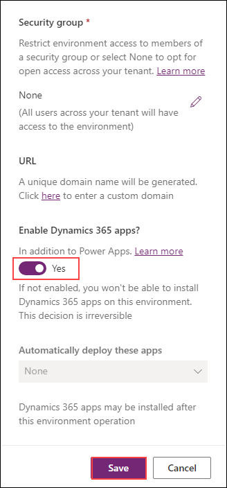
        
1. Now under Environments, the new environment has appeared with the name **Sales-<inject key="DeploymentID" enableCopy="false" />**  click on it to open.

   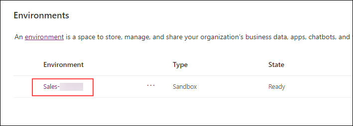

1. Inside the environment, Find and click on the  URL to open the sales hub platform in Dynamics 365.

   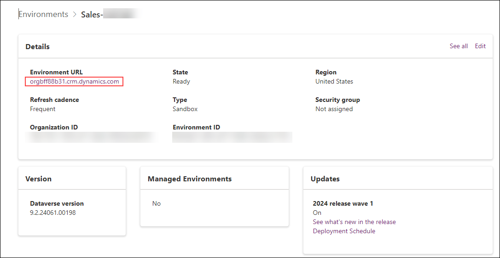
    
   >**Note:** If you do not find the Environment URL category, kindly delete the existing Environment and perform from step number 4 to 8.

1. Now the Dynamics 365 apps page will appear. In the list of **Apps**, open the **Sales Hub** application. When you are within an app, there will be different areas that you can work with based on what you are trying to do. For example, the Sales Hub application contains different administrative settings that you can work with.

   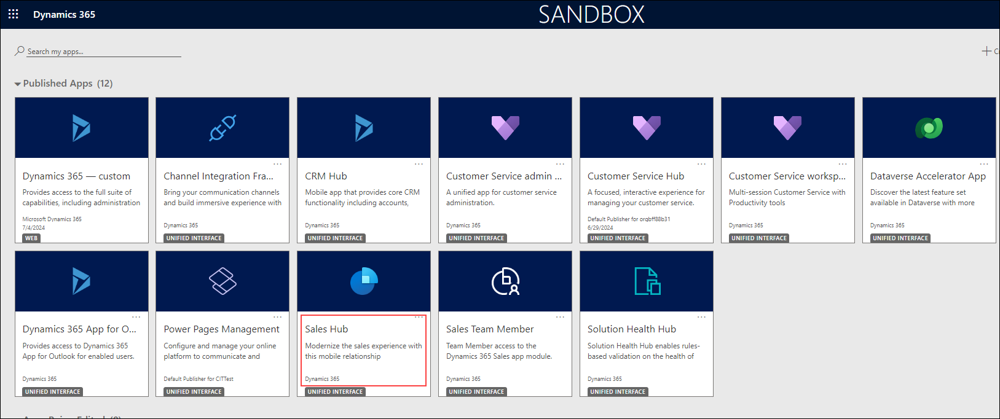

1. On the lower left side of the screen, at the very bottom of the left-hand navigation pane or **Site Map**, select the text **Sales**, from the list that appears, select **App Settings.** **App Settings** is where you can review and make changes to administrative settings. Notice how the left-hand navigation items have changed.

   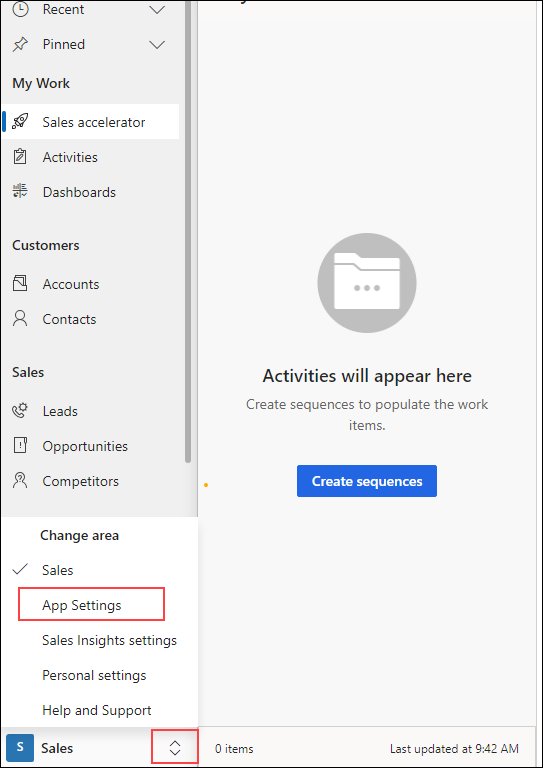

1. Select the **Change Area** selector again and change it from **App Settings** back to **Sales**.

   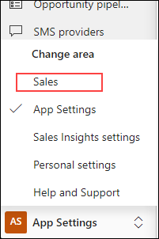

1. If you want to switch from the Sales app to a different app such as Customer Service workspace, select the **Sales Hub** text in the upper left part of the screen next to the text Dynamic 365.

   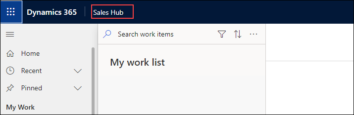

1. The **Apps** selector pop-up will appear, select **Customer Service Hub** and you will be taken to the **Customer Service Hub** application. Notice the **Customer Service Hub** has different areas available in the **Change Area** menu.

   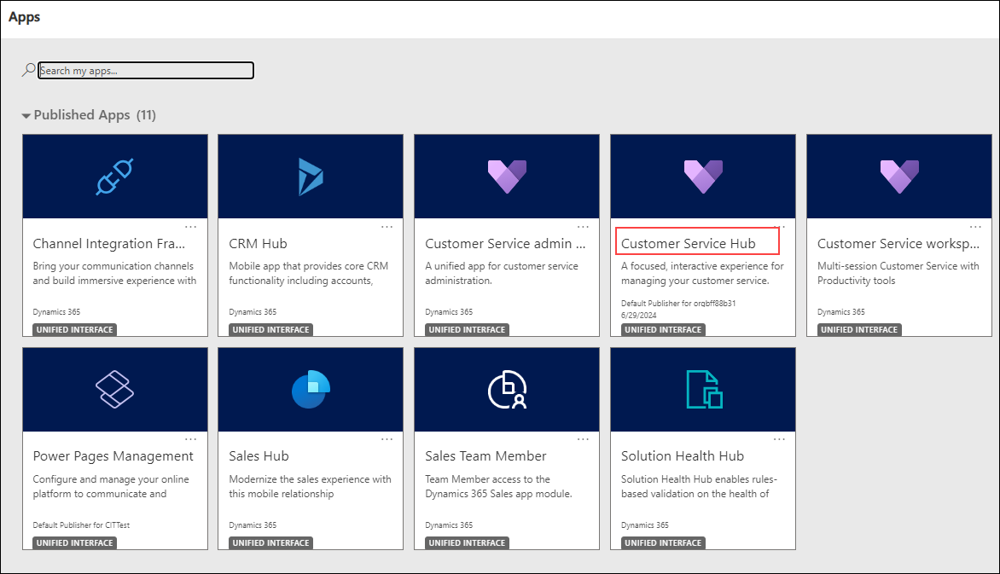

1. To switch back to the **Sales Hub** app, select the **Customer Service Hub** text at the top which opens the **Apps** selector pop-up. Select **Sales Hub**.

## validation

<validation step="0e9b1f3a-5161-4cd7-bbf7-0d507e2c81f3" />
 
## Review
Through this module, we gained familiarity with navigating and accessing different Dynamics 365 customer engagement applications, such as Sales Hub and Customer Service Hub, to explore their respective functionalities and administrative settings.

## You have successfully completed this module. Click Next
