# Module 1: Describe the foundations of Dynamics 365 customer engagement apps

## Lab Overview

This lab provides an introduction to Microsoft Power Platform and Dynamics 365 applications, focusing on setting up a new environment and navigating the Sales Hub. You will create an environment, enable Dynamics 365 apps, and explore key areas such as App Settings and navigation between different applications like the Customer Service Hub. 

## Lab Objective

In this lab, you will be performing the following task:

- Task 1: Introduction to Microsoft 365 Dynamic Applications

## Estimated Time: 30 minutes

## Architecture Diagram

   

## Task 1: Introduction to Microsoft 365 Dynamic Applications

In this task, we will explore Microsoft Power Platform and Dynamics 365 applications by setting up a new environment and navigating the Sales Hub. 

1.  In the lab VM open Microsoft Edge, right click on the following URL <https://admin.powerplatform.microsoft.com/> ,then **Copy link** and then paste it on the browser tab.

1. In the lab environment, provide the following username and password:

    - **Email/Username:** <inject key="AzureAdUserEmail"></inject>
    - **Password:** <inject key="AzureAdUserPassword"></inject>

1. In the **Action Required** window that appears,click on **Ask Later**.

    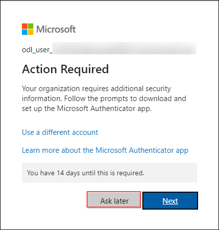

## Steps to Proceed with MFA Setup if the "Ask Later" Option is Not Visible

1. If you see the pop-up **Stay Signed in?**, click **No**.

1. If **Action required** pop-up window appears, click on **Next**.
   
   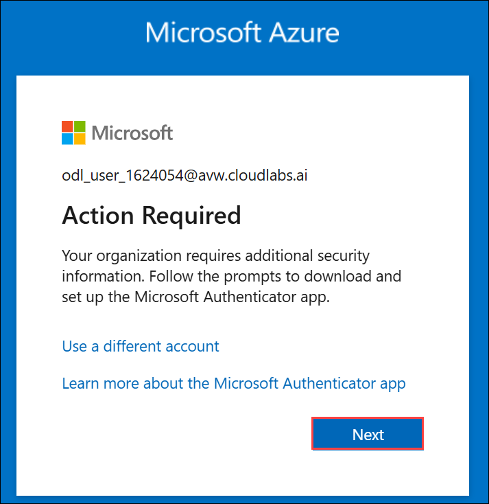

1. On **Start by getting the app** page, click on **Next**.
1. Click on **Next** twice.
1. In **android**, go to the play store and Search for **Microsoft Authenticator** and Tap on **Install**.

   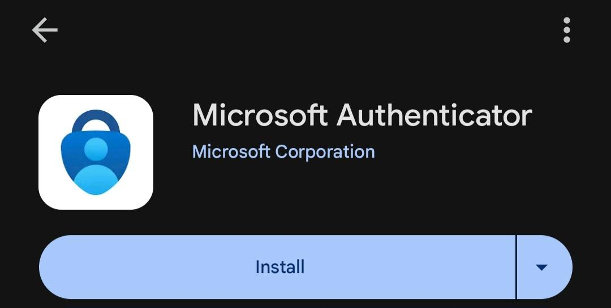

   > Note: For Ios, Open the app store and repeat the steps.

   > Note: Skip if already installed.

1. Open the app and tap on **Scan a QR code**.

1. Scan the QR code visible on the screen and click on **Next**.

   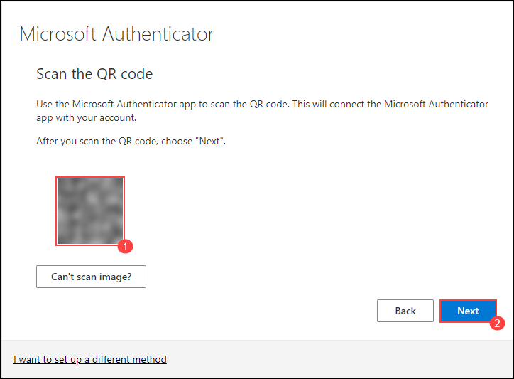

1. Enter the digit displayed on the Screen in the Authenticator app on mobile and tap on **Yes**.

1. Once the notification is approved, click on **Next**.

   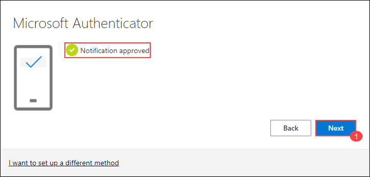

1. Click on **Done**.

1. If prompted to stay signed in, you can click **"No"**.

## Continue with the Lab

1. On the **Power Platform admin center** portal, turn off the **New admin center** toggle button.

   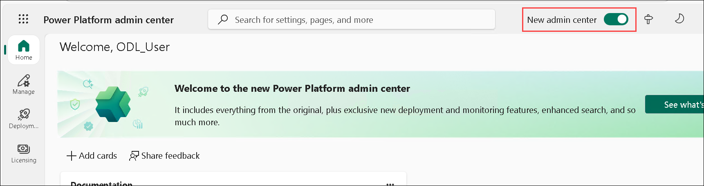

1. Once you have logged in, let us first create an environment. Click on **Environments (1)**  from the left navigation pane and click on **+ New (2)**

   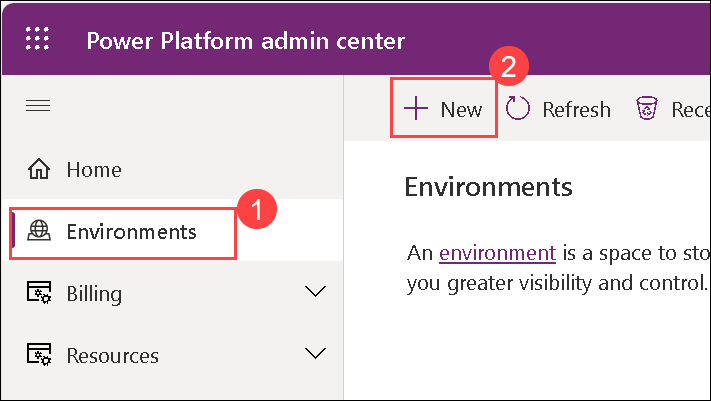

1. On the right tab enter the following details and leave the others as default:

    - Name - **Sales-<inject key="DeploymentID" enableCopy="false" />** **(1)**
    - Add a Dataverse data store - **Yes** **(2)**
    - Click **Next** **(3)**

      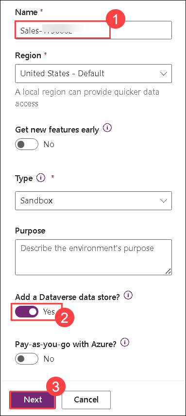
    
1. Under **Security group** click on the **+ Select** icon.

   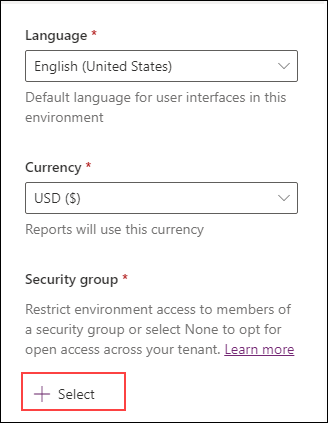

1. In the new window that appears, select **None (1)** and subsequently click on **Done (2)**.   

   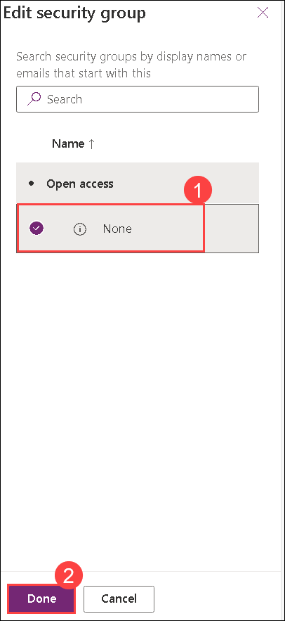
   
1. Next  towards the middle of the window, toggle  **Yes (1)** for  **Enable Dynamics 365 apps** leave the others as default and click on **Save (2)**.

   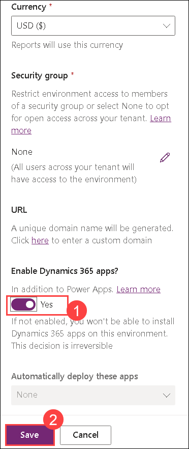
        
1. Now under Environments, the new environment has appeared with the name **Sales-<inject key="DeploymentID" enableCopy="false" />**  click on it to open once it is in ready state.

   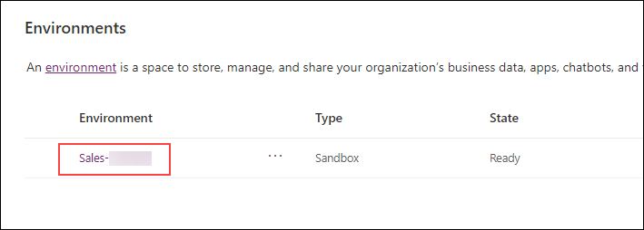

1. Inside the environment, Find and click on the  URL to open the sales hub platform in Dynamics 365.

   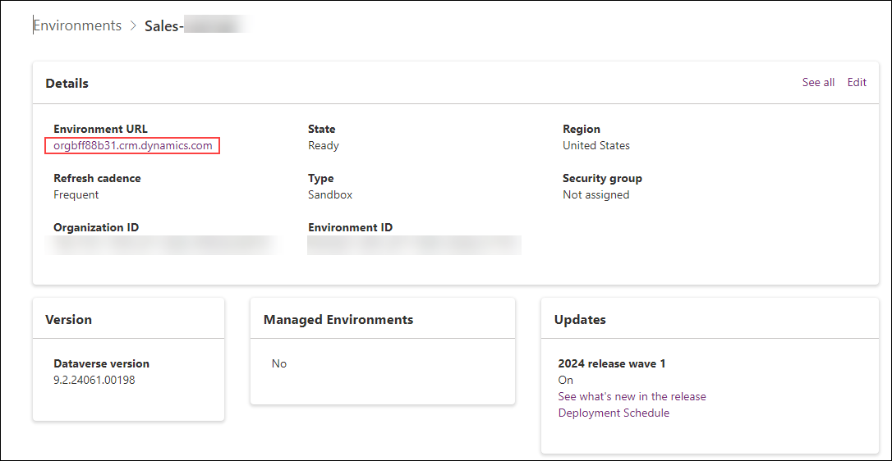
    
   >**Note:** If you do not find the Environment URL category, kindly delete the existing Environment and perform from step number 4 to 8.

1. Now the Dynamics 365 apps page will appear. In the list of **Apps**, open the **Sales Hub** application. When you are within an app, there will be different areas that you can work with based on what you are trying to do. For example, the Sales Hub application contains different administrative settings that you can work with.

   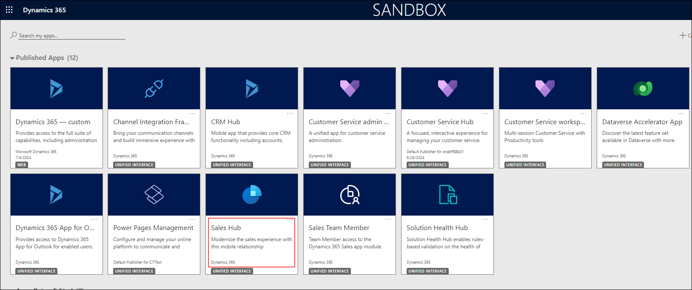

1. On the lower left side of the screen, at the very bottom of the left-hand navigation pane or **Site Map**, select the text **Sales (1)**, from the list that appears, select **App Settings (2)**. *App Settings* is where you can review and make changes to administrative settings. Notice how the left-hand navigation items have changed.

   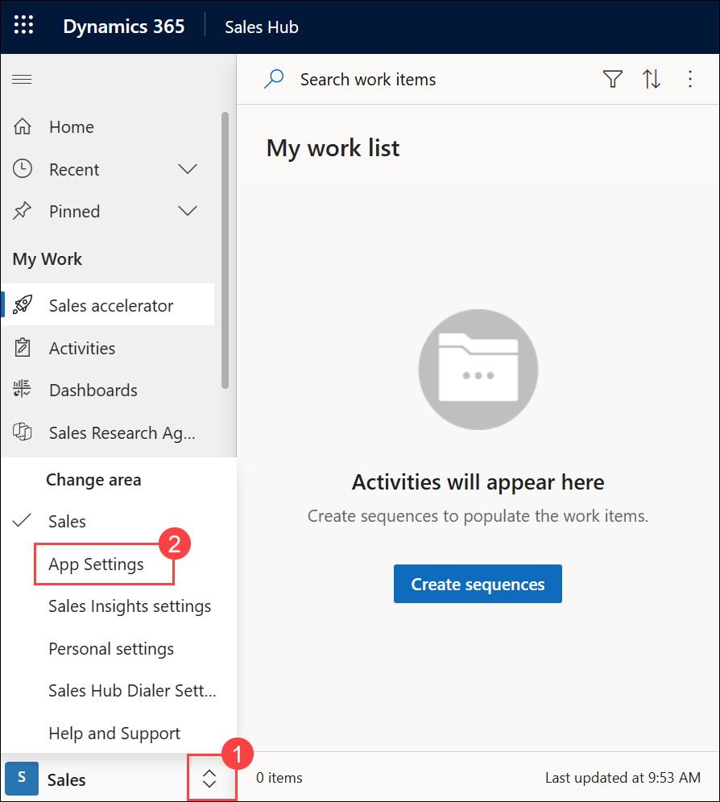

1. Select the **App Settings (1)** again and change it from **App Settings** back to **Sales (2)**.

   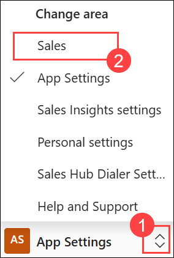

1. If you want to switch from the Sales app to a different app such as Customer Service workspace, select the **Sales Hub** text in the upper left part of the screen next to the text Dynamic 365.

   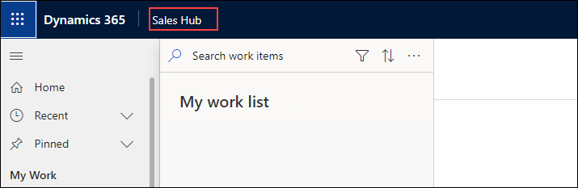

1. The **Apps** selector pop-up will appear, select **Customer Service Hub** and you will be taken to the **Customer Service Hub** application.

   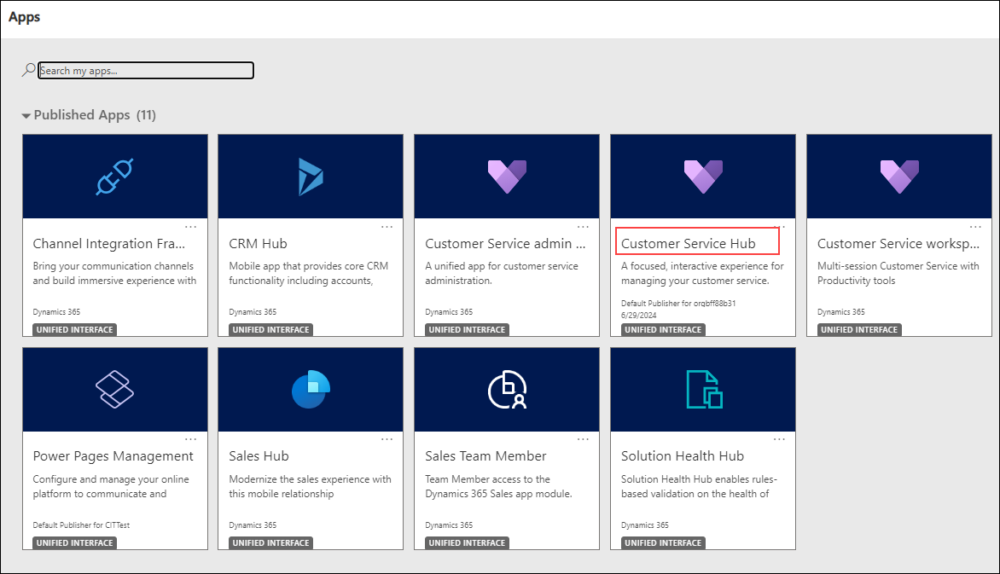

1. Click on **Services (1)**. Notice the **Customer Service Hub** has different areas available in the **Change Area** menu **(2)**. 

   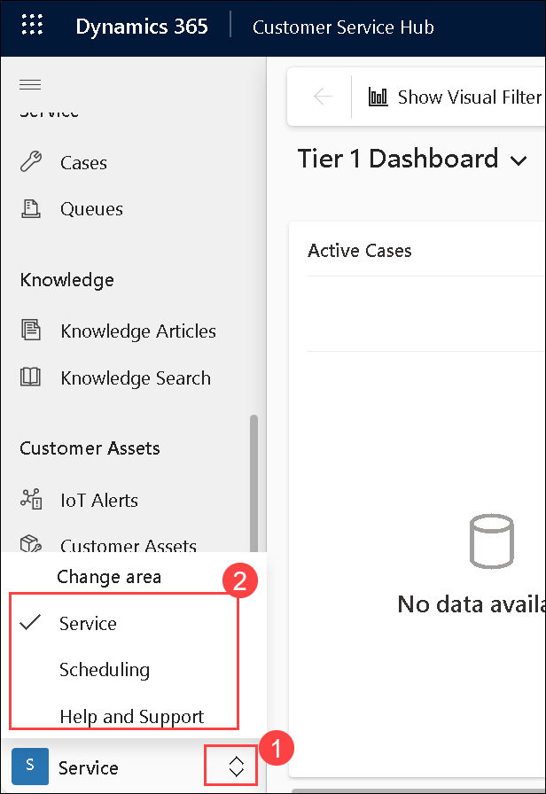

1. To switch back to the **Sales Hub** app, select the **Customer Service Hub** text at the top which opens the **Apps** selector pop-up.

   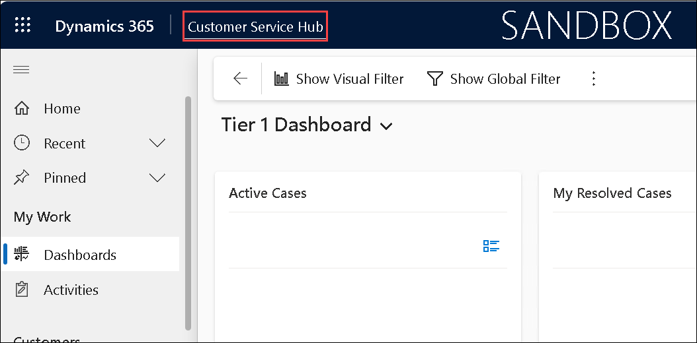

1. Select **Sales Hub**.
 
   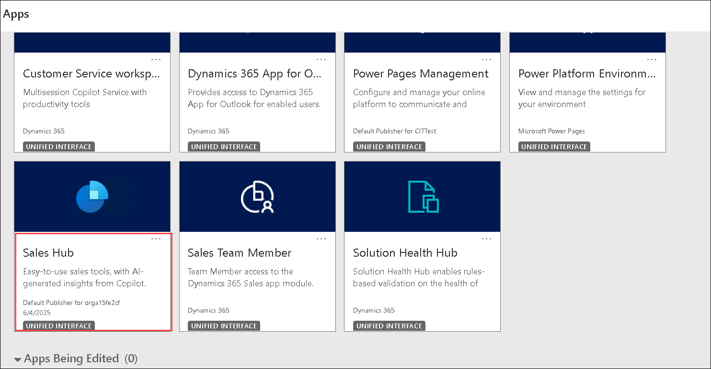

## Review
Through this module, we gained familiarity with navigating and accessing different Dynamics 365 customer engagement applications, such as Sales Hub and Customer Service Hub, to explore their respective functionalities and administrative settings.

## You have successfully completed this module. Click on **Next >>** to procced with next module.
