# Module 2: Describe shared activities and integration options in Dynamics 365 customer engagement apps

## Objectives

In this module, you will be working with common records that are used by all the first-party customer engagement apps. 

## Lab Setup

**Estimated Time**: 15 minutes

## Task 1: Manage customers and activities

In this task, you will be working with common records that are leveraged by all the first-party customer engagement apps. 

1. If it is not open already, open the **Dynamics 365 Sales Hub** application.

1. Using the navigation on the left side of the screen, select **Accounts**.

   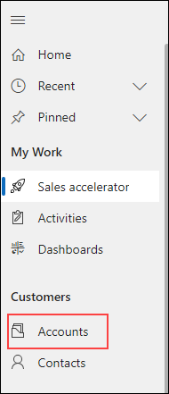

1. On the Command Bar, select the **New** button.

   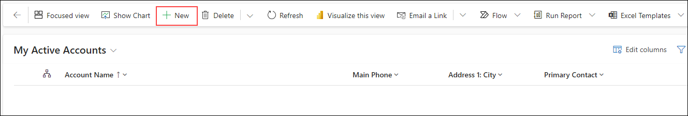

1. Complete the account record as follows:

	- **Account Name:** Contoso Corporate 

	- **Phone:** 888-555-1234 

	- **Address 1 Street 1:** 191 181st Ave N 

	- **Address 1 City:** Seattle

	- **Address 1 State/ Province:** WA

	- **Address 1 Postal Code:** 98101

1. On the Command bar, select the **Save and Close** button to save and exit the account record.

   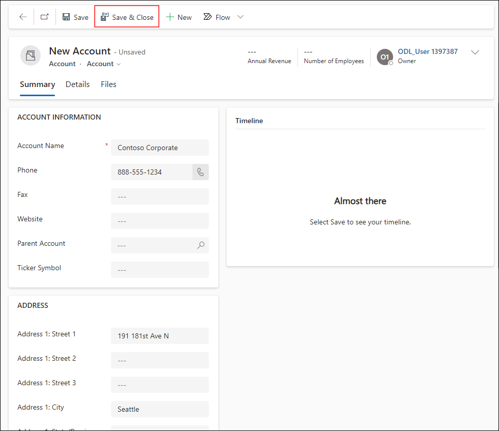

1. On the Command bar, from the list of accounts, select the **New** button again.

   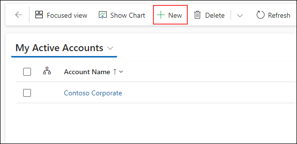

1. Complete the account record as follows:

	- **Account Name:** Contoso North America 

	- **Phone:** 888-555-4321 

	- **Address 1 Street 1**: 187 11th ST N (Your Initials)

	- **Address 1 City:** Chicago

	- **Address 1 State/ Province:** IL

	- **Address 1 Postal Code:** 60176

1. Set the **Parent Account** field to the **Contoso Corporate** account you created earlier.

   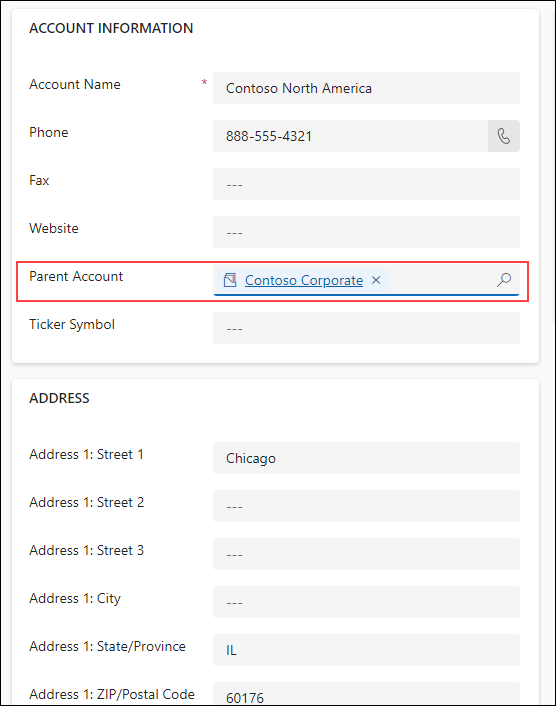

1. Click the **Save** button to save the account and leave it open.

   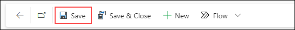

1. Locate the **Contacts Sub-grid** on the right side of the screen. Select the **Vertical Ellipsis**, and from the menu that appears, select **New Contact**.

   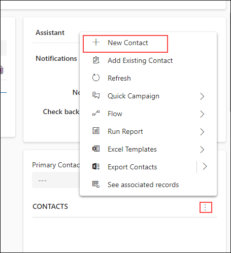
 
1. Using the **Quick Create Contac**t form, complete the contact as follows:

	- **First Name:** Jackson

	- **Last Name:** Anderson 

	- **Job Title:** CEO

	- **Email:** Jackson<inject key="DeploymentID" enableCopy="false" />@contososample.com

1. Select the **Save and Close** button.

   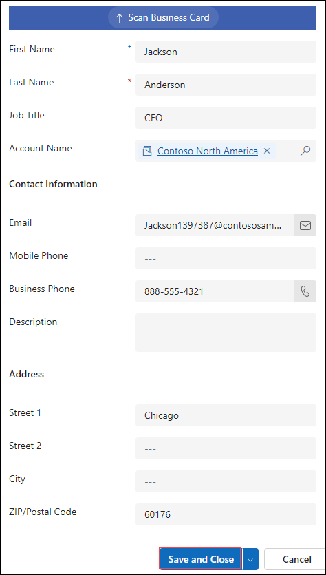

1. Just above the Contact sub-grid, select the **Primary Contact** field, and set it to the **Jackson Anderson** contact you just created.

   

1. On the **Record Timeline** located in the middle of the screen, select the **Plus Sign Icon** to add a new item.

   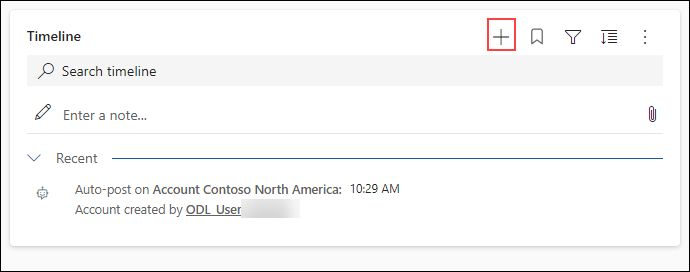

1. From the menu that appears, select **Appointment**

1. Complete the appointment as follows:

	- **Subject:** Meeting with Jackson 

	- **Start Time:** Today at 4:00 PM

	- **End Time:** Today at 4:30 PM

1. Select the **Save and Close** button.

   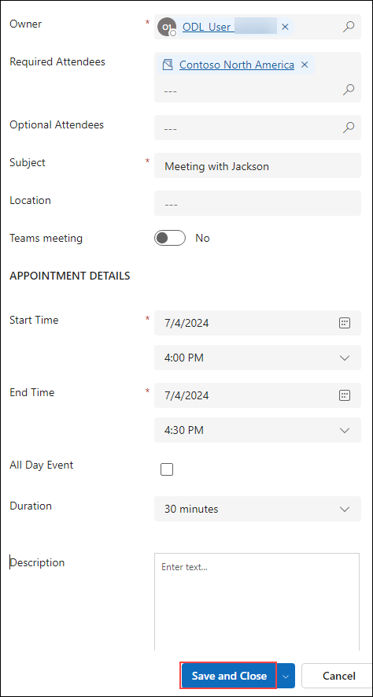

1. **Save and close** the account.

   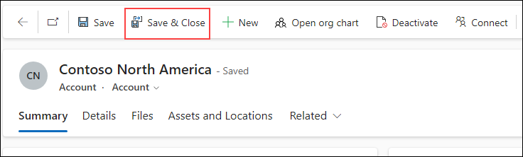

1. Open the Contoso North America account, click to select the **Appointment** and display the details about it.

   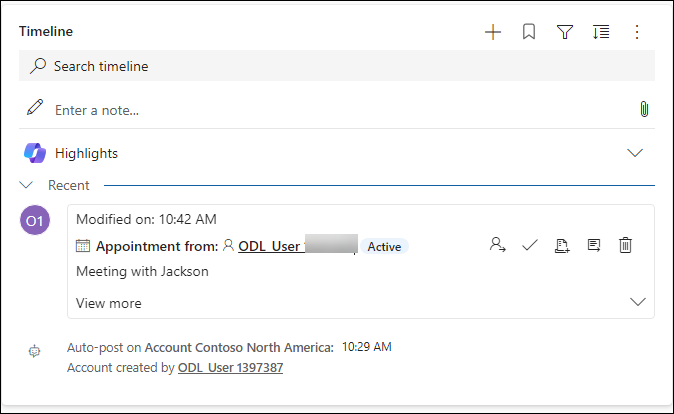

1. Select the **Open Record** link.

   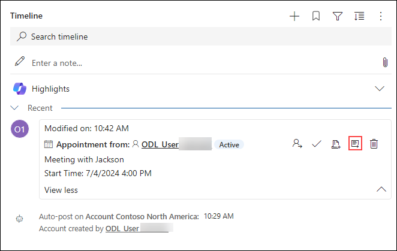

1. With the appointment record open, from the **Command Bar**, select the **Mark Complete** button to finish the appointment.

   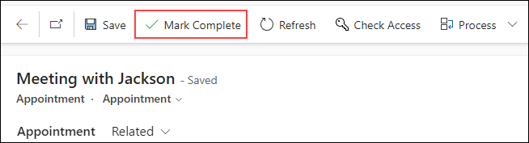

1. Select the **Save and Close** button to return to the account record.

1. Select **Save and Close** on the account record to leave the account record.
