# Module 2: Describe shared activities and integration options in Dynamics 365 customer engagement apps

### Estimated Duration: 45 minutes

## Lab Overview

In this lab, you will explore how to manage customer records and activities within Dynamics 365 Sales Hub, which is essential for effective customer engagement.You will create and link accounts, contacts, and appointments, demonstrating how Dynamics 365 enables streamlined customer relationship management.

## Lab Objective

In this lab, you will be performing the following task:
  
- Task 1: Manage customers and activities

## Architecture Diagram

   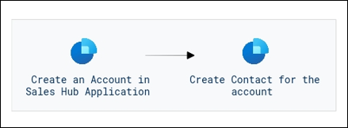

## Task 1: Manage customers and activities

In this task, you will be working with common records that are leveraged by all the first-party customer engagement apps. 

1. Open the **Dynamics 365 Sales Hub** application if it is not open already,

1. Using the navigation on the left side of the screen, select **Accounts** under **Customers** section.

   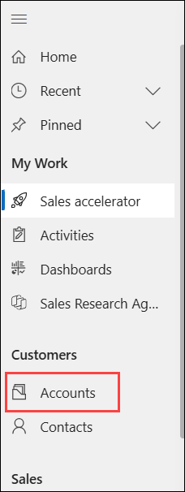

1. On the Command Bar, select the **+ New** button.

   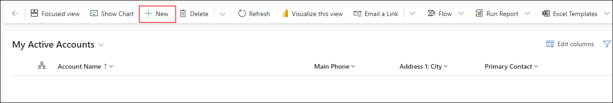

1. Complete the account record as follows:

	- **Account Name:** Contoso Corporate **(1)**

	- **Phone:** 888-555-1234 **(2)**

	- **Address 1 Street 1:** 191 181st Ave N  **(3)**

	- **Address 1 City:** Seattle **(4)**

	- **Address 1 State/ Province:** WA **(5)**

	- **Address 1 ZIP/Postal Code:** 98101 **(6)**

      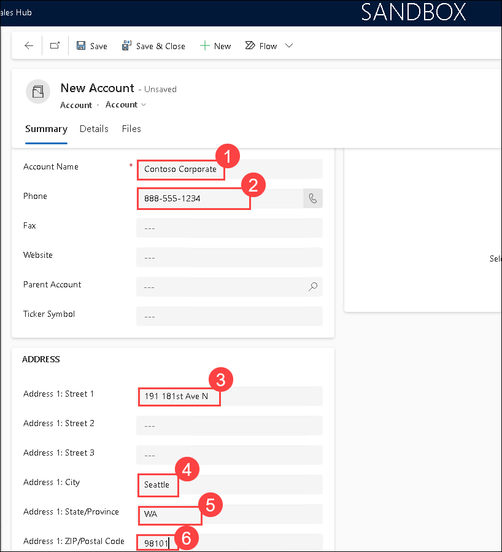	

1. On the Command bar, select the **Save & Close** button to save and exit the account record.

   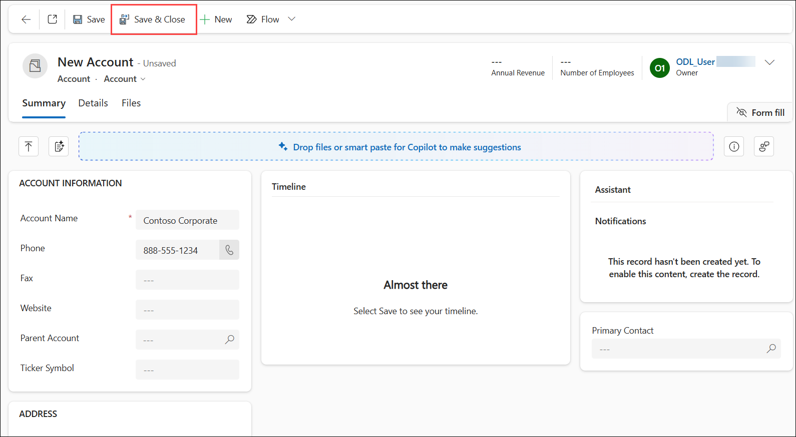

1. On the Command bar, from the list of accounts, select the **+ New** button again.

   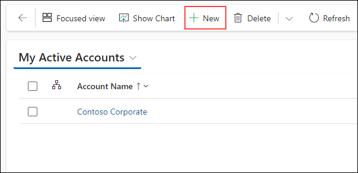

1. Complete the account record as follows:

	- **Account Name:** Contoso North America **(1)**

	- **Phone:** 888-555-4321 **(2)**

	- **Address 1 Street 1**: 187 11th ST N **(3)**

	- **Address 1 City:** Chicago **(4)**

	- **Address 1 State/ Province:** IL **(5)**

	- **Address 1 ZIP/Postal Code:** 60176 **(6)**

      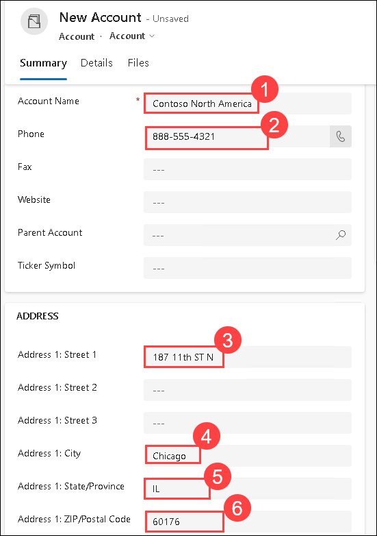	

1. Set the **Parent Account** field to the **Contoso Corporate** account you created earlier.

   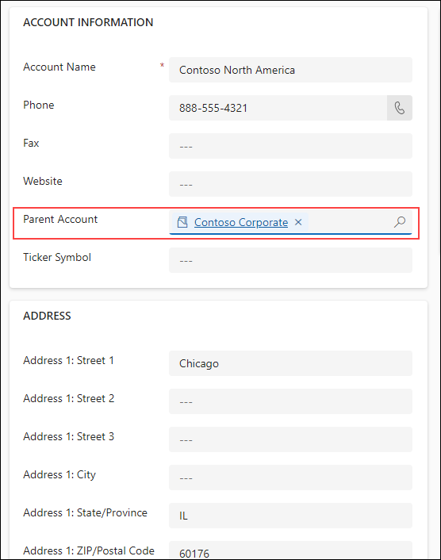

1. Click the **Save** button to save the account and leave it open.

   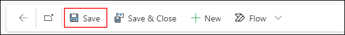

1. Scroll down and locate the **CONTACTS** sub-grid on the screen. Select the **Vertical Ellipsis (1)**, and from the menu that appears, select **+ New Contact (2)**.

   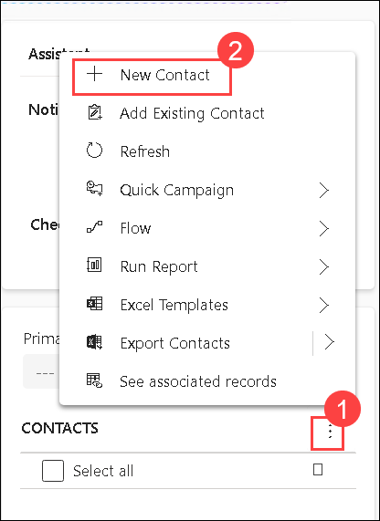
 
1. Using the **Quick Create Contac**t form, complete the contact as follows and then click on **Save and Close (5)** button.

	- **First Name:** Jackson **(1)**

	- **Last Name:** Anderson **(2)**

	- **Job Title:** CEO **(3)**

	- **Email:** Jackson<inject key="DeploymentID" enableCopy="false" />@contososample.com **(4)**

	  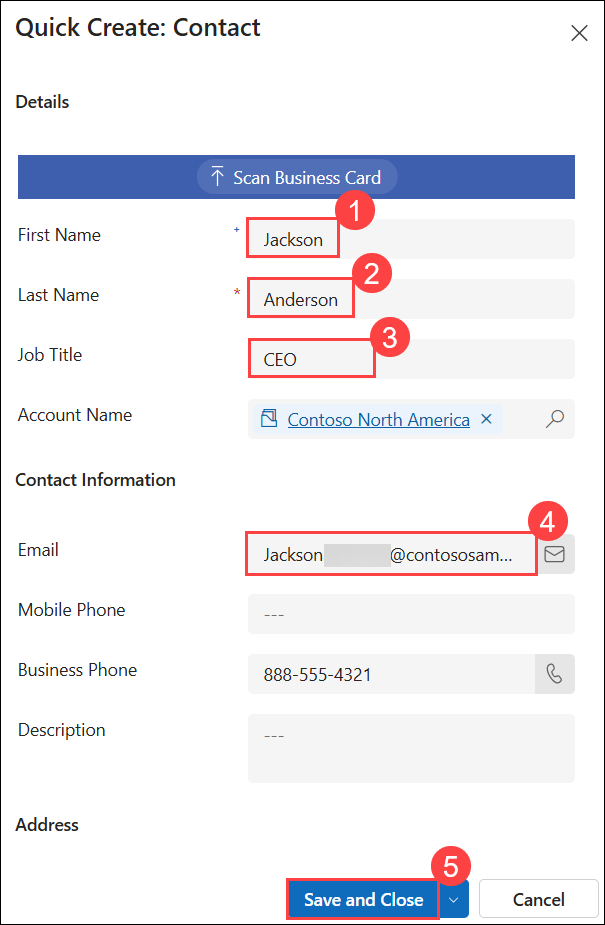

1. Just above the Contact sub-grid, select the **Primary Contact** field, and set it to the **Jackson Anderson** contact you just created.

   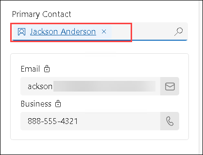

1. On the **Record Timeline**, select the plus sign icon **(+)** located in the top-right corner to add a new item.

   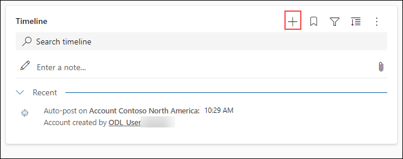

1. From the menu that appears, select **Appointment**.

   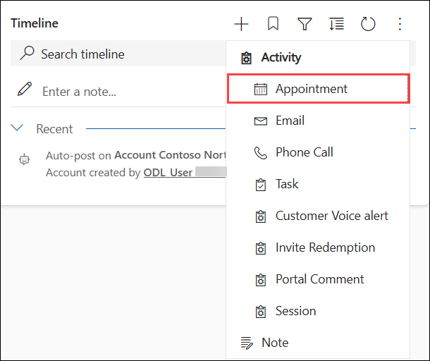

1. Complete the appointment as follows and then click on **Save and Close (4)**:

	- **Subject:** Meeting with Jackson **(1)**

	- **Start Time:** Today at 4:00 PM **(2)**

	- **End Time:** Today at 4:30 PM **(3)**

   - Click **Save and Close (4)**

      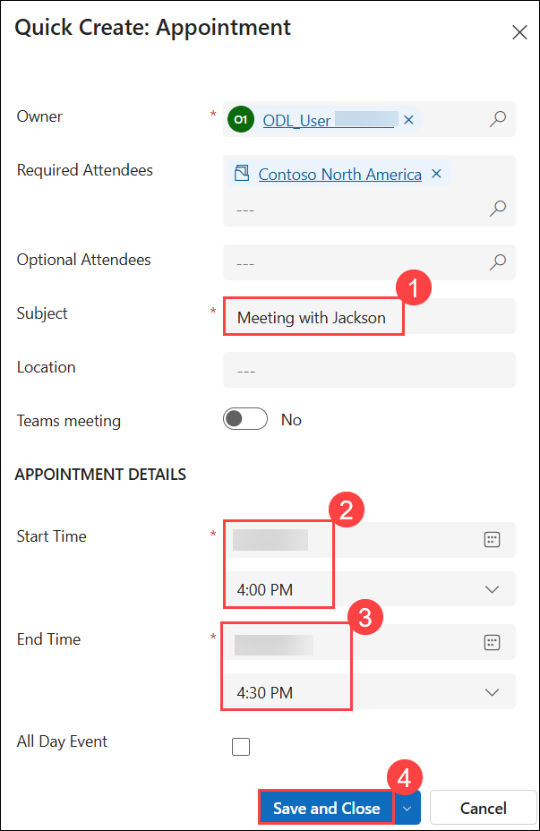

1. From the Command bar, select **Save & Close**.

   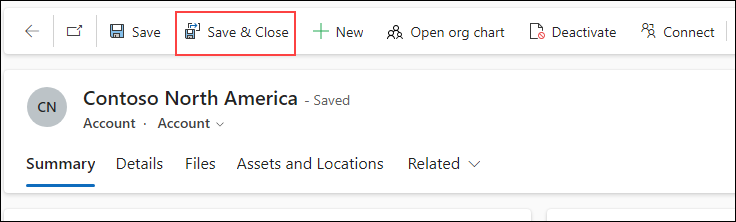

1. From the list of active accounts, select **Contoso North America** to open the account record.

   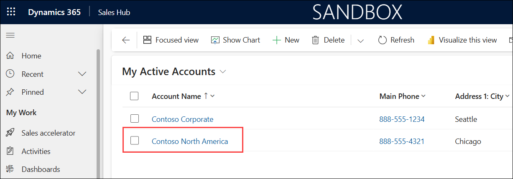

1. Under the **Timeline** section, select the **Open Record icon** to view the full activity details.

   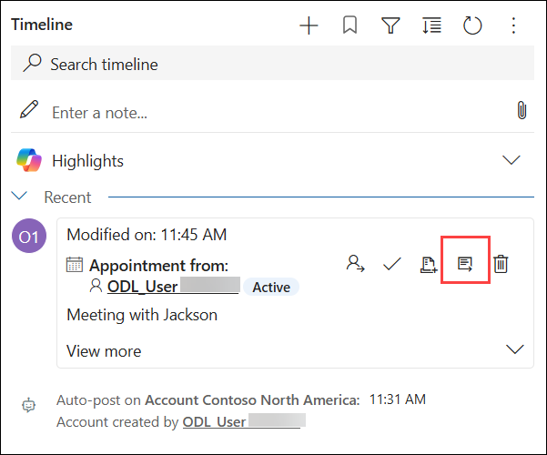

   > **Note**:  If you don't see the **Open Record** option. You can zoom out your browser page to get it visible.

1. With the appointment record open, from the **Command Bar**, select the **Mark Complete** button to finish the appointment.

   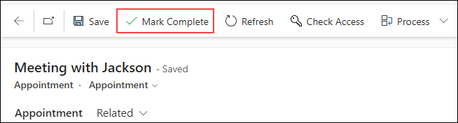

1. Select the **Save and Close** button to return to the account record.

   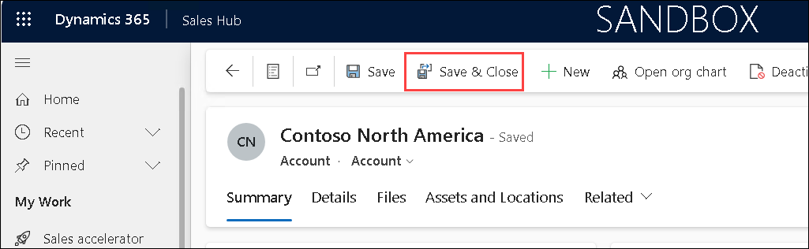

## Review

In this exercise, you have completed the following:
   - Managed common records such as accounts and contacts across Dynamics 365 Customer   Engagement apps.
   - Created and linked records to establish relationships between data.
   - Managed associated activities, including scheduling and tracking appointments.

## You have successfully completed this module. Click on **Next >>** to procced with next module.

   
