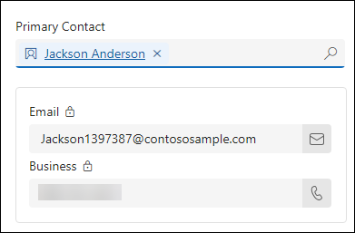

# Module 2: Describe shared activities and integration options in Dynamics 365 customer engagement apps

## Objectives

In this module, you will be working with common records that are used by all the first-party customer engagement apps. 

## Estimated Time: 45 minutes

## Architecture Diagram

   

## Task 1: Manage customers and activities

In this task, you will be working with common records that are leveraged by all the first-party customer engagement apps. 

1. If it is not open already, open the **Dynamics 365 Sales Hub** application.

1. Using the navigation on the left side of the screen, select **Accounts**.

   

1. On the Command Bar, select the **+ New** button.

   

1. Complete the account record as follows:

	- **Account Name:** Contoso Corporate 

	- **Phone:** 888-555-1234 

	- **Address 1 Street 1:** 191 181st Ave N 

	- **Address 1 City:** Seattle

	- **Address 1 State/ Province:** WA

	- **Address 1 ZIP/Postal Code:** 98101

1. On the Command bar, select the **Save & Close** button to save and exit the account record.

   

1. On the Command bar, from the list of accounts, select the **+ New** button again.

   

1. Complete the account record as follows:

	- **Account Name:** Contoso North America 

	- **Phone:** 888-555-4321 

	- **Address 1 Street 1**: 187 11th ST N 

	- **Address 1 City:** Chicago

	- **Address 1 State/ Province:** IL

	- **Address 1 ZIP/Postal Code:** 60176

1. Set the **Parent Account** field to the **Contoso Corporate** account you created earlier.

   

1. Click the **Save** button to save the account and leave it open.

   

1. Scroll down and locate the **Contacts Sub-grid** on the screen. Select the **Vertical Ellipsis**, and from the menu that appears, select **+ New Contact**.

   
 
1. Using the **Quick Create Contac**t form, complete the contact as follows:

	- **First Name:** Jackson

	- **Last Name:** Anderson 

	- **Job Title:** CEO

	- **Email:** Jackson<inject key="DeploymentID" enableCopy="false" />@contososample.com

1. Select the **Save and Close** button.

   

1. Just above the Contact sub-grid, select the **Primary Contact** field, and set it to the **Jackson Anderson** contact you just created.

   

1. On the **Record Timeline** located in the screen, select the **Plus Sign Icon** to add a new item.

   

1. From the menu that appears, select **Appointment**

1. Complete the appointment as follows:

	- **Subject:** Meeting with Jackson 

	- **Start Time:** Today at 4:00 PM

	- **End Time:** Today at 4:30 PM

1. Select the **Save and Close** button.

   

1. **Save & Close** the account.

   

1. Open the Contoso North America account, click to select the **Appointment** and display the details about it.

   

1. Select the **Open Record** link.

   

1. With the appointment record open, from the **Command Bar**, select the **Mark Complete** button to finish the appointment.

   

1. Select the **Save and Close** button to return to the account record.

>**Congratulations** on completing the task! Now, it's time to validate it. Here are the steps:

 > - Click the Lab Validation tab located at the upper right corner of the lab guide section and navigate to the Lab Validation tab.
 > - Hit the Validate button for the corresponding task.
 > - If you receive a success message, you can proceed to the next task. If not, carefully read the error message and retry the step, following the instructions in the lab guide.
 > - If you need any assistance, please contact us at labs-support@spektrasystems.com. We are available 24/7 to help you out.

## validation

<validation step="7cbb2a40-23ae-4a44-8803-245d152b8f7e" />

## Review
 
In this module, we have learnt how to  manage common records like accounts and contacts across Dynamics 365 customer engagement apps, demonstrating proficiency in creating, linking, and managing associated activities such as appointments.

## You have successfully completed this module. Click Next
