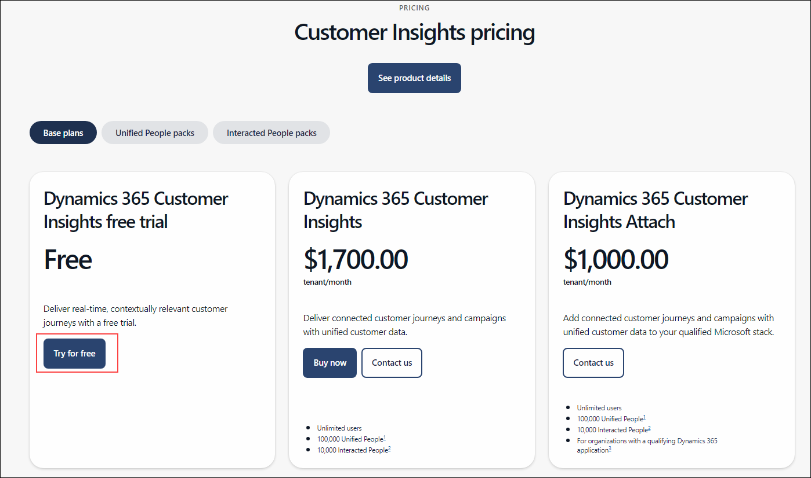

# Module 5: Explore Dynamics 365 Customer Insights - Journeys

**IMPORTANT**: Instructors, make sure that you have completed the all of the setup steps defined in the Dynamics 365 Customer Insights - Journeys section of the Trainer Prep Guide to ensure that your students can complete this lab correctly.   

## Objectives

During this execise you will see that customer journeys are a key component in Dynamics 365 Customer Insights - Journeys. You will create customer journeys as a basis for any marketing effort to guide the path a customer takes while interacting with your organization's marketing process. The goal of the journey, when it is complete, is to turn them into revenue. 

## Lab Setup

**Estimated Time**: 10 minutes

# Task 1: Log-in to Dynamics 365 Customer Insights

1. In a new browser window, browse this link (https://www.microsoft.com/en-us/dynamics-365/products/customer-insights/pricing).

1. In the window that appears, click on **Try for Free**.

    

1. Enter 

   

## Task 1: Create a simple customer journey

1. Using the navigation on the left, select **Journeys** under the **Engagement** group.

1. Using the Command Bar, select **+ New Journey**.

1. Select **Skip and Create from blank**

1. On the **Create Journey with Copilot** pop-up, select **Skip** **and create from blank**.

1. In the Name the Journey field, enter Fargo Customer Journey (Your Initials) 

1. Under Choose the Type of Journey, Set to Segment-based, and select the **Fargo Contacts** segment. The first tile populates with the segment name and the **Audience** pane displays the segment properties.

1. Under **Select the frequency**, choose **A one-time journey with a static audience**.

1. Set the **Start date** to **Tomorrow’s Date**.

1. Select the **Create** button.

1. Select the **Add an Action** button.

1. From the menu that appears, select **Email**.

1. In the Email Properties panel on the right, configure as follows:

	- **Select email:** Email 

	- **Send to:** Email

1. Your journey is now ready to go. To start the journey, publish it by selecting **Go live** on the command bar.
