# Lab 03: Explore Dynamics 365 Customer Insights - Journeys

### Estimated Duration: 60 minutes

## Lab Overview

In this lab, you will learn how to navigate Dynamics 365 Customer Insights - Journeys, create customer segments, and automate personalized marketing campaigns. You will go through the essential steps of email creation, segment definition, and customer journey automation, helping you understand how to engage customers effectively. 

## Lab Objective

In this lab, you will be performing the following task:

Task 1: Login to Dynamics 365 Customer Insights

## Architecture Diagram

   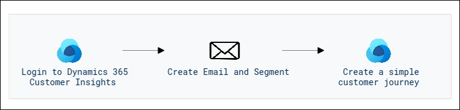

## Task 1: Login to Dynamics 365 Customer Insights

1. Right click on the following link (https://www.microsoft.com/en-us/dynamics-365/products/customer-insights/pricing), then click **Copy link** and then paste it on the browser tab.

1. In the window that appears, click on **Try for Free** under Dynamics 365 Customer Insights free trial.

    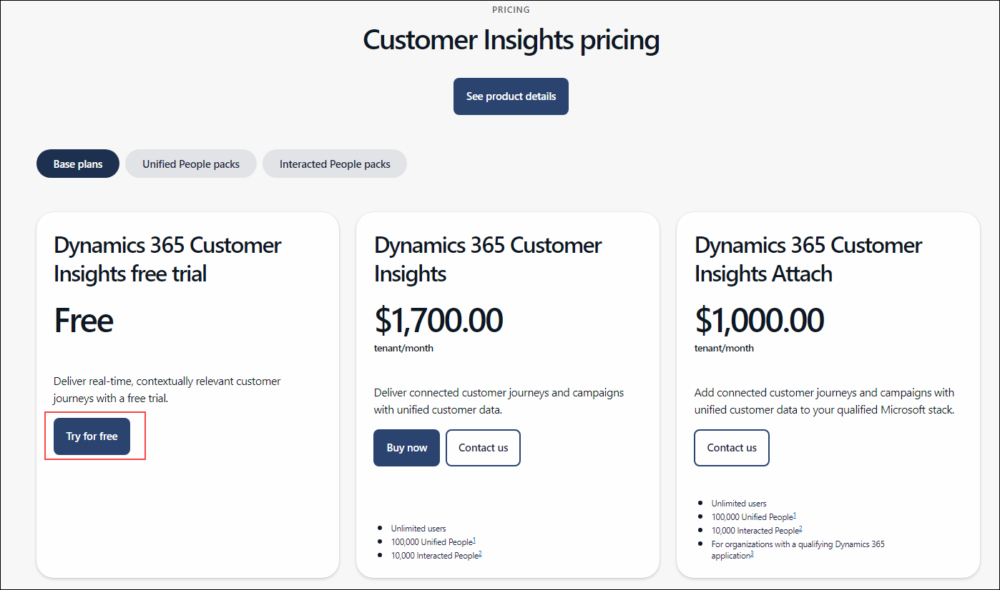

1. Enter the email **<inject key="AzureAdUserEmail"></inject> (1)** in the provided field, check the box to **agree to the terms and conditions (2)**, then click **Start your free trial (3)** to proceed.

   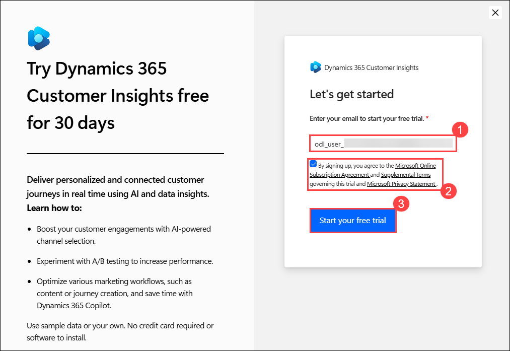

1. If the **Action Required** window appears, select **Ask Later** to continue.

1. In the window that appears, enter 10 digit random **phone number (1)** and click on **Submit (2)**.

   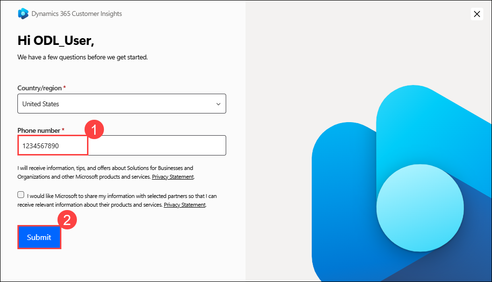

1. If prompted, click the **Launch Trial** button in the window that appears.

1. In the **Where do you want to start?** window, select **Start Customer Insights-Journey**.

   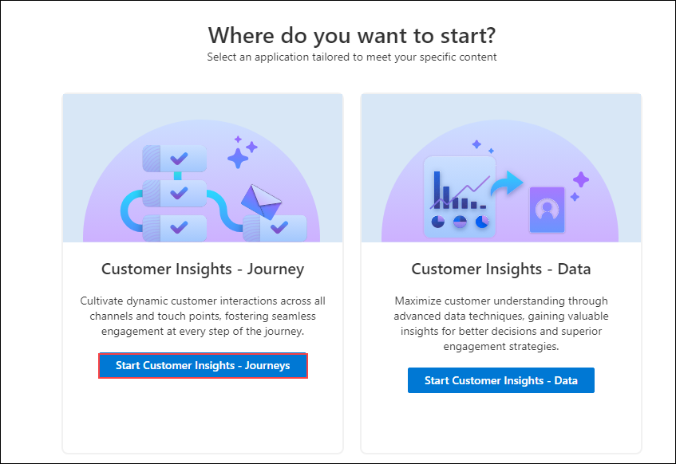

## Task 2: Create Email and Segment

1. In the Customer Insights portal, from the left navigation pane, select **Emails** under Channels.

   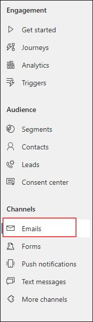

1. From the Command Bar click on **+ New**.

   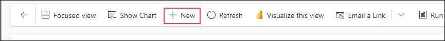

1. Choose any email template from the list **(1)** and click on **Select (2)**.

   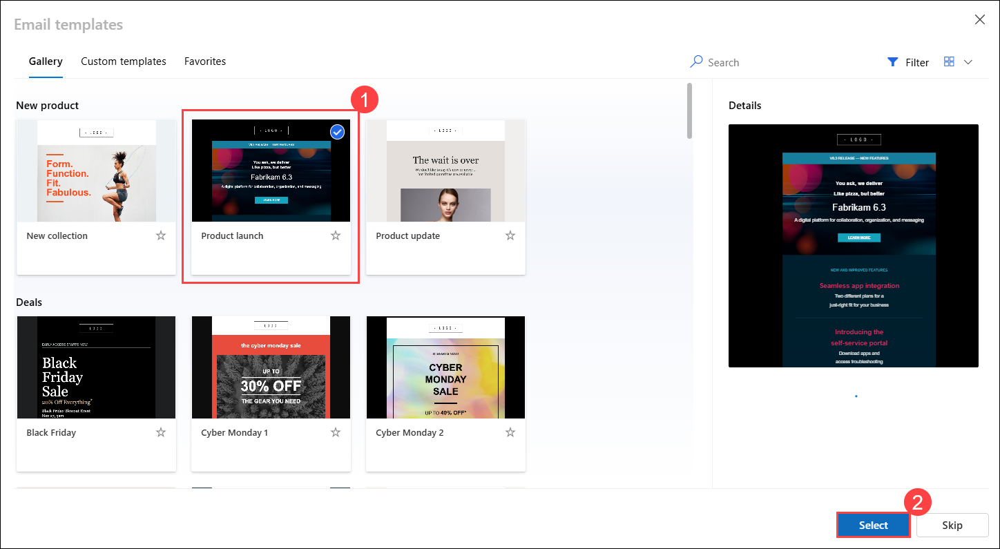

1. In the window that appears,enter the following details:

   - From: You can see **Default brand Sender** is already selected
   - Subject: Click on **Add a subject**

     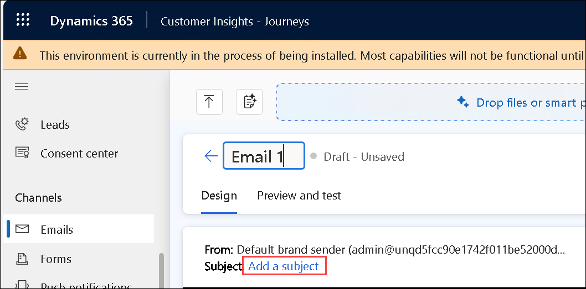   

1. Provide the Subject name as **Demo Email (1)** and then click on **Save (2)**.

     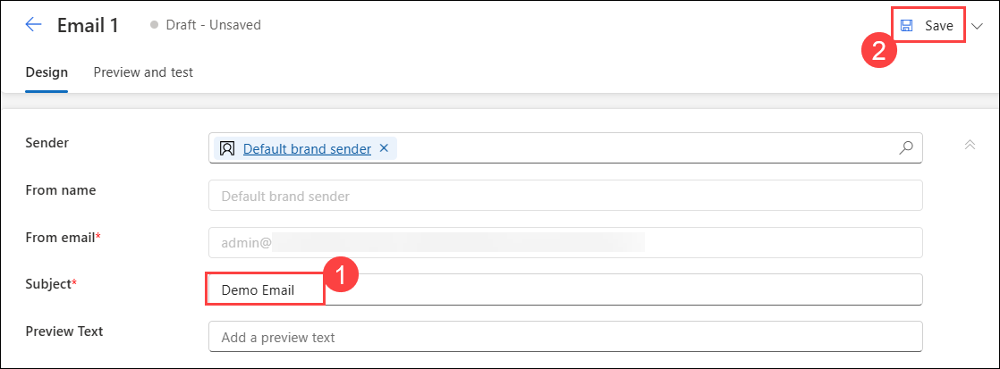

     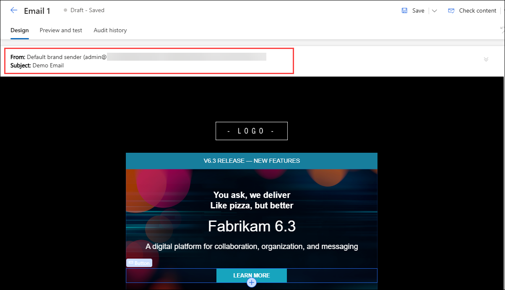

      >**Note:** You might have to click on the arrow-head facing downwards to view the options and if **sender** option is not visible, refresh the page and check.

1. Once you have entered the details,click on **Save (1)** and click on **Ready to Send (2)**.

   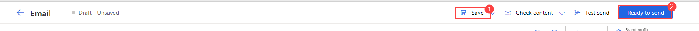

1. In the **Customer Insights** portal, from the left navigation pane, select **Segments** under **Audience**.

   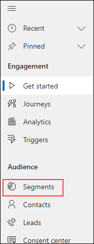

1. From the Command Bar click on **+ New Segment**.

   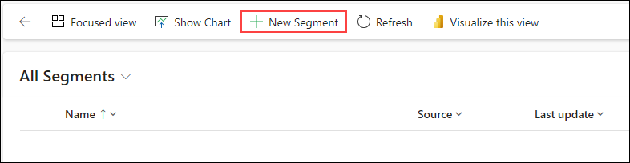

1. In window that appears enter the following details and click on **Create (3)**.

   - Name the segment: **Demo (1)**
   - Select a Target Audience: Choose **Contact (2)**
   - Click **Create (3)**

     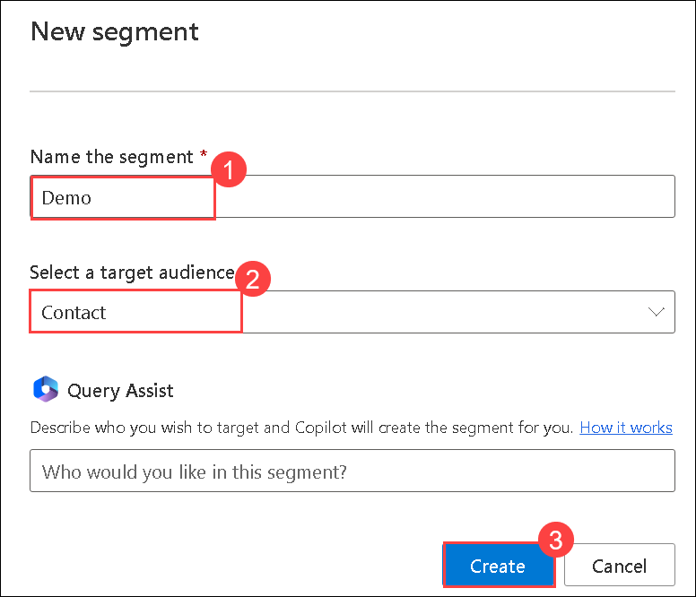

1. From the right navigation pane,under the **Attributes (1)** tab, search for **Email (2)**. Expand **Contacts (3)** and then select **Email (4)**.

   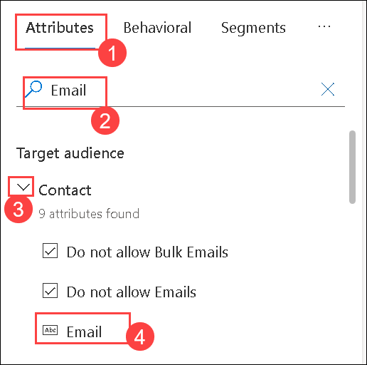

1. In the middle screen under **Group 1** choose **Contains data** option from the dropdown.
 
   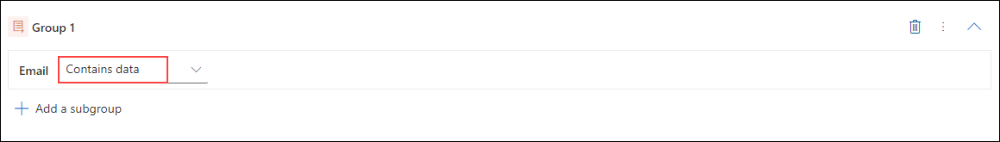

1. Now click on **Save (1)** and subsequently click on **Ready to use (2)**.

   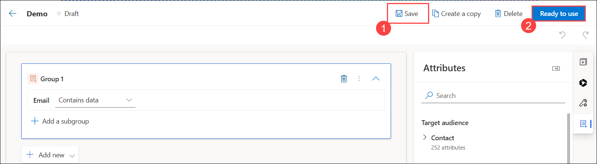

   > **Note**:  If you see **Share feedback on segment creation!** tab, select **Cancel**.

  > **Congratulations** on completing the task! Now, it's time to validate it. Here are the steps:
  > - Hit the Validate button for the corresponding task. If you receive a success message, you have successfully completed the task. 
  > - If not, carefully read the error message and retry the step, following the instructions in the lab guide.
  > - If you need any assistance, please contact us at cloudlabs-support@spektrasystems.com. We are available 24/7 to help

  <validation step="ed3cae2e-346a-4903-b445-7ecc8e3a44e1" />

## Task 3: Create a simple customer journey

1. Using the navigation on the left, select **Journeys** under the **Engagement** group.

   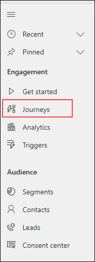

1. Using the Command Bar, select **+ New journey**.

   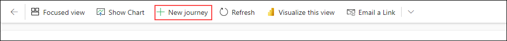

1. On the **Create Journey with Copilot** pop-up, select **Skip** **and create from blank**.

   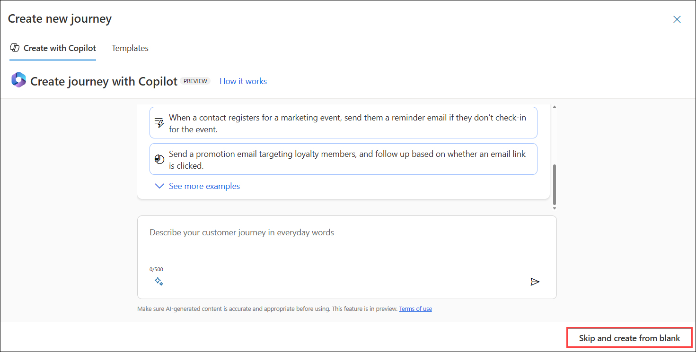

1.  Enter the following details:

    - In the Name the Journey field, enter **Demo Customer Journey** (1)
    - Under Choose the Type of Journey, Set to **Segment-based** (2)
    - Search for and select the **Demo** segment (3)
    - Under **Select the frequency**, choose **A one-time journey with a static audience** (4)
    - Set the **Start date** to **Tomorrow’s Date** (5)
    - Select the **Create** button (6)

      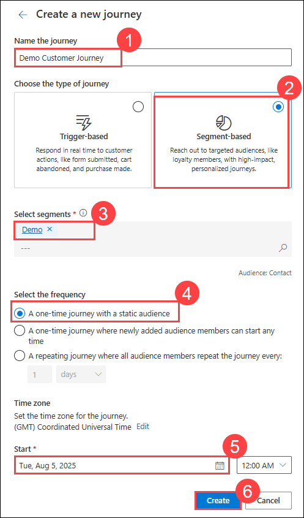

1. Select the **Add an action** button.

    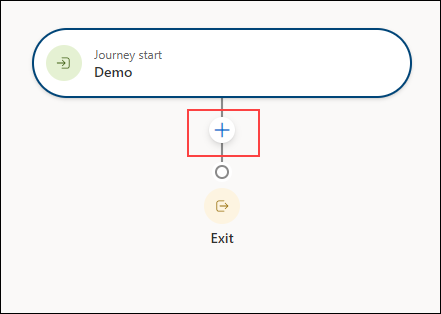

1. From the menu that appears, select **Email**.

    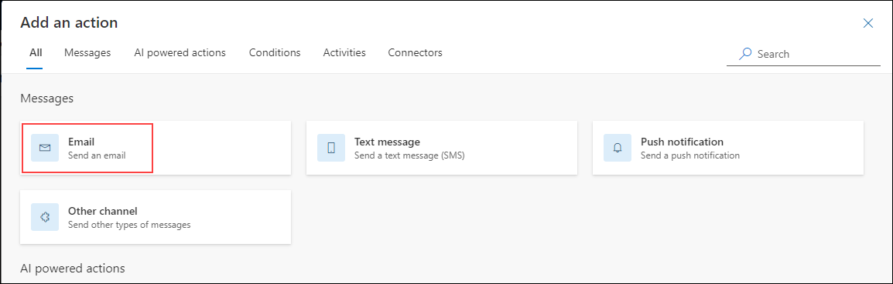

1. In the Email Properties panel on the right, configure as follows and then click on **Save (3)**.

	- Select email: **Email 1 (1)**

	- Send to: **Email (2)**

     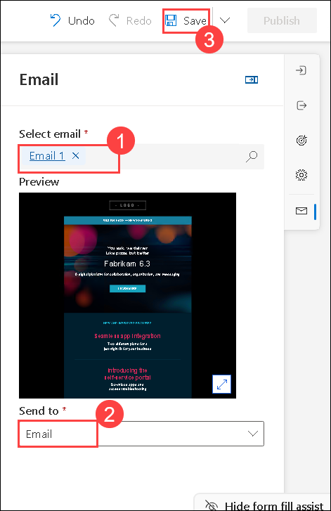

1. Your journey is now ready to go. To start the journey, publish it by clicking on  **Publish** from the command bar.

   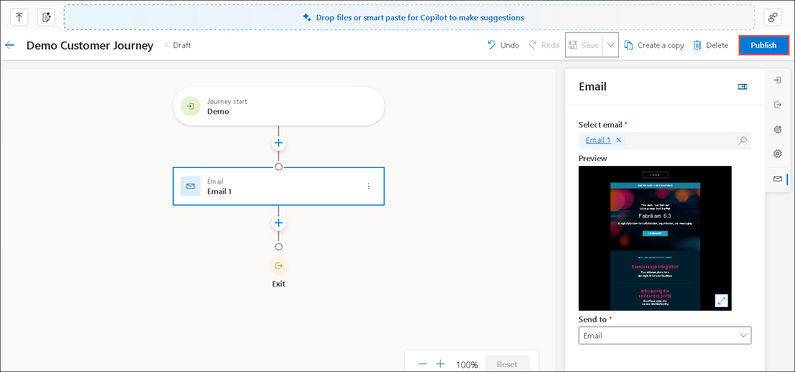

   > **Note**:  If you see **Congratulations!** tab, select **Skip** button. Subsequently, in the **Share feedback on journey creation!** tab, select **Cancel** tab.

## Review

In this exercise, you have completed the following:

   - Explored the role of customer journeys in Dynamics 365 Customer Insights.
   - Created and configured customer journeys to guide interactions.
   - Applied journey settings to enhance and optimize marketing efforts.

## You have successfully completed this module. Click on **Next >>** to procced with next module.

   
