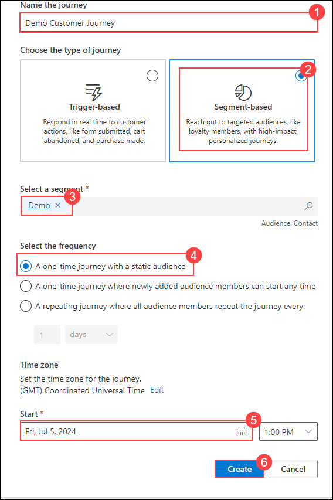

# Module 5: Explore Dynamics 365 Customer Insights - Journeys

## Objectives

In this module, you will see that customer journeys are a key component in Dynamics 365 Customer Insights - Journeys. You will create customer journeys as a basis for any marketing effort to guide the path a customer takes while interacting with your organization's marketing process. The goal of the journey, when it is complete, is to turn them into revenue. 

## Estimated Time: 40 minutes

# Task 1: Login to Dynamics 365 Customer Insights

1. In a new browser window, browse this link (https://www.microsoft.com/en-us/dynamics-365/products/customer-insights/pricing).

1. In the window that appears, click on **Try for Free**.

    

1. Enter <inject key="AzureAdUserEmail"></inject> for the email, agree to the terms and subsequently  click on **Start Free Trial**.

   

1. In the **Action Required** window,click on **Ask Later**.

1. In the window that appears, enter the phone number and click on **Submit**.

   

1. In the window that appears, click on **Launch Trial** button.

1. In the **Where do you want to start?** window, select **Start Customer Insights-Journey**.

   

## Task 2: Create Email and Segment

1. In the Customer Insights portal, from the left navigation pane, select **Emails**.

   

1. From the Command Bar click on **+ New**.

   

1. Choose any email template from the list and click on **Select**.

   

1. In the window that appears,enter the following details:

   - Sender: Choose **Default Sender**
   - Subject: **Demo Email**

     

1. Once you have entered the details,click on **Save** and click on **Ready to Send**.

   

1. In the Customer Insights portal, from the left navigation pane, select **Segments**.

   

1. From the Command Bar click on **+ New Segment**.

   

1. In window that appears enter the following details and click on **Create**.

   - Name the segment: **Demo**
   - Select a Target Audience: Choose **Contact**

     

1. From the right navigation pane,under the **Attributes** tab, search for and select **Email**.

   

1. In the middle screen under **Group 1** choose **Contains Data** option from the dropdown.
 
   

1. Now click on **Save** and subsequently click on **Ready to Use**.

   

## Task 3: Create a simple customer journey

1. Using the navigation on the left, select **Journeys** under the **Engagement** group.

   

1. Using the Command Bar, select **+ New Journey**.

   

1. On the **Create Journey with Copilot** pop-up, select **Skip** **and create from blank**.

   

1.  Enter the following details:

    - In the Name the Journey field, enter **Demo Customer Journey** (1)
    - Under Choose the Type of Journey, Set to **Segment-based** (2)
    - Select the **Demo** segment (3)
    - Under **Select the frequency**, choose **A one-time journey with a static audience** (4)
    - Set the **Start date** to **Tomorrow’s Date** (5)
    - Select the **Create** button (6)

      

1. Select the **Add an Action** button.

    

1. From the menu that appears, select **Email**.

    

1. In the Email Properties panel on the right, configure as follows:

	- **Select email:** Email 

	- **Send to:** Email

	 

1. Click on **Save**.

1. Your journey is now ready to go. To start the journey, publish it by clicking on  **Publish** from the command bar.

## Review

In this module we have explored the pivotal role of customer journeys within Dynamics 365 Customer Insights, learning to create and configure journeys as essential tools for guiding customer interactions and optimizing marketing efforts.

## You have successfully completed this workshop!
