# Module 4: Explore Dynamics 365 Sales

## Lab Overview

In this module, you will manually be creating a lead for Jane Anderson. Jane works for a company called Jim works for a company called **ABC Consulting**. Not only will you be capturing the lead information in the system, but you will be leveraging the tools available in Dynamics 365 Sales to qualify the lead as an opportunity and work it through closing the opportunity.

## Lab Objectives

In this lab, you will be performing the following task:

- Task 1: Create and manage an opportunity in Dynamics 365 Sales 

## Estimated Time: 60 minutes

## Architecture Diagram

   

## Task 1: Create and manage an opportunity in Dynamics 365 Sales 

1. Click on **Customer Insights - Journeys** from the top left corner.

   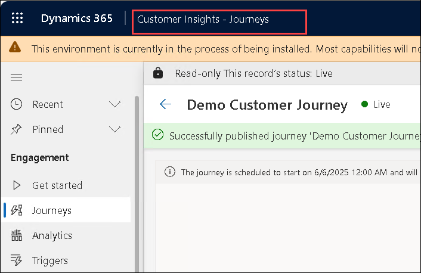

1. From the list of apps open the **Sales Hub**.   

   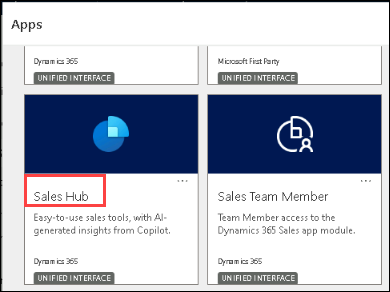

1. In the **Dynamics 365 Sales Hub** application from the left navigation pane, select **Leads** under **Sales**.

   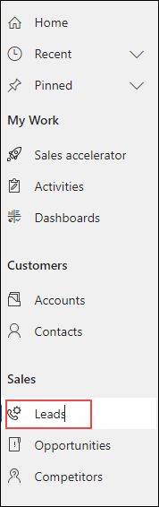

1. On the **My Open Leads** view, click on the ellipsis **(1)** and select the **+ New (2)** button to create a new lead.

   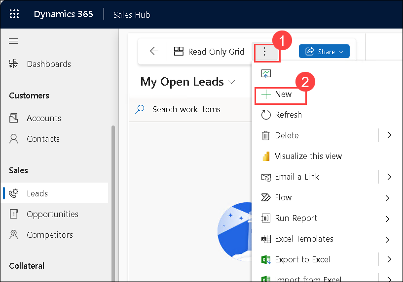

1. Complete the **Lead** information as follows:

	- **Topic:** Wants to upgrade their existing equipment **(1)**

	- **First Name:** Jane **(2)**

	- **Last Name:** Anderson **(3)**

	- **Job Title:** CEO **(4)**

	- **Business Phone:** 888-555-6767 **(5)**

	- **Email:** JaneA<inject key="DeploymentID" enableCopy="false" />@sample.com **(6)**

	- **Company:** ABC Consulting **(7)**

	- **Street 1:** 1987 191st Ave N **(8)**

	- **City:** Fargo **(9)**

	- **State/Province:** ND **(10)**

	- **Zip/Postal Code:** 58102 **(11)**

     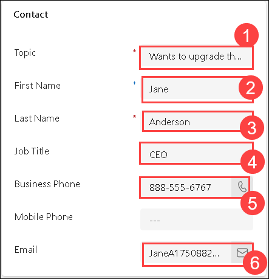

     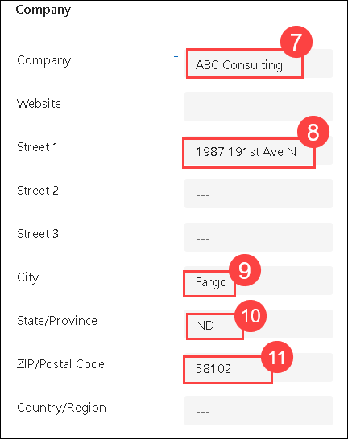   

1. On the **Lead to Opportunity** sales process, select the **Qualify** stage.

   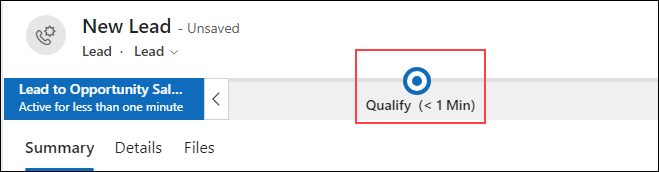

1. Complete as follows:

	- **Purchase Timeframe:** Select **Immediate (1)** from the dropdown

	- **Estimated Budget:** $50,000 **(2)**

	- **Purchase Process:** Select **Committee (3)** from the dropdown

1. Close the **Qualify** stage fly-out **(4)**. 

   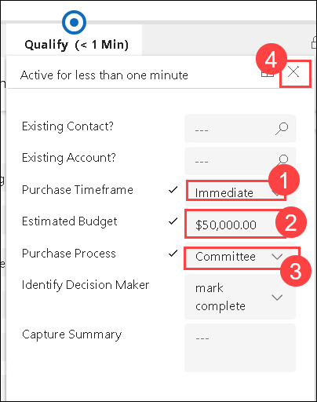

1. Click on **Save & Close**   

   

1. Select the Lead once again and select the **Qualify** button.

    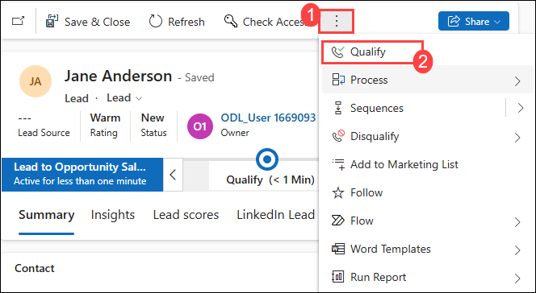
 
    > **Note:** If you do not see the Qualify button, select the **More Commands** button (Looks like three vertical dots).

1. The system will close the **Lead** record and create a new **Opportunity** record. Notice that the **Lead to Opportunity** business process flow has automatically been advanced to the **Develop** stage.

   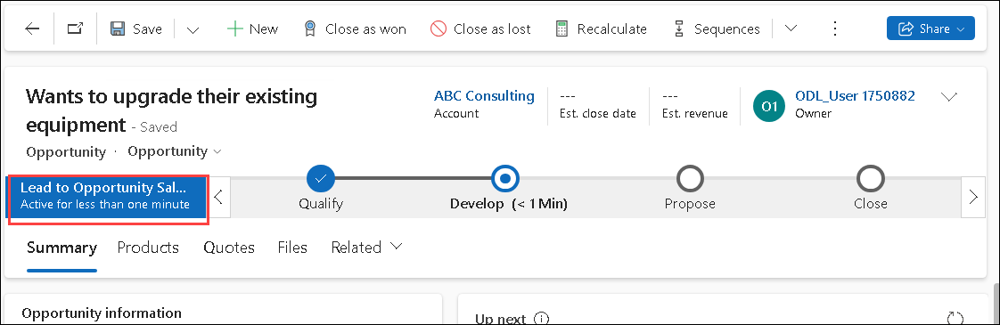

1. On the **Opportunity Header** at the top of the record, select the down arrow next to the **Owner** field.

    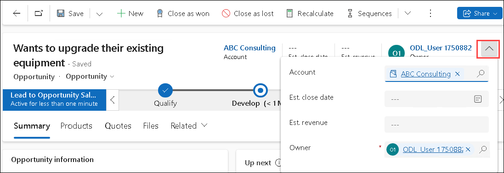

1. Complete as follows:

   - **Est. Close Date:** Two days from today **(1)**

   - **Est Revenue:** $50,000 **(2)**

     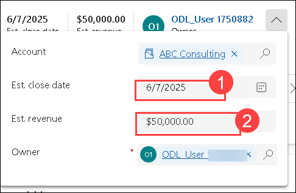

1. Scroll down, In the **Stakeholders** sub-grid, notice that **Jane Anderson** is already defined as a stakeholder.

    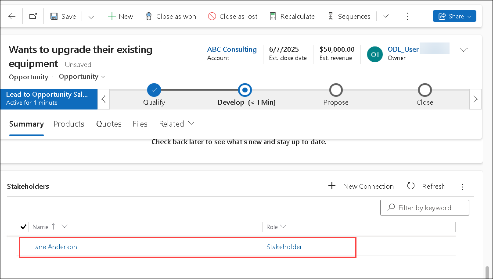

1. On the **Sales team** sub-grid, select the **Vertical Ellipsis (1)**. From the menu that appears select **+ New Connection (2)**.

   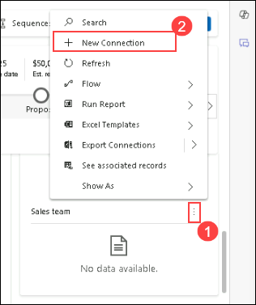

1. Search for and choose your user record i.e. **<inject key="AzureAdUserEmail"></inject> (1)**. Once completed, select the **Add (2)** button.

   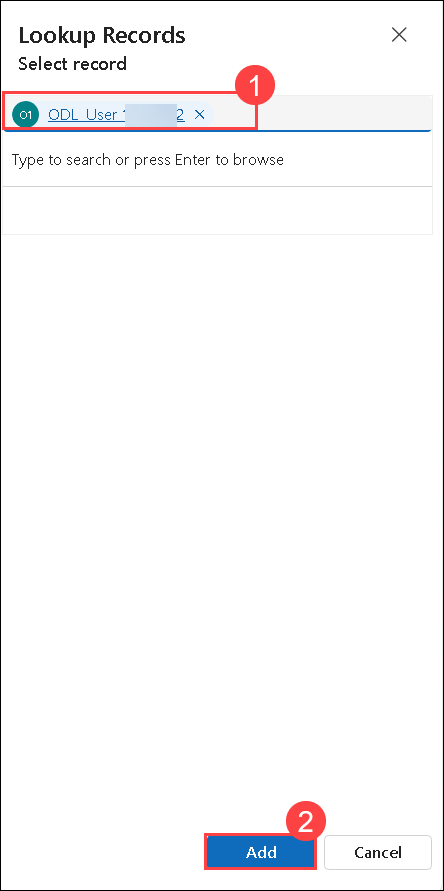

1. On the **Competitors** sub-grid, select the **Vertical Ellipsis** (look like three vertical dots). From the menu that appears select **Add Existing Competitor**.

   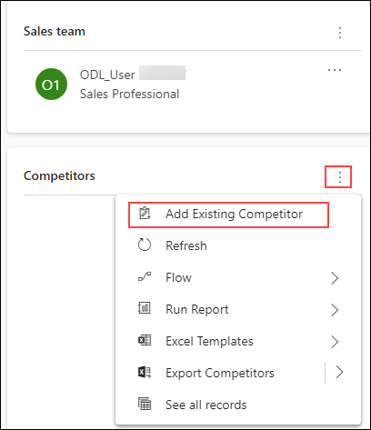

1. On the **Lookup Record** screen, select **+ New**.

   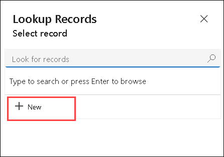

1. Then select **Competitors**.

   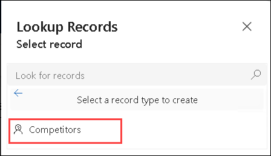

1. On the **Quick Create: Competitor** form, set the **Name** field to **Coho Technologies** and then select the **Save and Close** button.

   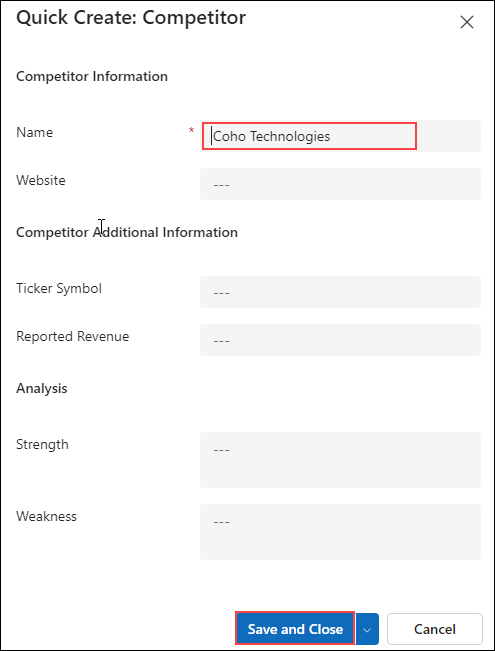

1. **Coho Technologies** should be selected in the lookup record window. Click the **Add** button to finish adding the competitor.

   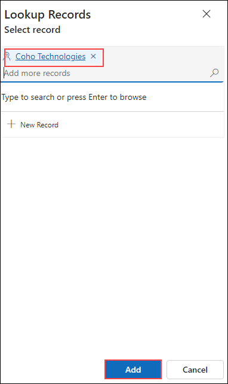
  
1. On the **Lead to Opportunity** business process flow, select the **Develop** stage.

   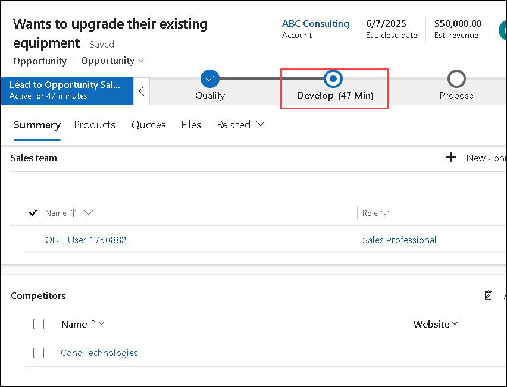

1. Complete as follows **(1)** and select the **Next Stage (2)** button to advance to the **Propose** stage.

	- **Identify Stakeholders**: Select **completed** from the dropdown

	- **Identify Competitors**: Select **completed** from the dropdown

         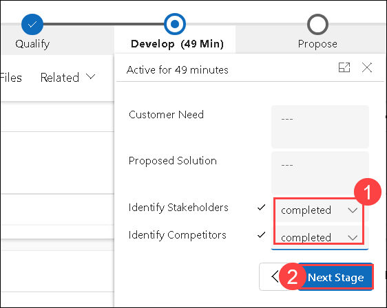

1. On the **Propose (1)** stage, mark all four tasks as **completed (2)**. Select **Next Stage (3)**.

    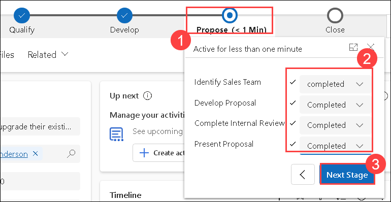

1. On the **Close (1)** stage, mark all tasks as **Completed (2)** and then click the **Finish (3)** button on the business process flow.

   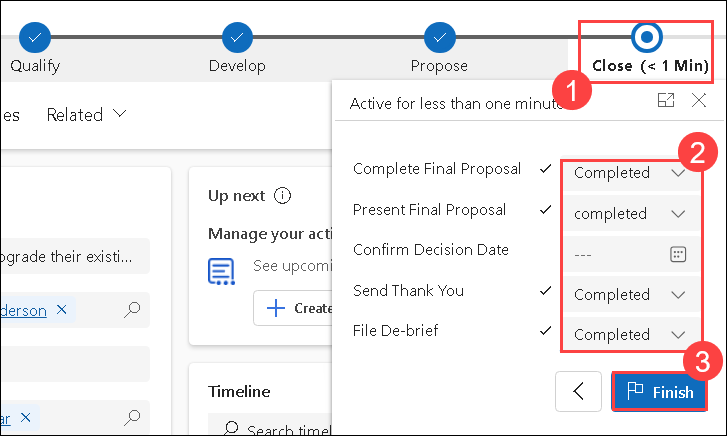

1. Now that you have completed the business process, you need to close the opportunity.

1. On the **Command Bar** of the opportunity, select the **Close as won** button.

    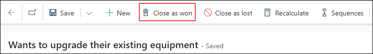

1. On the **Close Opportunity** dialog, select the **OK** button to finish closing the opportunity record.

    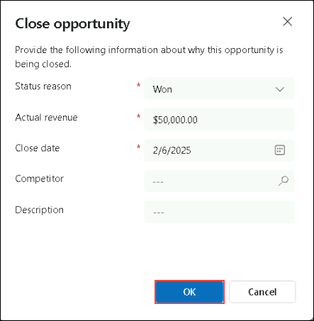

## Review

In this module we have demonstrated proficiency in utilizing tools within Dynamics 365 Sales to progress leads through stages, from initial capture to opportunity closure, effectively optimizing sales workflows.

## You have successfully completed this lab. Click on **Next >>** to procced with next module.
