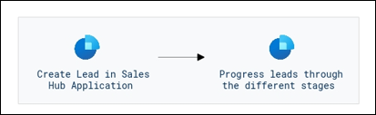
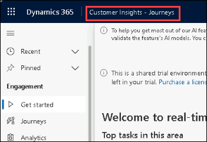
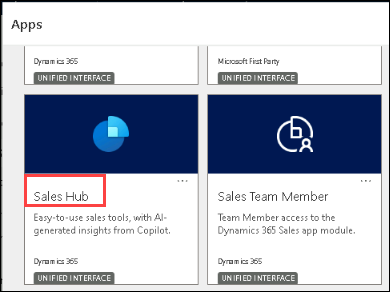
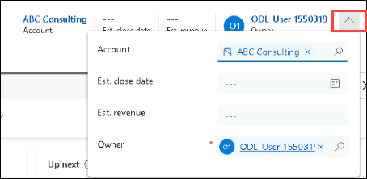

# Module 4: Explore Dynamics 365 Sales

## Objectives

In this module, you will manually be creating a lead for Jane Anderson. Jane works for a company called Jim works for a company called **ABC Consulting**. Not only will you be capturing the lead information in the system, but you will be leveraging the tools available in Dynamics 365 Sales to qualify the lead as an opportunity and work it through closing the opportunity.

## Estimated Time: 60 minutes

## Architecture Diagram

   

## Task 1: Create and manage an opportunity in Dynamics 365 Sales 

1. Click on **Customer Insights - Journeys** from the top left corner and from the list of apps open the **Sales Hub**.

   

   

1. In the **Dynamics 365 Sales Hub** application from the left navigation pane, select **Leads**.

   

1. On the **My Open Leads** view, click on the ellipsis and select the **+ New** button to create a new lead.

   

1. Complete the **Lead** information as follows:

	- **Topic:** Wants to upgrade their existing equipment 

	- **First Name:** Jane

	- **Last Name:** Anderson 

	- **Job Title:** CEO

	- **Business Phone:** 888-555-6767

	- **Email:** JaneA<inject key="DeploymentID" enableCopy="false" />@sample.com

	- **Company:** ABC Consulting 

	- **Street 1:** 1987 191st Ave N

	- **City:** Fargo

	- **State/Province:** ND

	- **Zip/Postal Code:** 58102

1. Select the **Save** button to save the Lead and leave it open.

   

1. On the **Lead to Opportunity** sales process, select the **Qualify** stage.

   

1. Complete as follows:

	- **Purchase Timeframe:** Immediate

	- **Estimated Budget:** $50,000

	- **Purchase Process:** Committee

1. Close the **Qualify** stage fly-out and click on **Save**

   

   

1. On the **Command bar**, select the **Qualify** button.

    
 
     > **Note:** If you do not see the Qualify button, select the **More Commands** button (Looks like three vertical dots).

1. The system will close the **Lead** record and create a new **Opportunity** record. Notice that the **Lead to Opportunity** business process flow has automatically been advanced to the **Develop** stage.

1. On the **Opportunity Header** at the top of the record, select the down arrow next to the **Owner** field.

    

1. Complete as follows:

   - **Est. Close Date:** Two days from today

   - **Est Revenue:** $50,000

        

1. In the **Stakeholders** sub-grid, notice that **Jane Anderson** is already defined as a stakeholder.

    

1. On the **Sales Team** sub-grid, select the **Vertical Ellipsis**. From the menu that appears select **+ New Connection**.

   

1. Search for and choose your user record. Once completed, select the **Add** button.

   

1. On the **Competitors** sub-grid, select the **Vertical Ellipsis** (look like three vertical dots). From the menu that appears select **Add Existing Competitor**.

   

1. On the **Lookup Record** screen, select **+ New Record**, and then select **Competitors**.

1. On the **Quick Create: Competitor** form, set the **Name** field to **Coho Technologies**

1. Select the **Save and Close** button.

   

1. **Coho Technologies** should be selected in the lookup record window. Click the **Add** button to finish adding the competitor.

   

	>**Congratulations** on completing the task! Now, it's time to validate it. Here are the steps:
	
	 > - Click the Lab Validation tab located at the upper right corner of the lab guide section and navigate to the Lab Validation tab.
	 > - Hit the Validate button for the corresponding task.
	 > - If you receive a success message, you can proceed to the next task. If not, carefully read the error message and retry the step, following the instructions in the lab guide.
	 > - If you need any assistance, please contact us at labs-support@spektrasystems.com. We are available 24/7 to help you out.
	
	<validation step="e642cac3-71d8-4e18-bd24-30c694802a39" />

21. On the **Lead to Opportunity** business process flow, select the **Develop** stage.

22. Complete as follows and select the **Next Stage** button to advance to the **Propose** stage.

	- **Identify Stakeholders**: completed

	- **Identify Competitors**: completed

         

23. On the **Propose** stage, mark all four tasks as **completed**. Select **Next Stage**.

    

24. On the **Close** stage, mark all tasks as **completed**.

   

25. Select the **Finish** button on the business process flow.

26. Now that you have completed the business process, you need to close the opportunity.

27. On the **Command Bar** of the opportunity, select the **Close as won** button.

    

28. On the **Close Opportunity** dialog, select the **OK** button to finish closing the opportunity record.

## Review

In this module we have demonstrated proficiency in utilizing tools within Dynamics 365 Sales to progress leads through stages, from initial capture to opportunity closure, effectively optimizing sales workflows.

## You have successfully completed this module.Click Next
