# Module 5: Explore Dynamics 365 Customer Service

## Lab Overview

In this lab, you will learn how to create and manage customer service cases using Dynamics 365 Customer Service Hub. You will go through the complete case lifecycle—from case creation and activity logging to resolution—using the Phone to Case business process flow. 

## Lab Objectives

In this lab, you will be performing the following task:

- Task 1: Create and manage cases in Dynamics 365 Customer Service

## Estimated Time: 60 minutes

## Architecture Diagram

   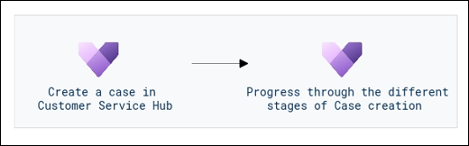

## Task 1: Create and manage cases in Dynamics 365 Customer Service

1. Click on **Sales Hub** from the top left corner and from the list of apps open the **Dynamics 365 Customer Service Hub** application.

   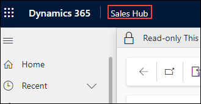

   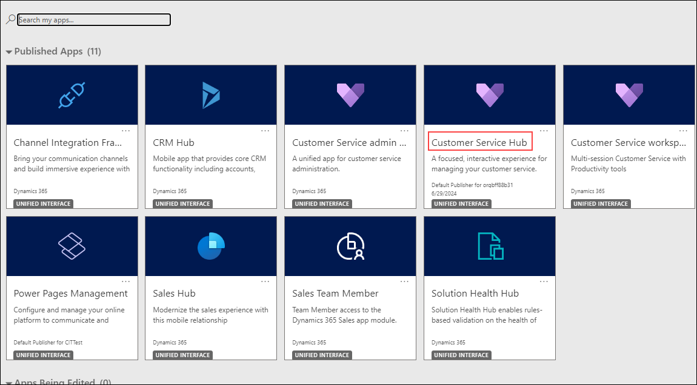

1. Using the navigation on the left, select **Cases**.

   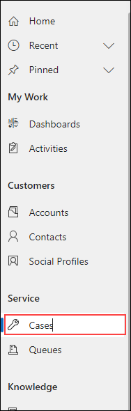

1.  On the **Command Bar**, select the **+ New Case** button to create a new case record.

    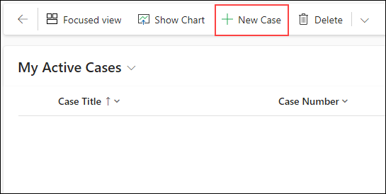

1.  Complete the new case record as follows:

	- **Case Title:** Item arrived Damaged 

	- **Customer:** Jackson Anderson

1.  Select the **Save** button to save the record and leave it open. 

1.  Using the **Timeline**, select the **Plus Sign Icon**, to create a new activity. 

    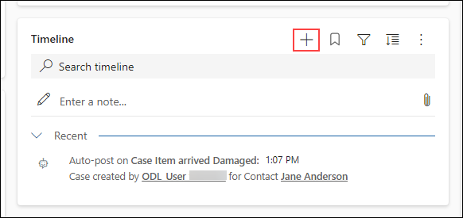

1.  From the menu that appears, select **Phone Call**.

1.  Set the **Subject** field to **Return Call** and leave the rest of the fields as default. Select the **Save and Close** button.

    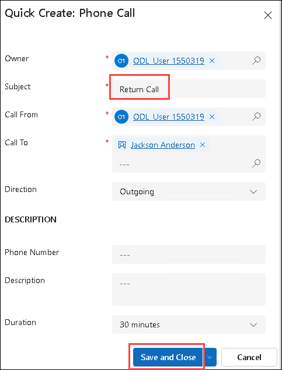

1. On the **Phone to Case Process**, select the **Identify** stage.Select the **Next Stage** button to advance to the **Research** stage.

    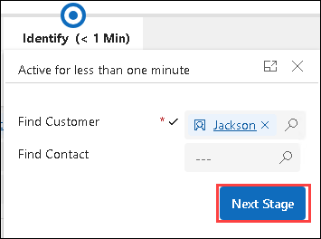

1. Select the **X** on the **Research** stage fly out window so you can continue working. 

1. On the **Timeline**, select the **Phone Call** activity you created earlier. Select **Close activity** to complete the activity. 

   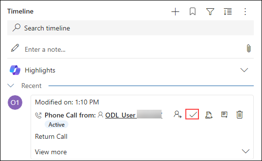

1. On the **Close Phone Call** screen, select the **Close Phone Call** button. 

1. Verify the activity updates to **Closed**. 

   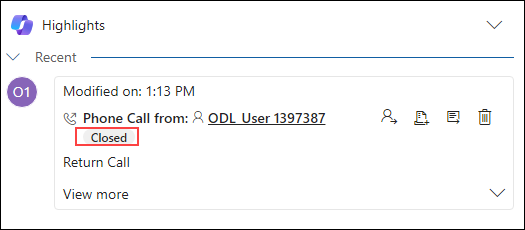

1. On the **Phone to Case Process**, select the **Research** stage, and select the **Next Stage** button to advance to the **Resolve** stage.

    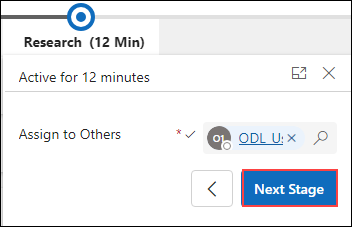

1. On the **Resolve** stage, select the **Finish** button to complete the business process flow. 

    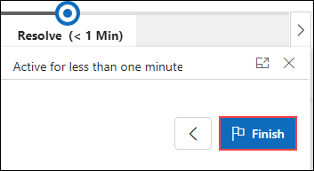

1. On the **Command Bar** for the case record, select the **Resolve Case** button. 

    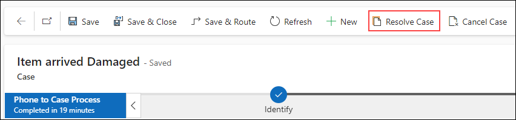

1. On the **Resolve Case** window, set the **Resolution** field to **Knowledge Article**. Select the **Resolve** button to complete the process. 

    

  > **Congratulations** on completing the task! Now, it's time to validate it. Here are the steps:
  > - Hit the Validate button for the corresponding task. If you receive a success message, you can proceed further. 
  > - If not, carefully read the error message and retry the step, following the instructions in the lab guide.
  > - If you need any assistance, please contact us at labs-support@spektrasystems.com. We are available 24/7 to help
	
  <validation step="ae24efd7-832c-441b-9767-bc114d8c10cc" />

## Review

 In this module, we have learnt to utilize Dynamics 365 Customer Service Hub to create and manage cases, demonstrating proficiency in handling customer issues from inception to resolution. 

## You have successfully completed the workshop!
