# Module 5: Explore Dynamics 365 Customer Service

### Estimated Duration: 60 minutes

## Lab Overview

In this lab, you will learn how to create and manage customer service cases using Dynamics 365 Customer Service Hub. You will go through the complete case lifecycle—from case creation and activity logging to resolution—using the Phone to Case business process flow. 

## Lab Objectives

In this lab, you will be performing the following task:

- Task 1: Create and manage cases in Dynamics 365 Customer Service

## Architecture Diagram

   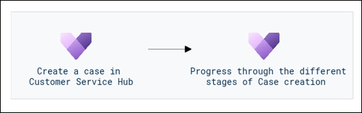

## Task 1: Create and manage cases in Dynamics 365 Customer Service

1. Click on **Sales Hub** from the top left corner.

   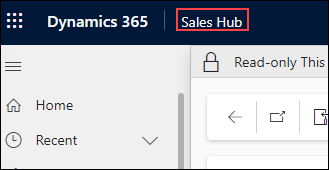

1. From the list of apps open the **Customer Service Hub** application.   

   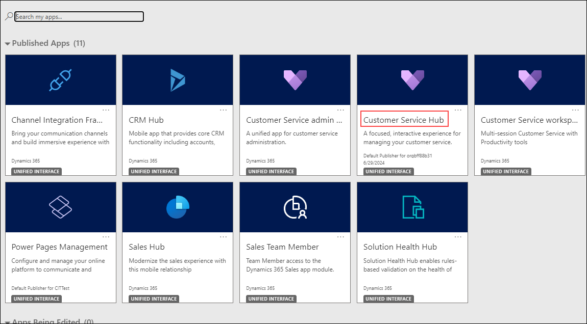

1. Using the navigation on the left, select **Cases** under **Service** section.

   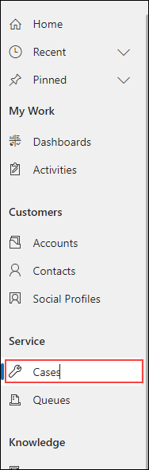

1.  On the **Command Bar**, select the **+ New Case** button to create a new case record.

    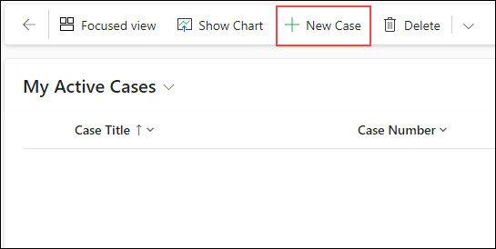

1.  Complete the new case record as follows:

	- **Case Title:** Item arrived Damaged (1)

	- **Customer:** Jane Anderson (2)

    - Select the **Save (3)** button to save the record and leave it open. 
        
        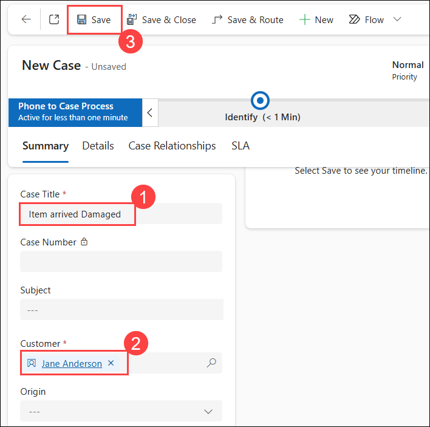

1.  Using the **Timeline**, select the **Plus Sign Icon (1)**, and select **Phone Call (2)**.  

    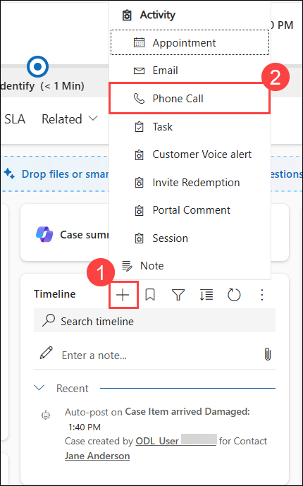

1.  Set the **Subject** field to **Return Call (1)** and leave the rest of the fields as default. Select the **Save and Close (2)** button.

    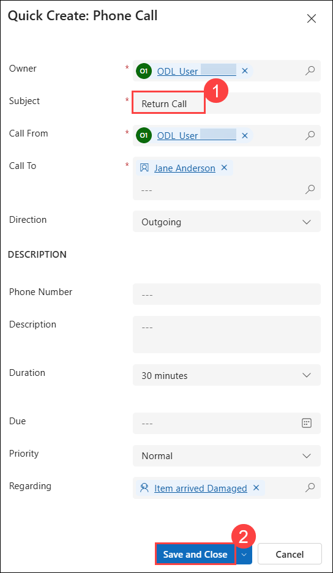

1. On the **Phone to Case Process**, select the **Identify (1)** stage, and select the **Next Stage (2)** button to advance to the **Research** stage.

    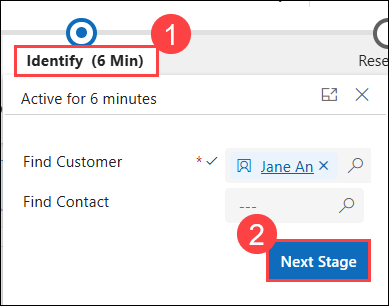

1. Select the **X** on the **Research** stage fly out window so you can continue working. 

   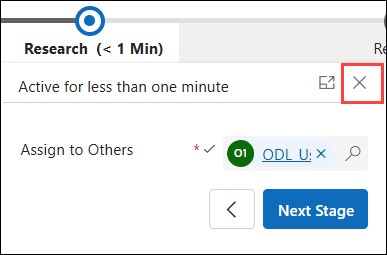

1. On the **Timeline**, select the **Phone Call** activity you created earlier. Select **Close activity** to complete the activity. 

   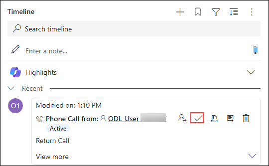

1. On the **Close Phone Call** screen, select the **Close Phone Call** button. 

   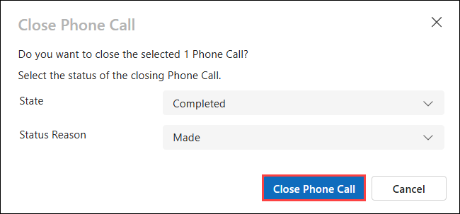

1. Verify the activity updates to **Closed**. 

   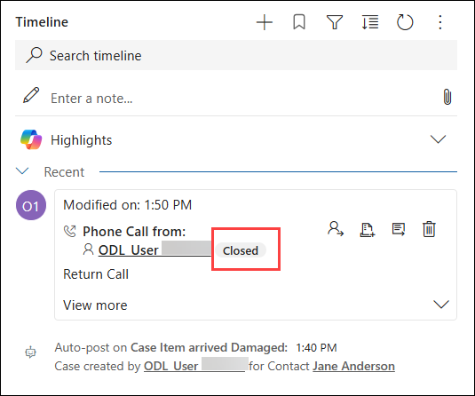

1. On the **Phone to Case Process**, select the **Research (1)** stage, and select the **Next Stage (2)** button to advance to the **Resolve** stage.

    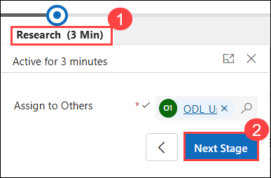

1. On the **Resolve** stage, select the **Finish** button to complete the business process flow. 

    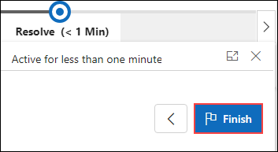

1. On the **Command Bar** for the case record, select the **Resolve Case** button. 

    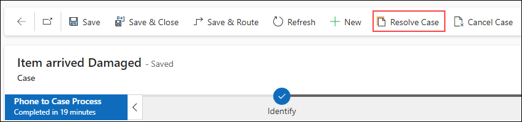

1. On the **Resolve Case** window, set the **Resolution** field to **Knowledge Article (1)**. Select the **Resolve (2)** button to complete the process. 

    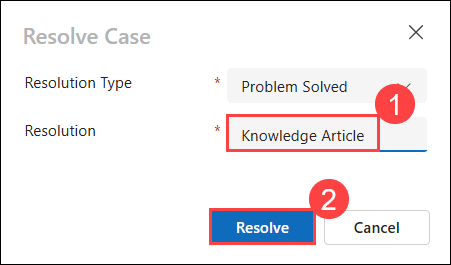

## Review

In this exercise, you have completed the following:

   - Utilized Dynamics 365 Customer Service Hub to create and manage cases.
   - Handled customer issues from initiation through to resolution.
   - Demonstrated proficiency in case management workflows and tools.

## You have successfully completed this workshop!
