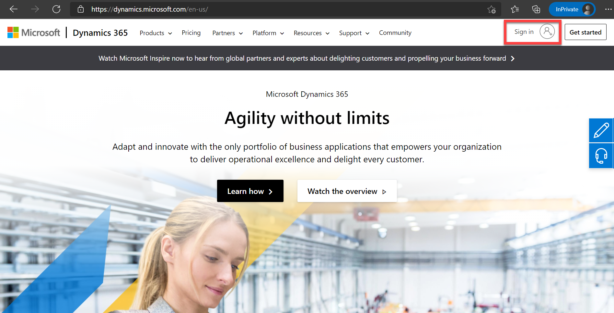
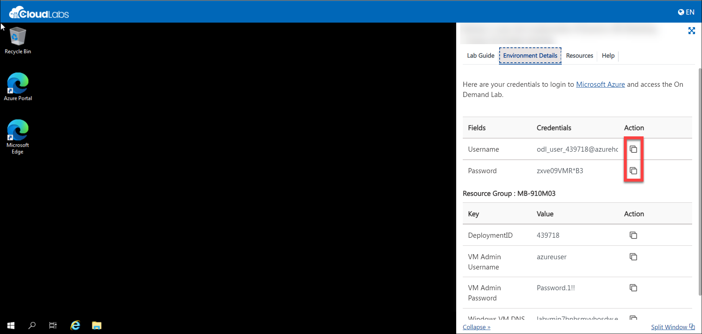

Module 1: Learn the Fundamentals of Dynamics 365 Marketing
========================

Exercise 1 - Access the Dynamics 365
------------------------------------

### Task 1 – Log into the Dynamics 365

1.  Navigate to this web URL in a new private window -> <https://dynamics.microsoft.com/en-us/> .

    

2. In the lab environment, navigate to environment details page as shown in the below image and use the given user credentials to login into dynamics 365. Use the button next to the user details to copy the values.

    

3. After logged in, click on the products tab from the top navigation pane and from the options find marketing and click on it to open the marketing portal. Refer below screenshot for reference.

    
    
4. Click on **Try for free**. 

    

5. Click on **Start your free trial**.

    

6. Enter country/region and phone number and tick the statement and click on **Submit**.

    

7.  Explore the navigation pane on the left hand side. 

8.  The button on the bottom of the pane allows you to change areas. You are currently viewing the **Marketing** area. 

    

9.  Select **Marketing** at the bottom of the navigation pane and select the **Events** area. Explore the **Events** area of the navigation pane. 

    
    
    
    
    

10. Spend a few minutes exploring the application and then return to the **Marketing** area.
