Module 1: Learn the Fundamentals of Dynamics 365 Marketing
========================

## Practice Lab 1.2 - Work with customer engagement apps 

## Objectives

During this exercise, you will see that it is very easy to access the different Dynamics 365 applications available to you directly from the Home screen. Once you have opened an app, you can easily switch between the different applications as required. Accessing and using the basic functionality in Dynamics 365 applications is something you as a user will do daily.

## Lab Setup

  - **Estimated Time**: 15 minutes

## Instructions

In this exercise, you will become familiar with how to access the different Dynamics 365 Customer engagement applications by using the Dynamics 365 Home screen. 

1.  Navigate to this web URL in a new private window -> <https://admin.powerplatform.microsoft.com/> .

1. In the lab environment, navigate to environment details page as shown in the below image and use the given user credentials to login into dynamics 365. Use the button next to the user details to copy the values.

    

1. After logged in, create environment for launching the sales portal , follow the below steps. Click on **Environments** and click on **+ New**

    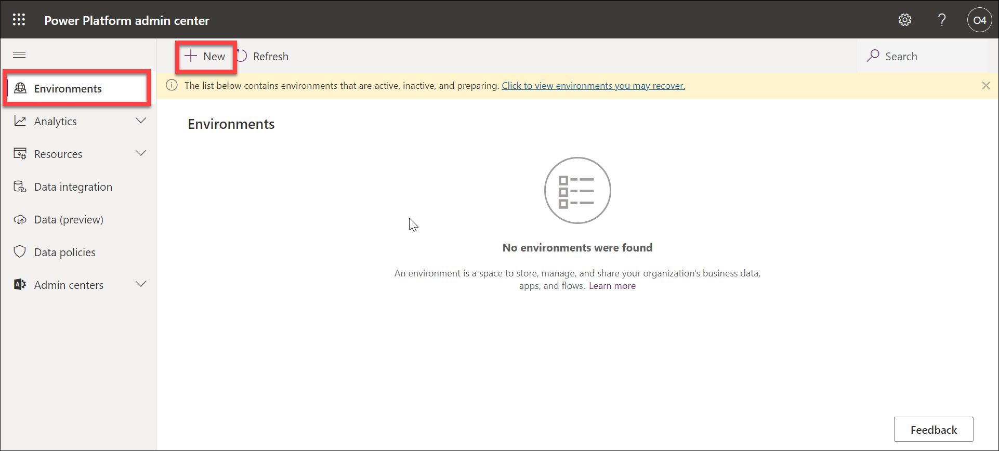

1. On the right tab , enter Name - **Sales-DeploymentID** , type - **SandBox** , Create a database for this environment - **Yes** and click on **Next**

    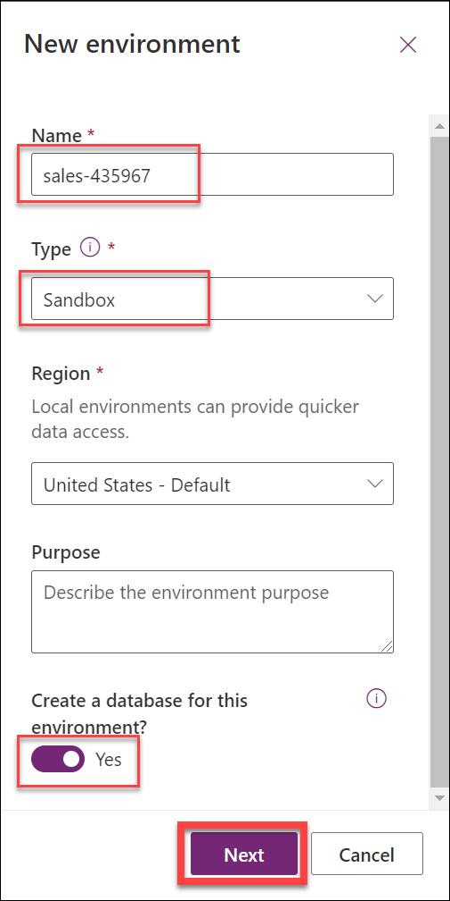
    
1. Next navigate towards the middle and enable **Enable Dynamics 365 apps** to **yes**. and Under **Automatically deploy these apps** select **Sales Enterprise**.

    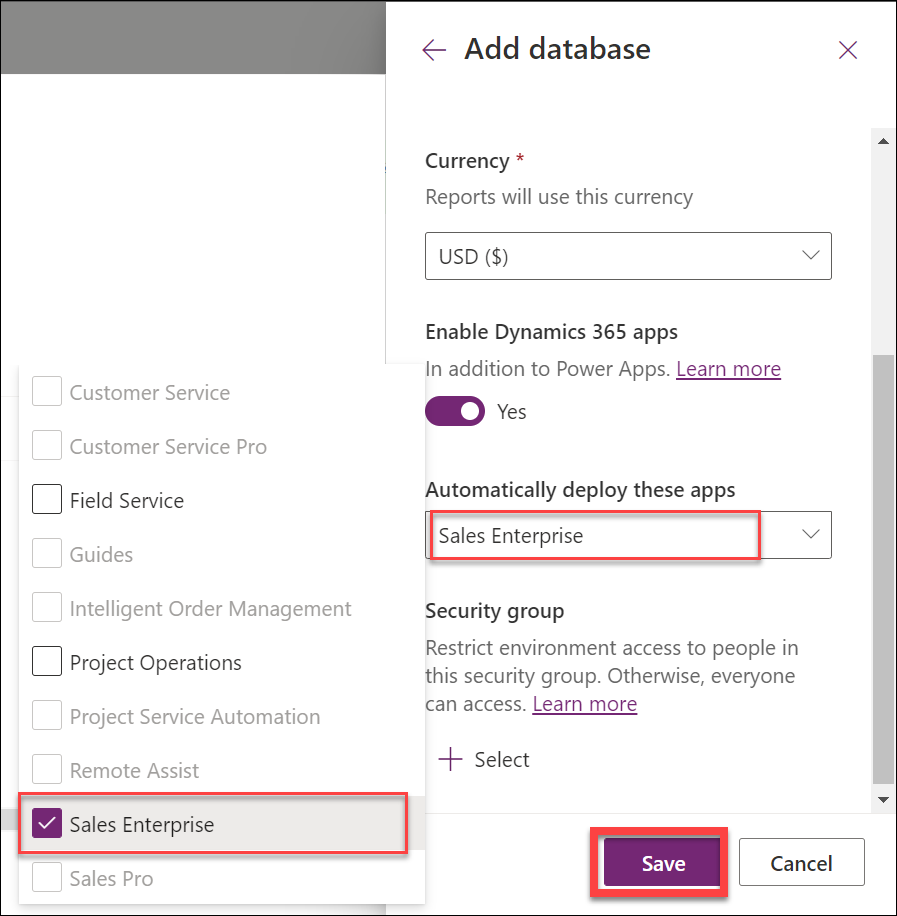
    
1. See the options as per the image below and click on **Save**.

    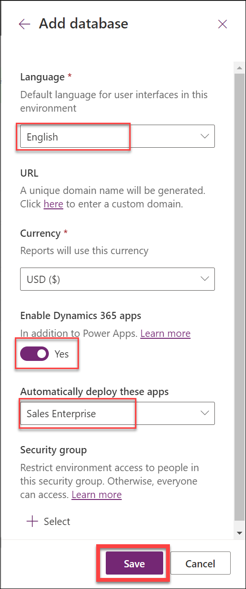
    
1. Now under Environments, the new environment has started with the name **Sales-DeploymentID** and click on it to open.

    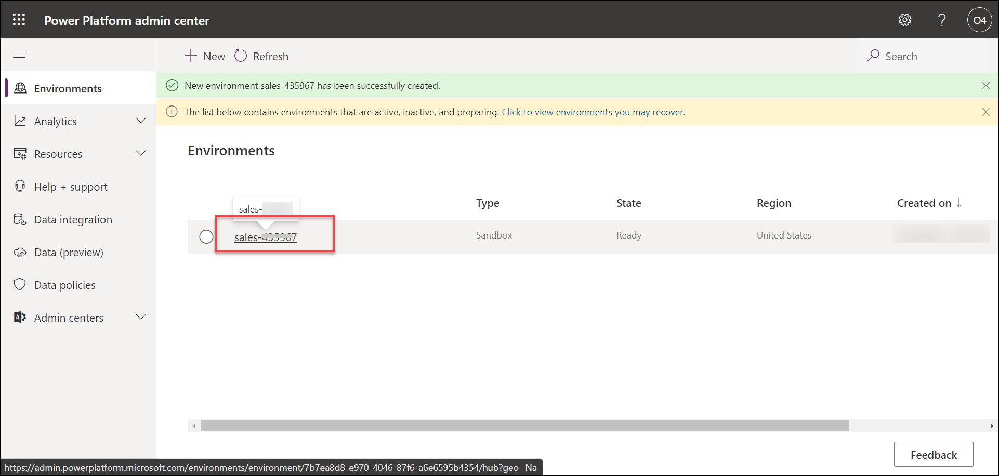

1. Inside the environment, Find and Click on URL to open the sales hub platform in dynamics 365.

    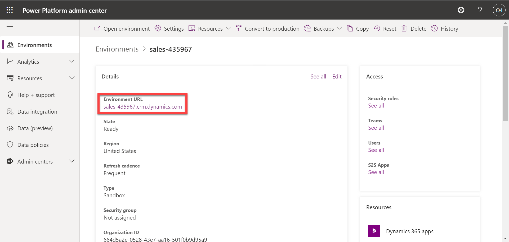
    
1. Now the apps page will appear.

    

1. Type the text **Sales Hub** and select the **Sales Hub** app to open it. 

    

1. When you are within an app, there will be different areas that you can work with based on what you are trying to do. For example, the Sales Hub application contains different administrative settings that you can work with. 

    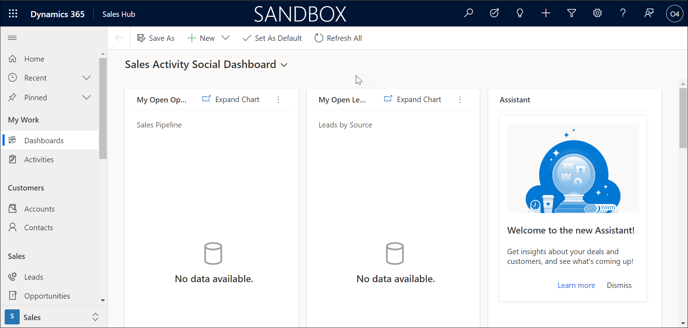

1. On the lower left side of the navigation pane, Select **Sales** and change to the the **App Settings** area. Explore the application settings.

    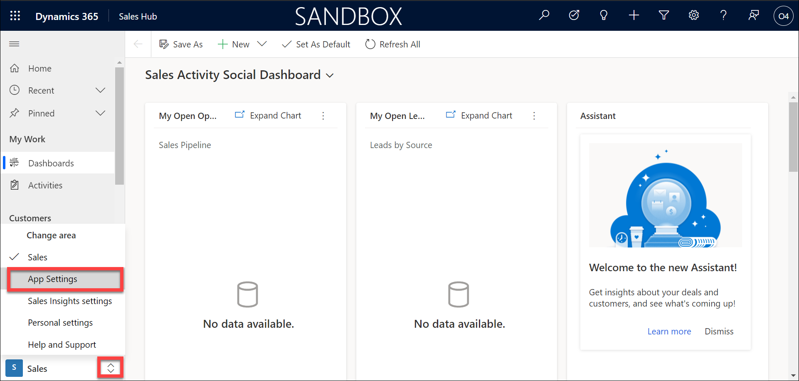
    
    

1. Select the Area selector again and change it from **App Settings** back to **Sales**.

    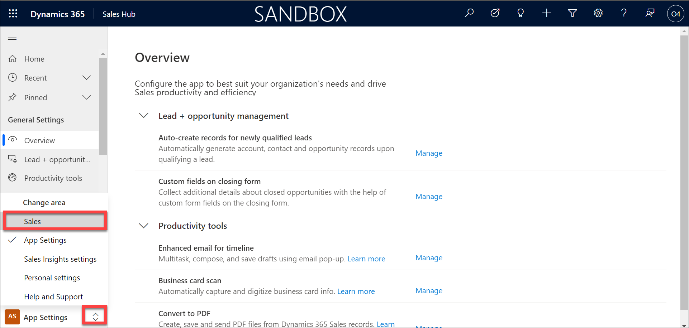

1. If you want to switch from the Sales app to a different app such as Customer Service hub, select the **Sales Hub** text in the upper left part of the screen next to the text Dynamic 365. 

    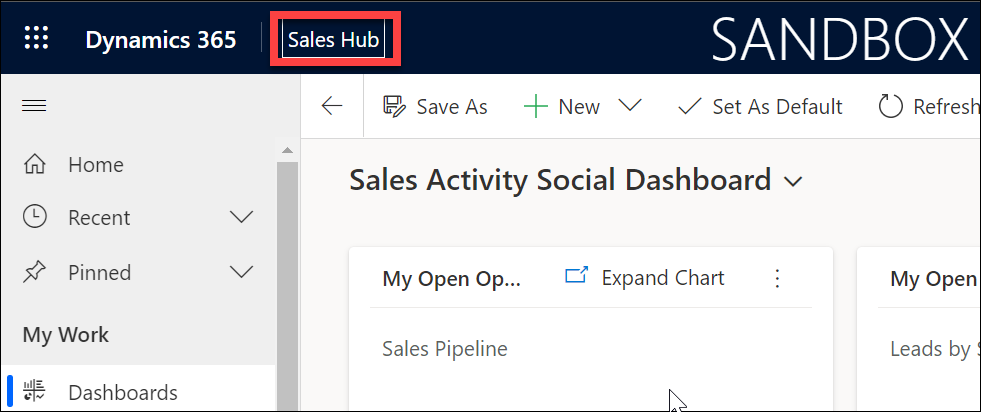

1. The Apps screen will appear, select **Customer Service Hub** and you will be taken to the Customer Service Hub Application. 

    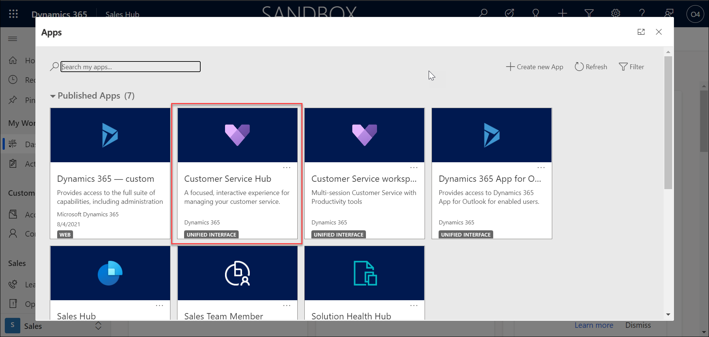

1. Select the **Customer Service Hub** text at the top to switch back to the **Sales Hub** App. 

    
