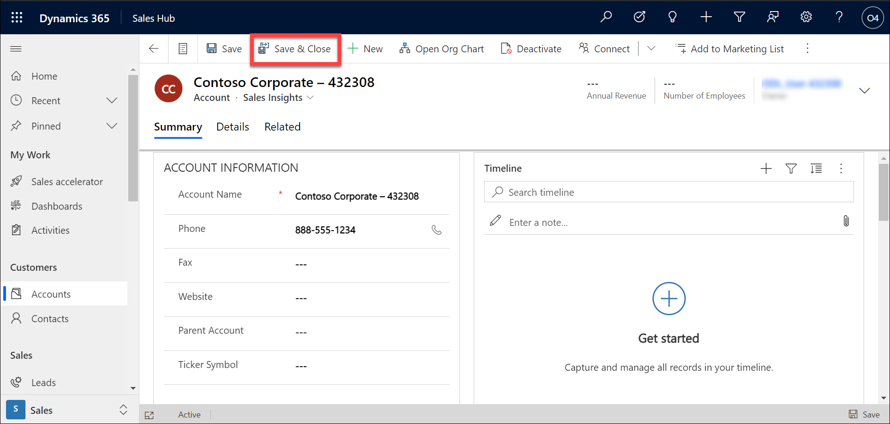
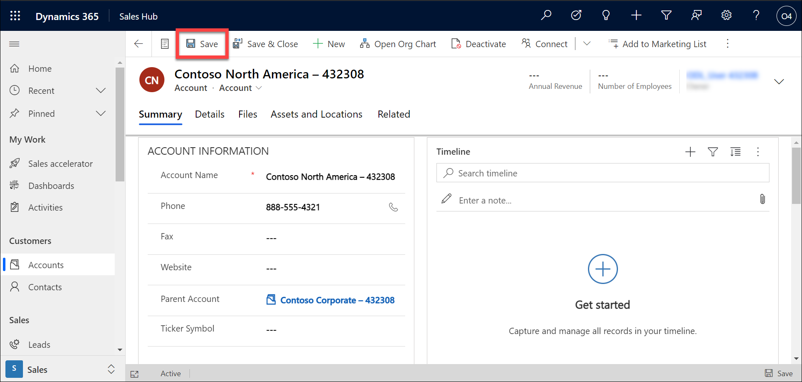
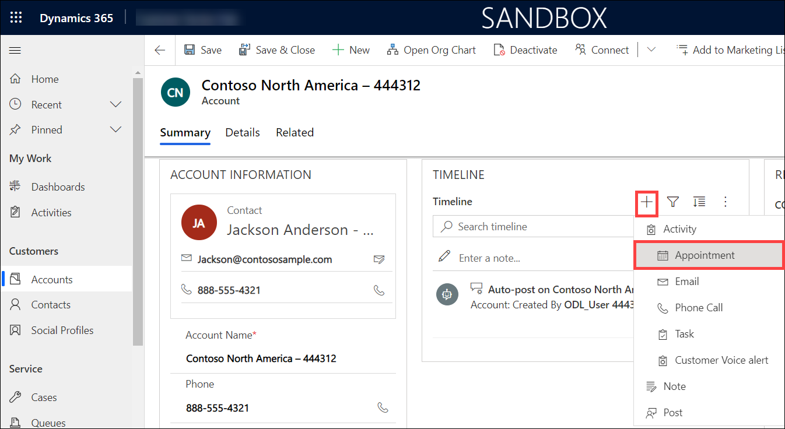
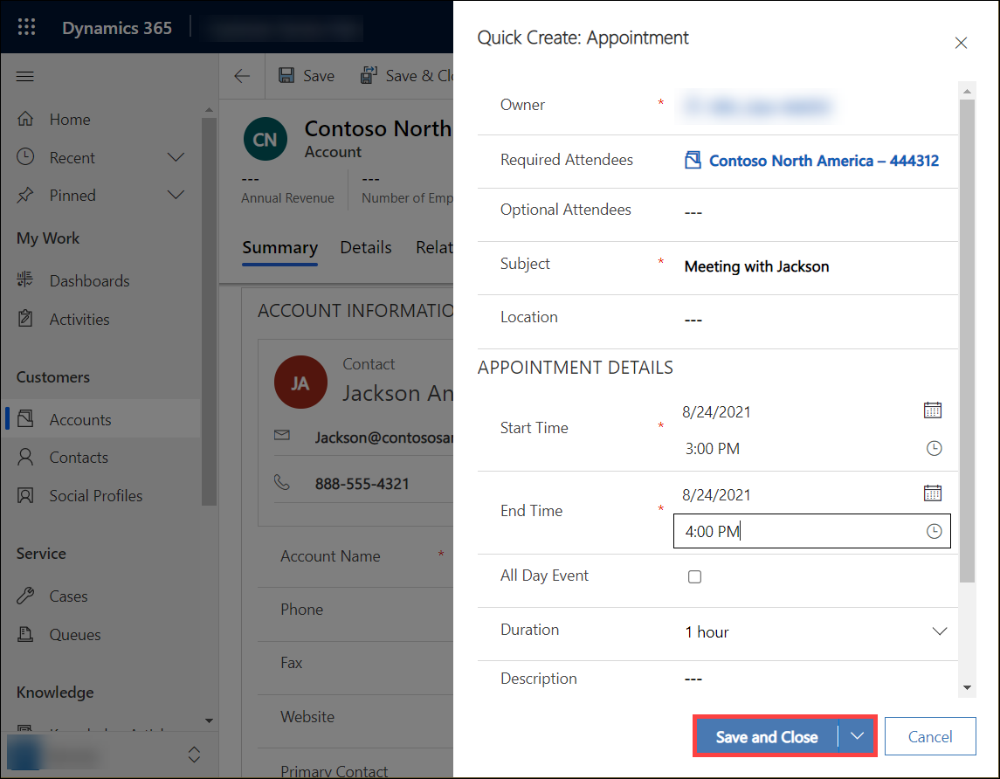
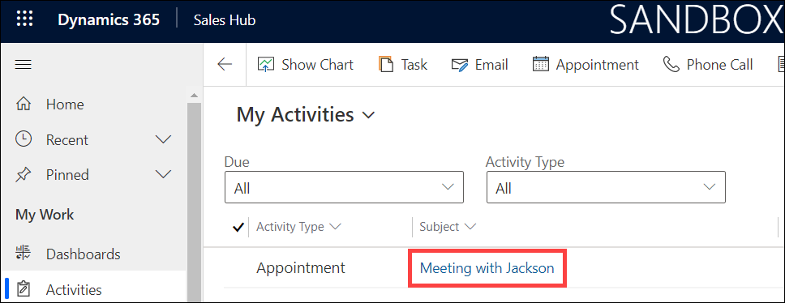
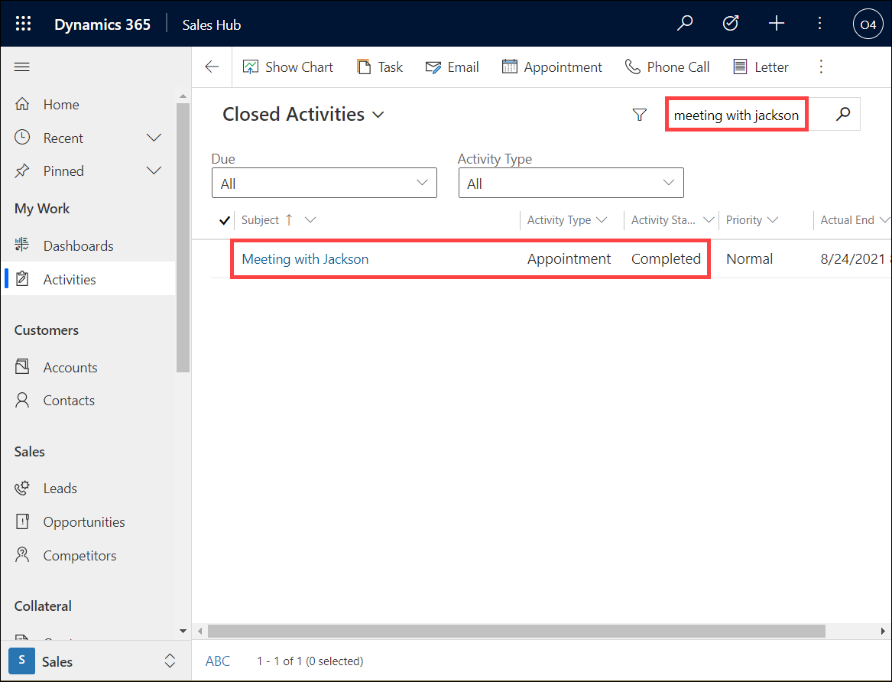

## Module 1: Learn the Fundamentals of Dynamics 365 Marketing

## Practice Lab 1.3 - Manage Customers and Activities

## Objectives

Defining and working with account and contact records in Dynamics 365 applications is one of the most common activities you will do. Once accounts and contacts are created, activities such as phone calls, tasks, and appointments will represent the interactions that you have with your customers.

## Lab Setup

  - ## Estimated timing: 15 minutes

## Instructions

In this exercise, you will be working with common records that are used by all Dynamics 365 customer engagement apps. 

1. If is not open already, open the **Dynamics 365 Sales Hub** application. 

2. Using the navigation on the left side of the screen, select **Accounts**. 

3. On the Command Bar at the top of the screen, select the **New** button.

    

4. Complete the account record as follows:

	- **Account Name:** Contoso Corporate – deploymentID

	- **Phone:** 888-555-1234

	- **Address 1 Street 1:** 191 181st Ave N

	- **Address 1 City:** Seattle

	- **Address 1 State/ Province:** WA

	- **Address 1 Postal Code:** 98101
        
	- **Address 1 Country/Region:** United States

    
5. On the Command Bar, select the **Save and Close** button to save and exit the account record.

    
    
    

6. On the Command bar, for the list of accounts, select the **New** button again

7. Complete the account record as follows:

	- **Account Name:** Contoso North America – deploymentID

	- **Phone:** 888-555-4321

	- **Address 1 – Street 1**: 187 11th ST N

	- **Address 1 City:** Chicago

	- **Address 1 State/ Province:** IL

	- **Address 1 Postal Code:** 60176

	- **Address 1 Country/Region:** United States

8. Set the **Parent Account** field to the **Contoso Corporate** account you created earlier. 

    
    
    

9. Select the **Save** button to save the account and leave it open.

    

10. Locate the **Contacts Sub-grid** on the right side of the screen. You need to scroll down to find this.

11. Select the **Vertical Ellipsis**, and from the menu that appears, select **New Contact**.

    

12. Using the **Quick Create Contact** form, complete the contact as follows:

	- **First Name:** Jackson

	- **Last Name:** Anderson - deploymentID

	- **Job Title:** CEO

	- **Email:** Jackson@contososample.com

13. Select the **Save and Close** button.

    

14. Just above the Contact sub-grid, select the **Primary Contact** field, and set it to the **Jackson Anderson** contact you just created.

    

15. On the **Record Timeline** located in the middle of the screen, select the **+** icon to add a new activity item. 

16. From the menu that appears, select **Appointment**

    

17. Complete the Appointment as follows:

	- **Subject:** Meeting with Jackson

	- **Start Time:** Today at 3:00 PM

	- **End Time:** Today at 4:00 PM

18. Select the **Save and Close** button. 

    

19. Wait while the timeline automatically refreshes. 

20. Notice that the **Timeline** now displays information about the appointment. 

21. **Save and close** the account. 

    

22. In the **My Work** section of the navigation pane, select **Activities**.

23. Select the **Meeting with Jackson** link to open the appointment row and display the form. Use the search bar in upper-right corner to find the row by searching **Meeting with Jackson**. 

    
    
    

24. With the appointment record open, from the **Command Bar**, select the **Mark Complete** button to complete the appointment.

    

25. Notice that the appointment is no longer listed in the **My Activities** view. 

    

26. Select the **My Activities** view to change to the **Closed Activities** view. The completed **Meeting with Jackson** appointment is displayed.

    
    
    
