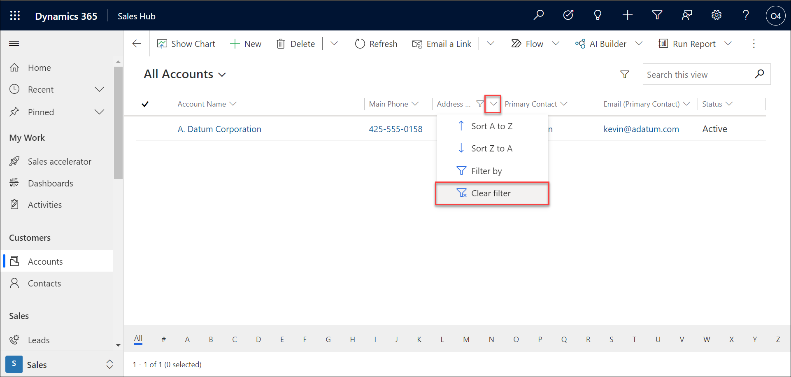
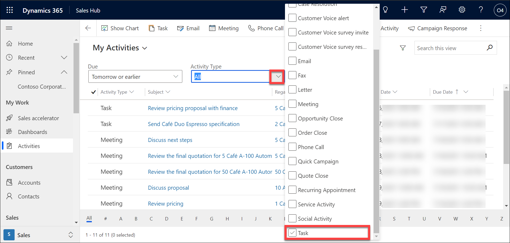
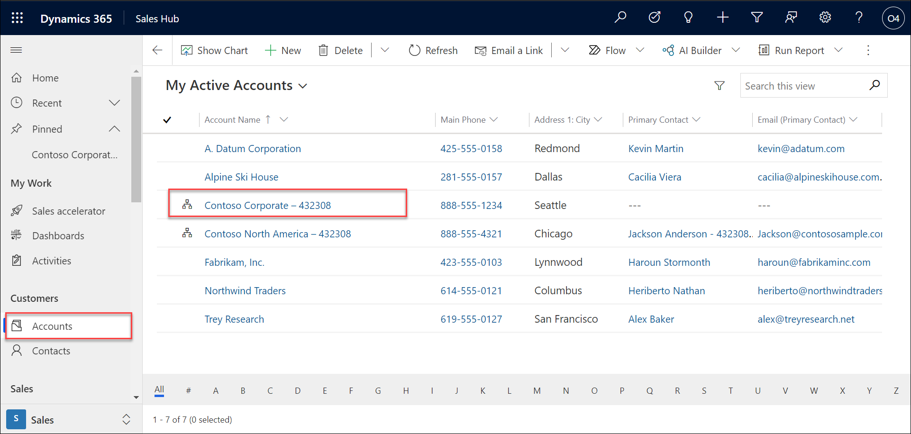

## Module 1: Learn the Fundamentals of Dynamics 365 Marketing

## Practice Lab 1.4 - Search and filter data

## Objectives

Locating data in the application is almost a daily task. The more efficient you are at finding and searching, the quicker you will be at handling customer inquiries, and navigating through the application in general.  This lab will walk you through the process.

## Lab Setup

  - **Estimated Time**: 15 minutes

## Instructions

In this exercise, you will leverage the searching and filtering capabilities of Dynamics 365 to locate and work with different records. 

1. If is not open already, open the **Dynamics 365 Sales Hub** application. Refer practice lab 1.2, if need help in accessing sales hub

2. Using the navigation on the left side of the screen, select **Accounts**. Change to the **All Accounts** view.

    

3. select the **Address 1 City** column and From the menu that appears, select **Filter By**.

    

4. In the Filter by box, leave the **operator** as **Equals**, enter **Redmond** for the value, press **enter** or select **Apply** to filter by Redmond.

    

5. Notice that only accounts with a city of Redmond are being displayed. 

6. Select the **Address 1 City** column again, from the menu that appears select **Clear Filter**. 

    

7. Locate the **Search this View** field on the upper right side of the screen, enter the text **Contoso** and press **enter**.

    
    
    

8. Notice that the Contoso accounts are displayed. 

9. Select the **Contoso Corporate** link to open the record. 

    

10. On the **Record Timeline** in the middle of the screen, select the **+** icon to add a new activity. 

11. From the menu that appears, select **Task**.

    

12. Complete the **Quick Create Task** form as follows:

	- **Subject:** Send Marketing Materials -Your Initials

	- **Due:** Tomorrow at 8:30 AM

	- **Priority:** High

13. Select the **Save and Close** button.

    

14. On the **Command Bar** for the Contoso Corporate account, select the **Save and Close** button to exit the record. 

    

15. Using the navigation on the left side of the screen, select the **down arrow** next to the word **Recent** to expand the **Recently Viewed Records** section. Notice that Contoso Corporate is on the list. 

    
    
    

16. Since we will be working with Contoso Corporate a lot, hover over the record name in the recent list and select the **Pin Icon**. Contoso Corporate will be added to the pinned section. 

    

17. Expand the **Pinned** section to verify that Contoso Corporate is listed. 

    

18. Using the navigation on the left, locate and select **Activities** under the **My Work** heading.

19. Under the my **All Activities** view, set the **Due** filter to **Tomorrow or earlier**.

    

20. Set **Activity Type** filter to **Task**.

    

21. Select the **Send Marketing Materials text** to open the task you created earlier. 

    

22. On the **Command Bar**, select the **Mark Complete** button. 

    

23. Using the navigation on the left, select **Accounts**.

    

24. Open the **Contoso Corporate** account record and verify that the **Send Marketing Materials** task is displaying as **Closed** on the Record Timeline. 

    

25. Select **Save and Close** on the account record to leave the account record. 

    
