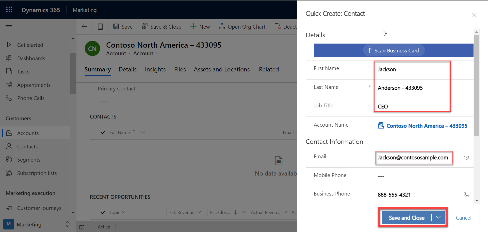

## Module 1: Learn the Fundamentals of Dynamics 365 Marketing

## Practice Lab 1.5 - Create a Segment in Dynamics 365 Marketing

## Objectives

During this exercise you will see that it is very easy to create customer segments that target specific contacts based on common demographic information such as where they live or interests. The creation on customer segments in Dynamics 365 Marketing is extremely common because customer segments are used for key marketing activities such as defining the target contacts in Customer Journeys.

## Lab Setup

  - **Estimated Time**: 20 minutes

## Instructions

1. Open the Dynamics Marketing application. The **Marketing** area should be selected.

1. Using the navigation on the left side of the screen, select **Accounts**. 

1. On the Command Bar at the top of the screen, select the **New** button.

    

1. Complete the account record as follows:

	- **Account Name:** Contoso North America – deploymentID

	- **Phone:** 888-555-4321

	- **Address 1 – Street 1**: 187 11th ST N

	- **Address 1 City:** Chicago

	- **Address 1 State/ Province:** IL

	- **Address 1 Postal Code:** 60176

	- **Address 1 Country/Region:** United States

    
1. Enter the above information and click on the save button.

    
    
1. Locate the **Contacts Sub-grid** on the right side of the screen. You need to scroll down to find this.

1. Select the **Vertical Ellipsis**, and from the menu that appears, select **New Contact**.

    

1. Using the **Quick Create Contact** form, complete the contact as follows:

	- **First Name:** Jackson

	- **Last Name:** Anderson - deploymentID

	- **Job Title:** CEO

	- **Email:** Jackson@contososample.com

    
    
1. Just above the Contact sub-grid, select the **Primary Contact** field, and set it to the **Jackson Anderson** contact you just created.

    

1. Select the **Save and Close** button.

    

1. Select **Segments** under **Customers**.

1. On the command bar, select **New**.

1. From the drop-down menu that appears, select **New Dynamic Segment**.

    

1. In the **Segment Templates** dialog box that opens, select **Skip** to close it and continue to the **New Segment** screen.

    

1. Select **Add query block** to create a query against the contact table. 

    

1. Select the **Select attribute** control.

    

1. Type "city" to filter the list and select **Address 1: City**.

    
    
1. Leave the next drop-down list set to **Is**. 

1. Clck **Type to search** and type **Chicago**.

    

1. Select the **Name** field at the top of the query and enter **Chicago Contacts - DeploymentID**.

1. Select **Save** on the command bar to save your segment.

    

1. Select **Go Live** to publish the segment.

    

1. Wait for about a minute and then select **Refresh** on the command bar to refresh the page. 

1. You should now see that a **Members** tab has been added. Jackson Anderson is listed.
