## Module 1: Learn the Fundamentals of Dynamics 365 Marketing

## Practice Lab 1.6 - Create a simple Customer Journey

## Objectives

During this exercise you will see that Customer Journeys are a key component in Dynamics 365 Marketing. You will create customer journeys as a basis for any marketing effort to guide the path a customer takes while interacting with your organization's marketing process. The goal of the journey, when it is complete, is to turn them into revenue.

## Lab Setup

  - ## Estimated timing: 10 minutes

## Instructions

**Note:** Marketing Emails cannot be created or edited in Internet Explorer. Please use Microsoft Edge or Google Chrome to complete this exercise.

**Note:** Before we create a customer journey, we need to make sure that we have an active email that can be added to the customer journey. 

1. If necessary open the Dynamics 365 Marketing Application. 

2. Using the navigation on the left, select **Marketing emails** under the Marketing Execution group.

3. Select the **Created on** column and select **Sort Olderst to Newest**. Locate and open the **Introduction to Chairs** marketing email.

    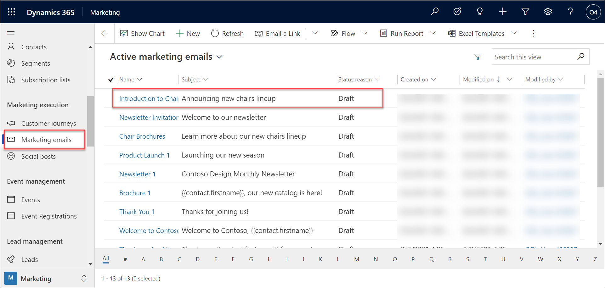

4. We need to add a active mail id that will be able to receive just for trial purpose.
    
    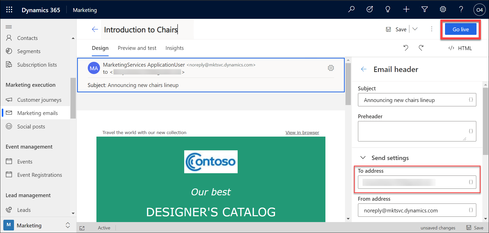

5. On the **Command Bar** at the top, select the **Go Live** button. Will receive a message the from address is not authenticated , please ignore and it will not cause a issue now as its for testing purpose but for real situations , we need to authenticate.

    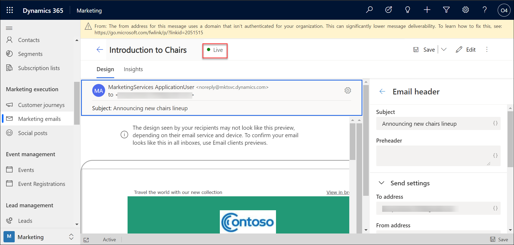

6. Now that the email is live, use the navigation on the left to select **Customer Journeys** under the Marketing Execution group

7. Using the command bar, select **New**.

    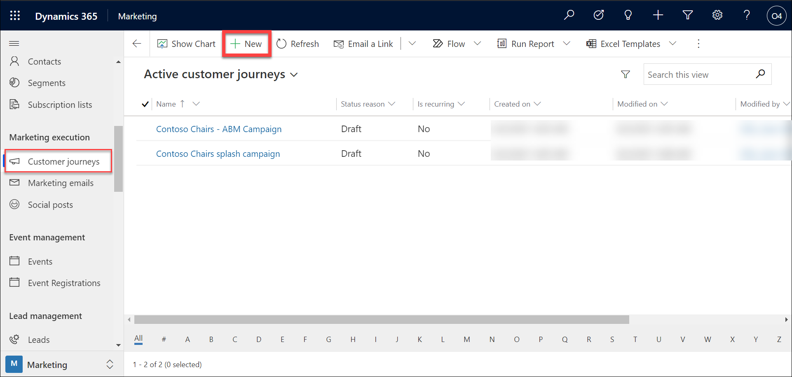

8. The **New Customer Journey** page opens with the **Select a Customer Journey Template** dialog box shown. Select **Skip** to start creating the journey from scratch.

    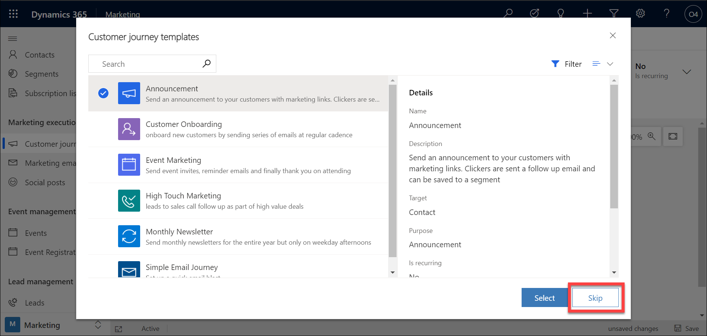

9. Select **Set audience** (or, alternatively, select **+**). Select the Chicago Customers segment (enter chicago and wait till it loads and then select) that you created in the previous exercise. The first tile populates with the segment name and the **Audience** pane displays the segment properties.

    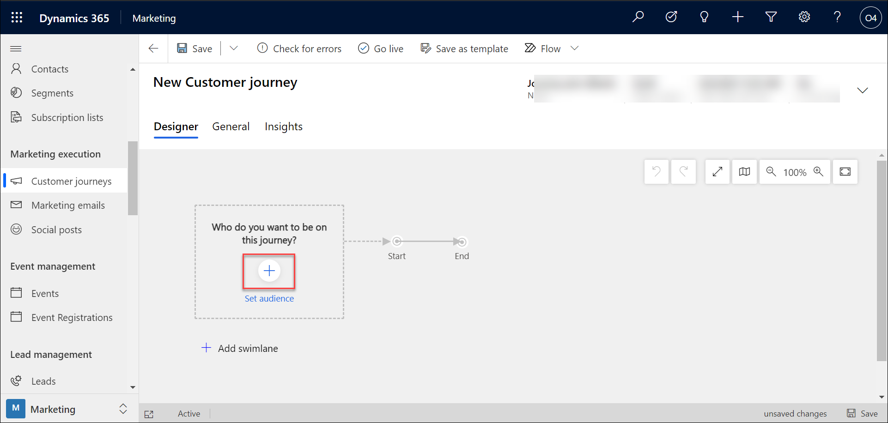
    
    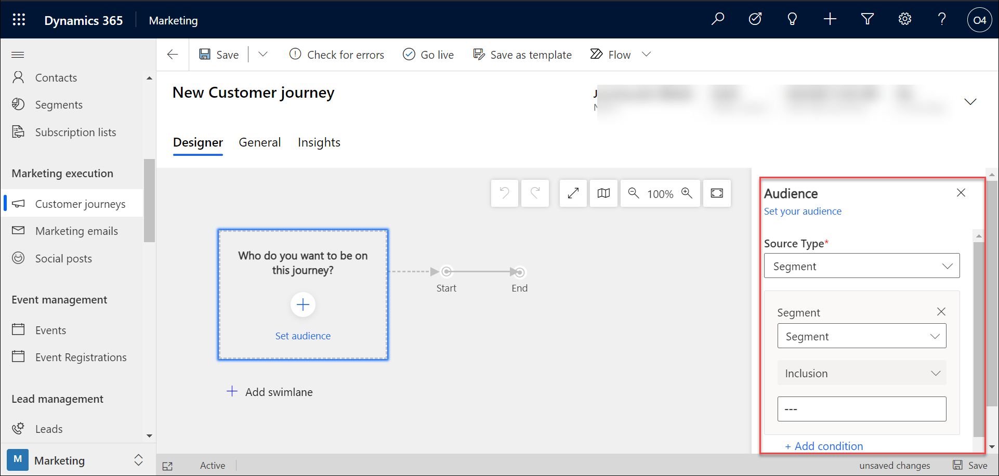
    
    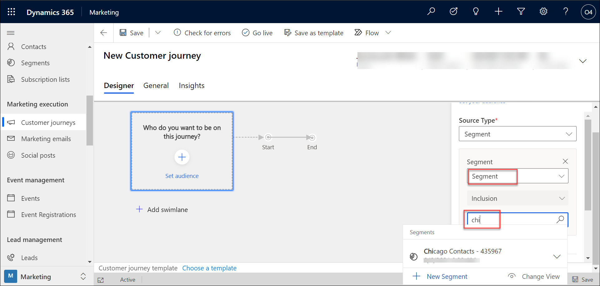

10. Select **+** on the Chicago Contacts swimlane, and then select **Send an email** from the contextual menu.

    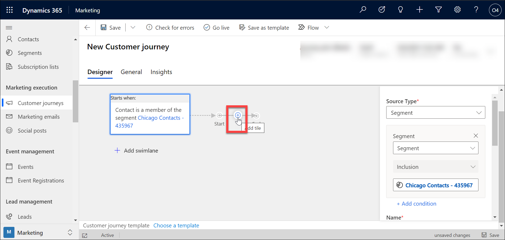
    
    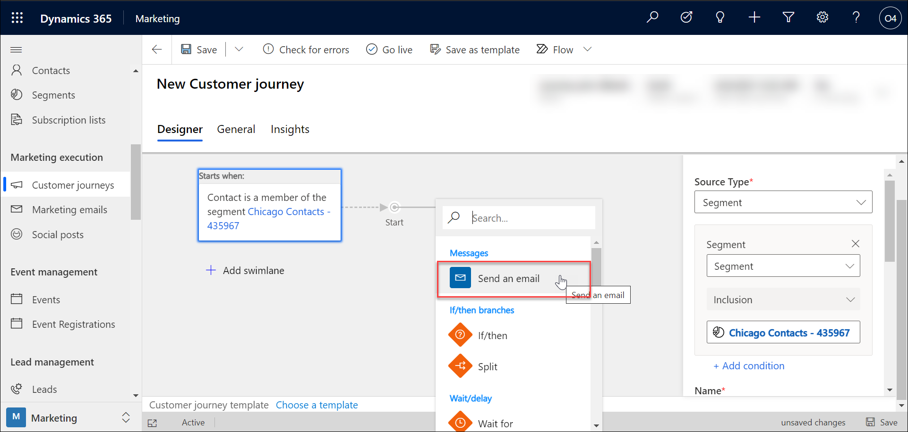

11. Select the **Introduction to Chairs** email that you activated earlier. 

   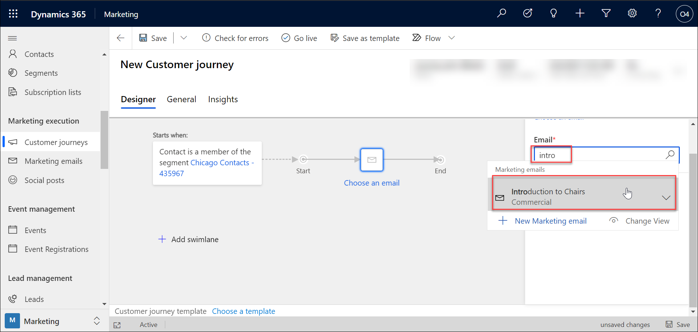

12. Select the General tab located towards the top of the Customer Journey Record. Enter the following information into the **General** tab:

	- **Name**: Chicago Customer Journey

	- **Start date and time**: Enter Todays Date

	- **End date and time**: One Month from Today

	- **Time zone**: Select your local time zone 

   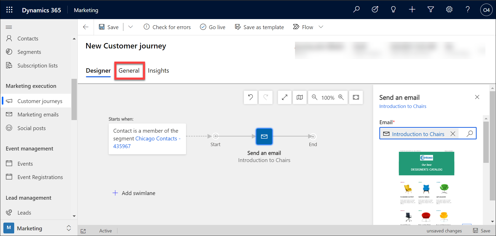

   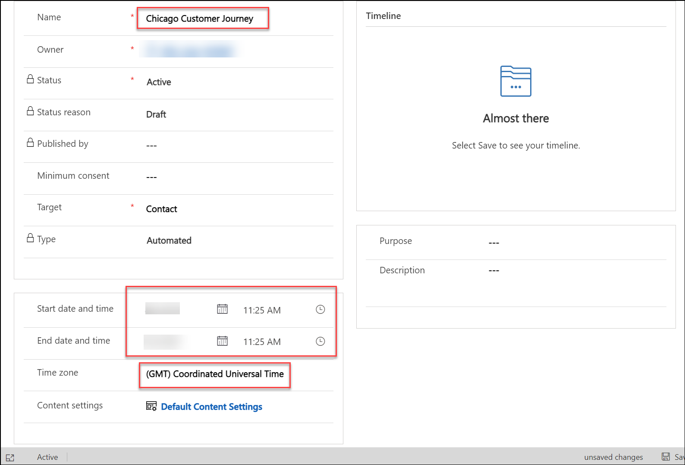
13. On the command bar, select **Save** to save the work you've done so far.

   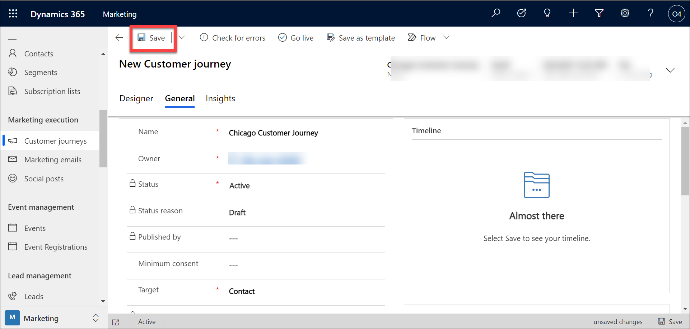

14. Your journey is now ready to go. To start the journey, publish it by selecting **Go live** on the command bar.

   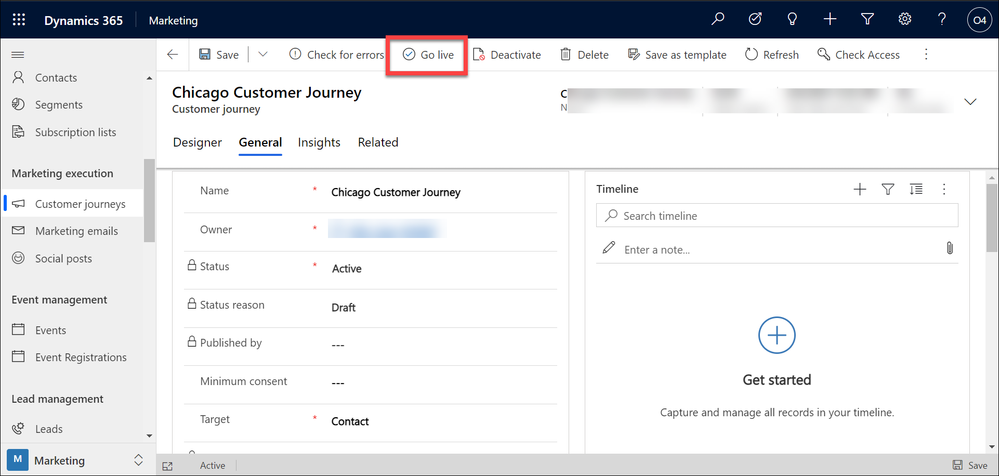
   
15. We can stop the live by clicking on **Stop**

   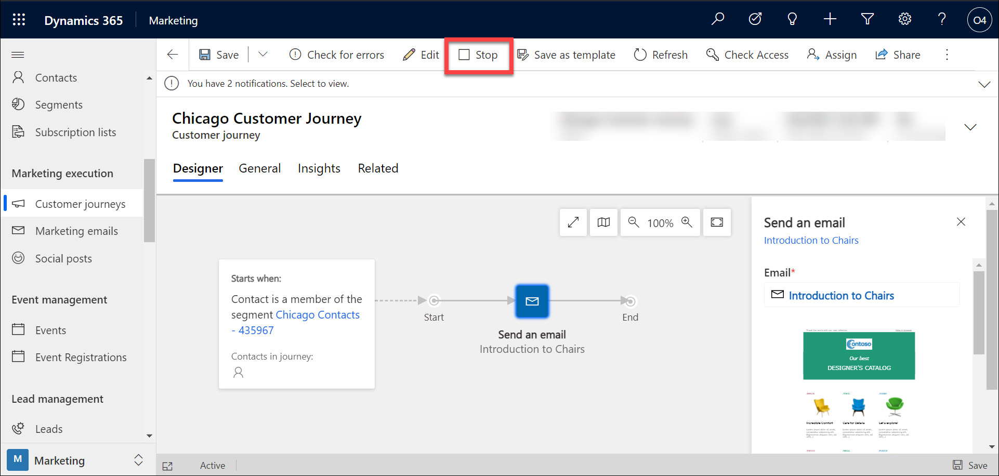
