## Module 1: Learn the Fundamentals of Dynamics 365 Marketing

## Practice Lab 1.7 - Dynamics 365 Marketing capstone lab

**Note:** Marketing Emails cannot be created or edited in Internet Explorer. Please use Microsoft Edge or Google Chrome to complete this exercise.

## Lab Scenario

ABC company specializes in the manufacturing, selling, installation and servicing of security equipment. Their products include both indoor and outdoor security cameras, moisture and fire sensors, monitoring services, and more. 

ABC company uses Dynamics 365 applications to engage with all their customers across different areas of their organization from sales to service. 

**Sales and Marketing**

ABC Company markets to their residential customers directly through targeted marketing campaigns. Customers are targeted based on their city, and other factors. Marketing materials are sent through email and based on their interaction with the email are guided accordingly. 

While some of their smaller products are sold through retailers, most products are sold direct to consumers by their internal sale staff.

Internally, they focus on two key areas: 

- **Residential Customers:** Residential customers are typically looking for either individual components, or to buy a whole home solution. These sales cycles are typically shorter and originate from social media, websites, referrals, or direct contact from the prospect. Since residential customers are typically more focused on specific products or smaller installs, their sales cycles typically last a few days or weeks. 

- **Enterprise Customers:** Enterprise sellers focus on customers who need a more specialized and tailored business solutions. Enterprise sales typically span multiple locations with linked communication, and often require multiple resources to complete the project. These sales cycles are typically longer and have many more moving parts. 

It is important that all of ABC company’s sellers have the tools, resources, and guidance necessary regardless of their focus area while selling to their customers. 

**System Installation:**

The installation process for purchased security equipment varies based on the type of customer that was sold. 

- **Residential Customers:** Since residential installs typically take less than a day, they are done by internal employees. After the sale is made, a work order is created, and a qualified technician is identified and scheduled to perform the install. 

- **Enterprise Customers:** Enterprise deploys can take months, and require a project manager to oversee the day-to-day operations. This includes creating project plans, defining project teams, and scheduling resources. 

**Service and Support:**

Once the systems are installed, ABC Company provides support after the sale. If a customer has an issue, they can contact customer support. An agent will attempt to work with the customer remotely to resolve their issue. If their issue cannot be resolved remotely, the support agent can escalate the issue to a work order that will be scheduled and worked on by a qualified field technician. 

## Objectives

ABC Company markets to their residential customers directly through targeted marketing campaigns. Customers are targeted based on their city, and other factors. Marketing materials are sent through email and based on their interaction with the email are guided accordingly. 

A recent marketing campaign targeting homeowners in Portland led to a lot of new leads. ABC Company was able to convert many those leads into sales revenue. You have been asked to do something similar in the Seattle area. 

Upon completion of the lab, you will have completed the following:

- Create a customized marketing email.

- Create a dynamic customer segment.

- Create a Customer Journey that leverages your marketing email and customer segment. 

## Lab Setup

  - **Estimated Time**: 45 minutes

## Instructions

## Exercise 1: Create a Marketing email

1. If necessary open the Dynamics 365 Marketing Application. 

2. Using the navigation on the left, select **Marketing emails** under **Marketing execution** group

3. To create a new marketing email, on the **Command Bar**, select **New**.

    

4. From the list of **Marketing email Templates**, select **1 column newsletter**, and select the **Select** button.

    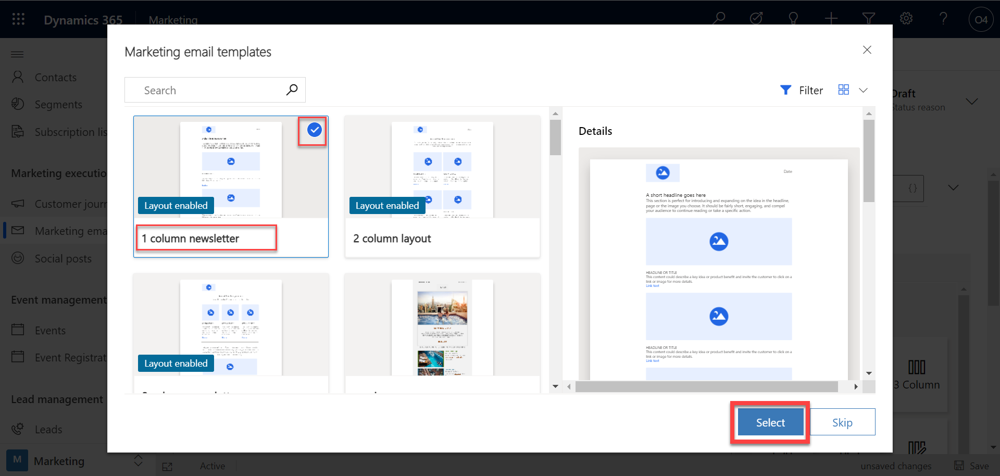

5. After the new record opens, select the drop-down arrow next to the **Status reason** field in the record header at the top. 

6. In the **Name** field enter **Home Security – deploymentID**. 

    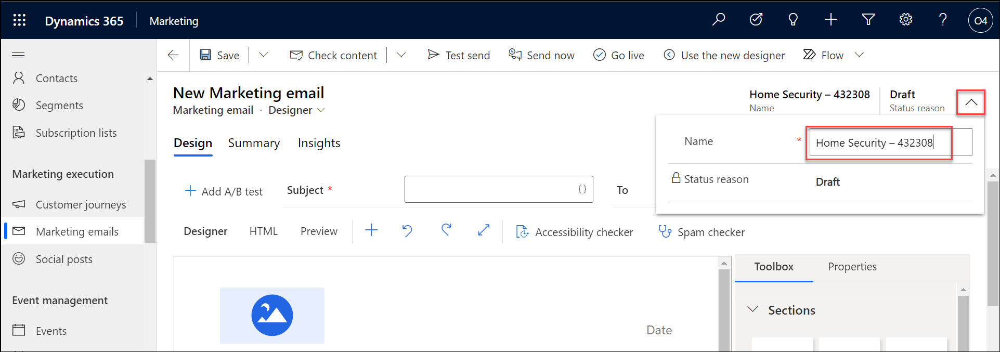

7. In the **Subject** field enter the text **Keep you family Safe**! You may need to scroll to the top of the Design page to reveal the Subject field.

    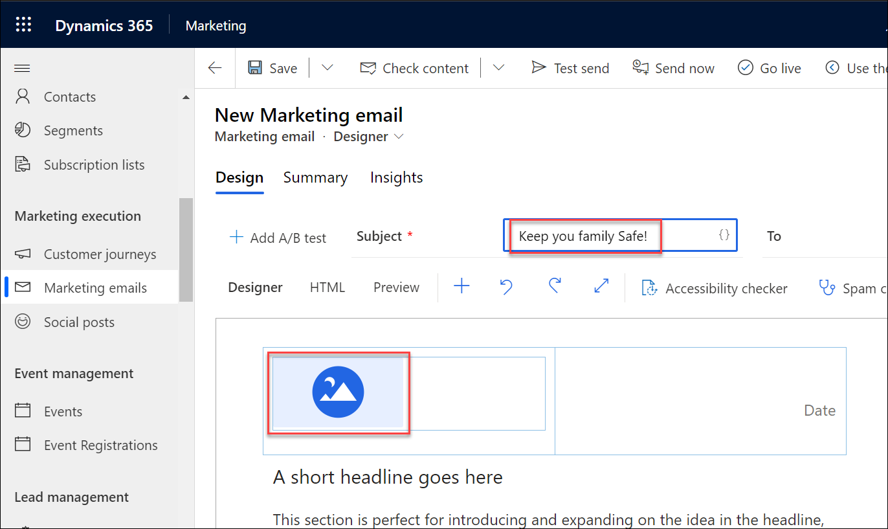

8. In the message window, locate and select the small image **above** the text a **Short headline goes here**. Here one can change the images as per there requirements, by clicking on the image and selecting the properties pane and select the image. For now we are not changing and following the next step.

    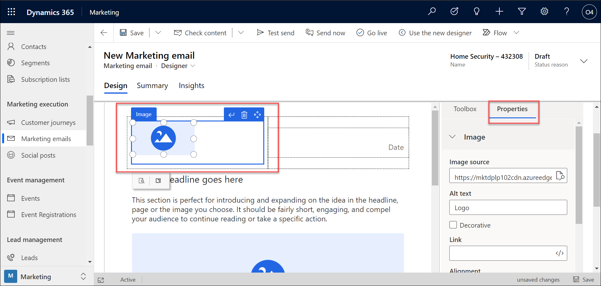

9. You can manage the size of by Using the size handles on the image to size the image to the desired size. 

10. Select the **A short headline goes here** box. Change the text to **Feel Safe 24/7**.

    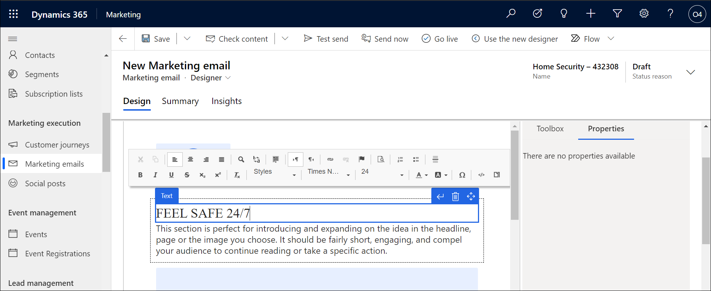

11. Select the section below the text you just modified. 

12. Replace the text with the following text: Do you know what is always happening in and around your home? You and your family deserve to feel safe and secure whether you are home or away. The right security system can not only provide that sense of security but might also save you money on your insurance. 

    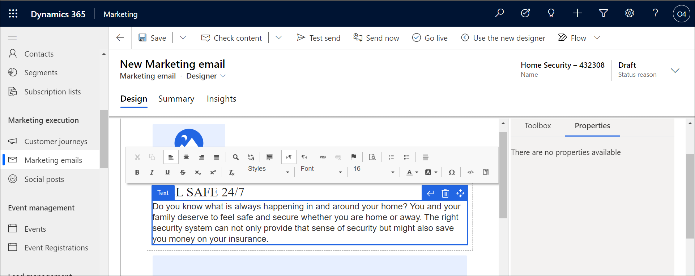

13. Select the **Headline or title box** just below the image, replace the text with the text **We have everything you need**. 

20. Select in the text box below the heading you just modified. 

21. Replace the text with the following text: **Our award-winning systems protect you.**

    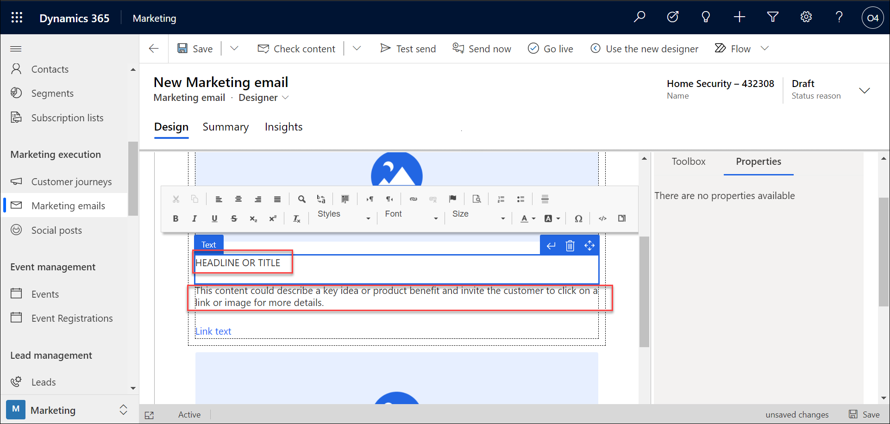
    
    

22. Select the entire section below the section you just modified. Press the **trash can** icon to remove the section. 

    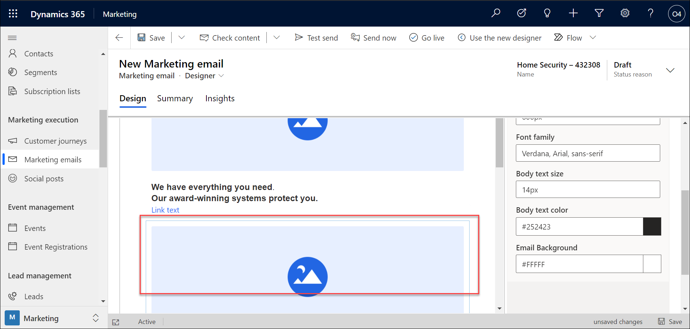
    
    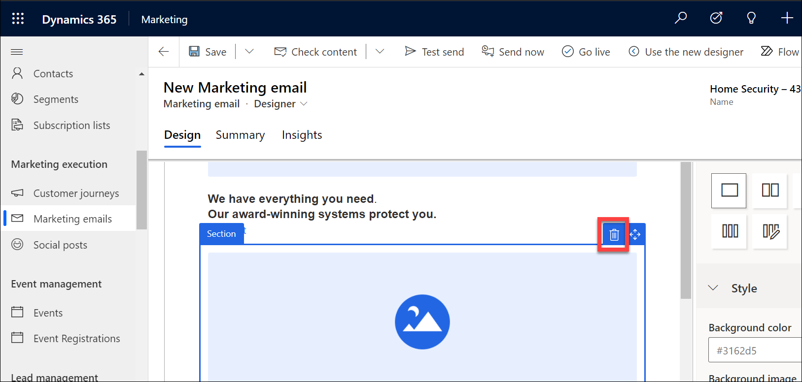

23. Repeat the process for the remaining sections or other elements in the message.

24. We will not be performing the following steps as it need a authenticated domain to send emails. Please read through the below four steps to just understand how the check for errors and go live functionality works.

25. Before we make the email live, we can check if any errors are present by clicking on the **Check content** button present On the **Command Bar**. 

26. Once you have verified that there are no errors, we can go live by clicking on **Go Live** button present on the command bar. 

27. Select the drop-down arrow next to the **Save** button on the command bar and select **Save and Close**. 

28. If you have used the same email address for both contacts you will receive a **Duplicate records found** alert. Choose **Ignore and save**.

## Exercise 2: Create a Segment in Dynamics 365 Marketing

### Task 1: Add some sample Contacts to work with 

1. Using the navigation on the left, select Contacts under the Customers Group

2. On the command bar, select **New**.

    

3. Complete the **New Contact** page as follows.

	- **First Name**: Piper 

	- **Last Name**: Smith – DeploymentID

	- **Email**: Enter an email address that you can receive mail from.

	- **Address 1 Street 1:** 1989 191st Ave N

	- **Address 1: City**: Seattle

	- **Address 1 State:** WA

	- **Address 1 Zip/Postal:** 98001

	- **Country/Region:** United States

4. Once you have completed the contact, select **Save &amp; Close**.

    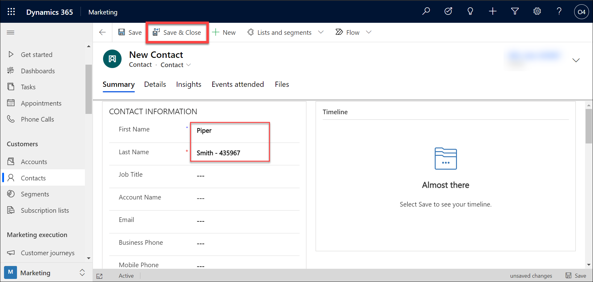

5. Next, we will have you add yourself as a contact, so you have multiple people to work with. 

6. On the **Command Bar**, select the **New** button.

7. Complete the second contact as follows:

	- **First Name**: Your First Name

	- **Last Name**: Your last name - DeploymentID

	- **Email**: Enter an email address that you can receive mail from.

	- **Address 1 Street 1:** 1989 191st Ave N

	- **Address 1: City**: Seattle

	- **Address 1 State:** WA

	- **Address 1 Zip/Postal:** 98001

	- **Country/Region:** United States

**NOTE:** We are using the same address information, to make it easy to recognize the contacts as sample data. 

### Task 2: Create a Customer Segment

Creating a customer segment will let us define the customers that we want to target different marketing actions towards. 

1. Using the navigation on the left, select **Segments** under the **Customers** group. 

2. On the command bar, select **New**.

    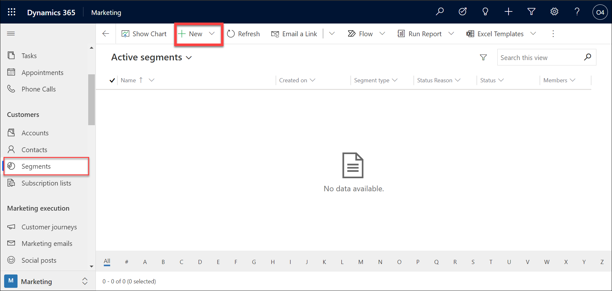

3. Since we had the membership to change as contacts are added, removed, or edited, we will select **New Dynamic Segment** from the menu that appears. 

    

4. In the **Segment Templates** dialog box that opens, select **Skip** to close it and continue to the **New Segment** screen.

    

5. After the new record opens, select the drop-down arrow next to the **Status reason** field in the record header at the top. 

    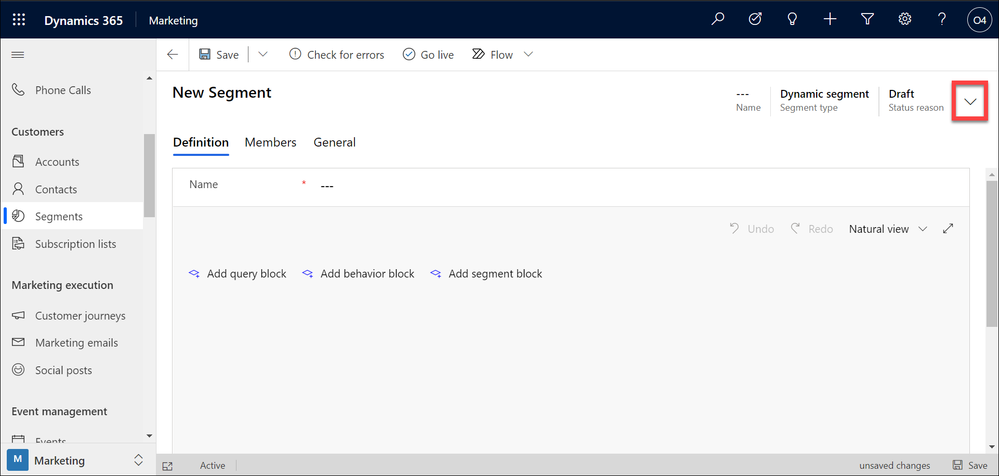

6. In the **Name** field enter **Seattle Customers – DeploymentID**. 

    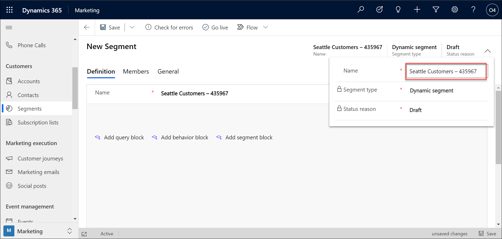

7. In the segment definition window, select **Add query block**.

    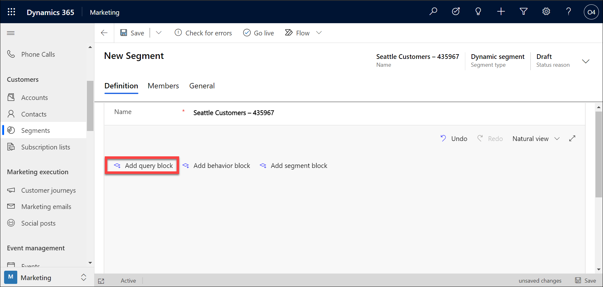

8. Notice that the Contact table is selected by default. Do not Change it. 

    

9. Select the text **Select attribute**. 

10. Enter the word City to filter the list. Choose **Address 1: City** from the list.

    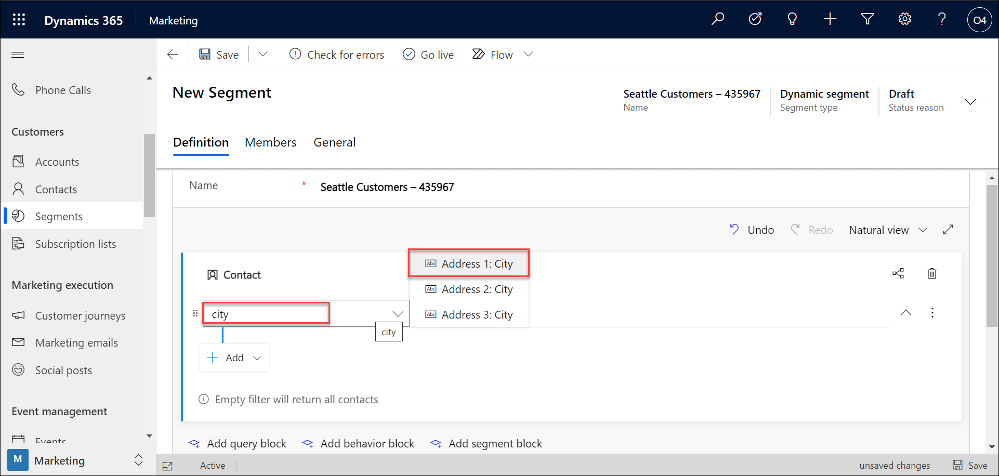

11. Leave the next drop-down list set to **Is**. 

12. Select the third drop-down list, which contains the text **Enter text** and select **Seattle**.

13. Select **Save** on the command bar to save your segment.

    

14. Select **Go Live** to publish the segment.

    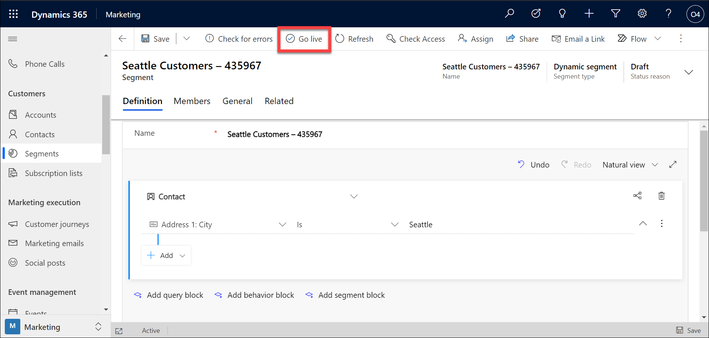

15. Wait for about a minute and then select **Refresh** on the command bar to refresh the page. 

16. You should now see that a **Members** tab has been added.

    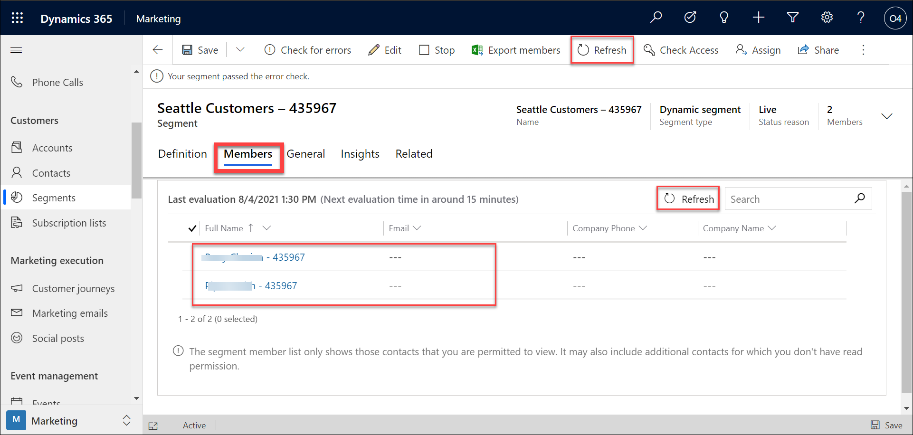

### Task 3: Test your Customer Segment

Now that we have successfully created your segment, let’s verify the dynamics segment will populate correctly as contacts are added or removed. To do this we will create a new contact who lives in Seattle. 

1. Using the navigation on the left, select **Contacts** under the Customers Group

2. On the command bar, select **New**.

3. Complete the **New Contact** page as follows.

	- **First Name**: Rick

	- **Last Name**: Jones – DeploymentID

	- **Email**: Enter an email address that you can receive mail from.

	- **Address 1 Street 1:** 1989 191st Ave N

	- **Address 1: City**: Seattle

	- **Address 1 State:** WA

	- **Address 1 Zip/Postal:** 98001

4. Once you have completed the contact, select **Save &amp; Close**.

5. Using the navigation on the left, select **Segments** under the **Customers** group. 

6. Open the **Seattle Customers – DeploymentID** segment you created earlier. 

7. Select the **Members** tab. Notice that **Rick Jones – DeploymentID** should now be present. You may need to refresh the view.

**IMPORTANT:** Since we are working a shared environment and everyone is working in the same system, you will likely see other Contacts in the Dynamic Marketing segment as well. That is OK for purposes of this course. 

## Exercise 3: Create a Customer Journey

Now that we have created the marketing content that we want to deliver and defined a segment of customers to target, we are ready to create a Customer Journey to target the customers. 

1. Using the navigation on the left, select **Customer Journeys** under the **Marketing Execution** group.

2. Using the command bar, select **New** 

3. The **New Customer Journey** page opens with the **Select a Customer Journey Template** dialog box shown. Select **Skip** to start creating the journey from scratch.

4. In the **Audience** area, verify the **Source type** is set to **Segment**. 

5. Select the segment look up below the **Inclusion** drop-down. 

6. Enter the text **Seattle** and select the **Seattle Customers** segment you created earlier. 

7. On the design canvas, move your cursor between **Start** and **End**. Select the **+** sign, from the menu that appears, select **Send an email**.

8. Enter the text **Home** and select the **Home Security – DeploymentID** marketing email message you created in Exercise 1. 

9. Move your cursor after the Send an email action. Select the **+** sign, from the menu that appears, select **If/Then**.

10. In the **If/Then** area on the left side of the screen, under conditions select the **Select a source** field. 

11. Select the **Home Security – DeploymentID** segment. 

12. Select the **Select a Condition** field. Choose **a link has been clicked**.

13. In the **Yes** path, select the **+** sign. From the menu that appears, select **Create lead**.

14. Do not modify or add anything to the **No** path. 

15. Select the General tab located towards the top of the Customer Journey Record. Enter the following information into the **General** tab:

	- **Name**: Seattle Area Fall Promotion – DeploymentID

	- **Start date and time**: Enter Todays Date

	- **End date and time**: One Month from Today

	- **Time zone**: Select your local time zone 

16. On the command bar, select **Save** to save the work you've done so far.

17. Your journey is now ready to go. To start the journey, publish it by selecting **Go live** on the Command Bar.

 
