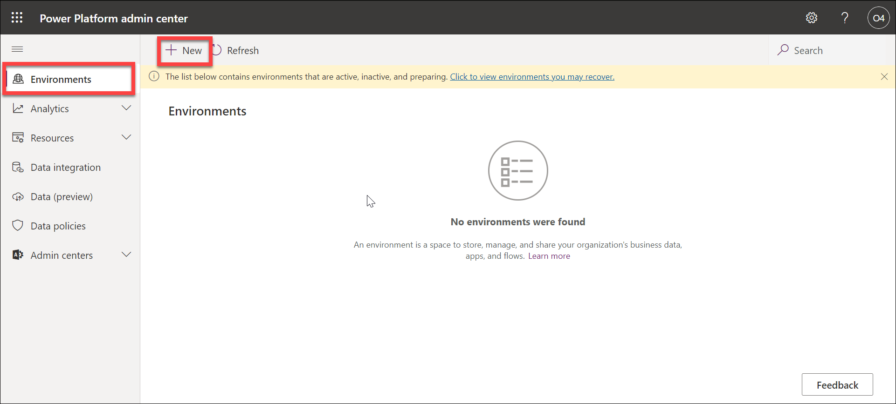
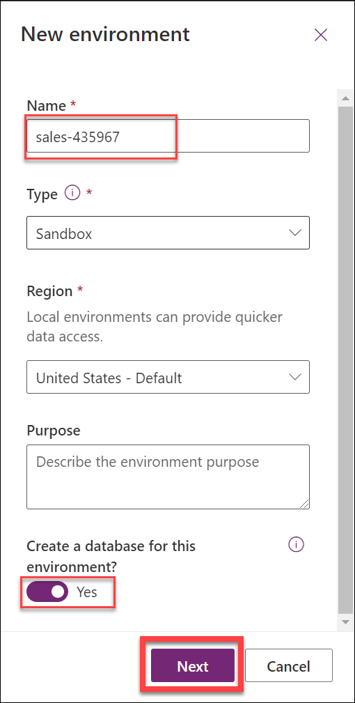
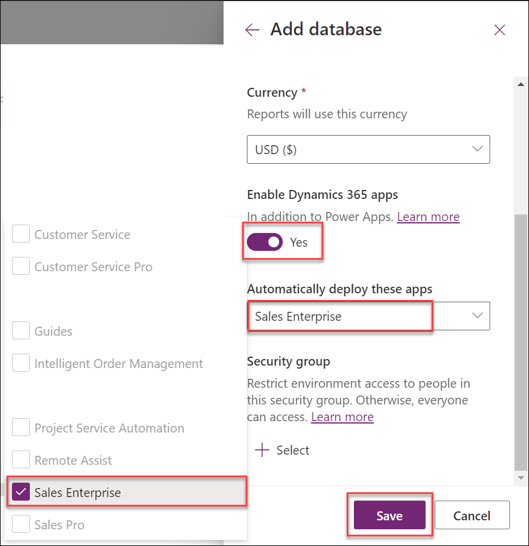
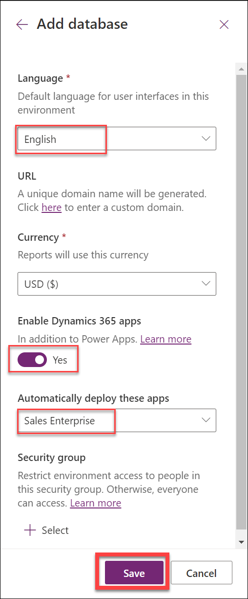
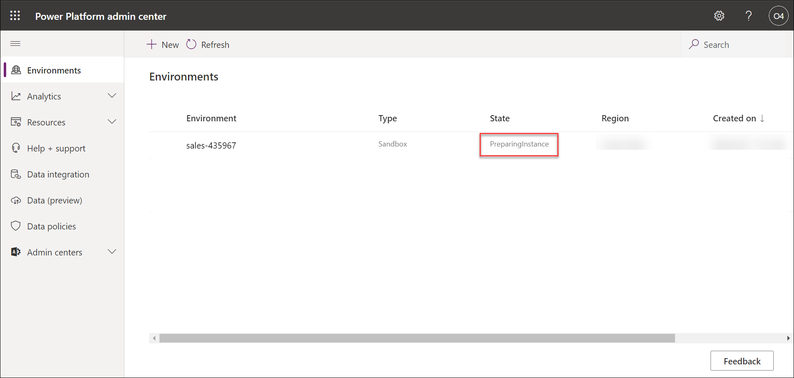
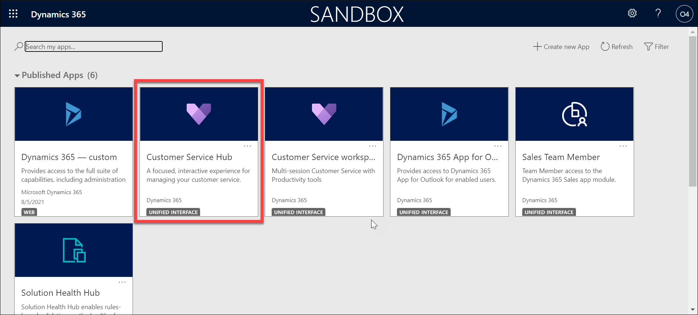
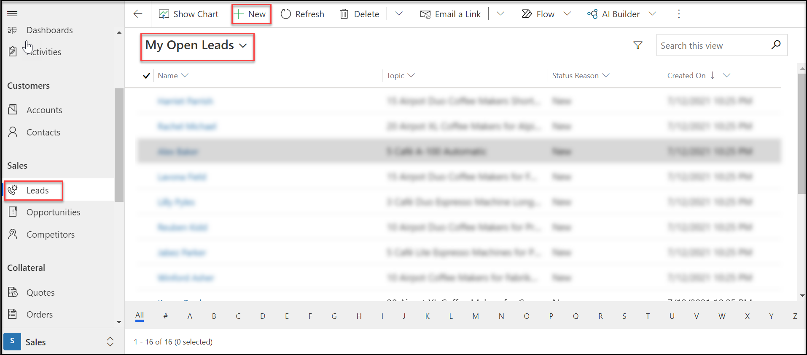
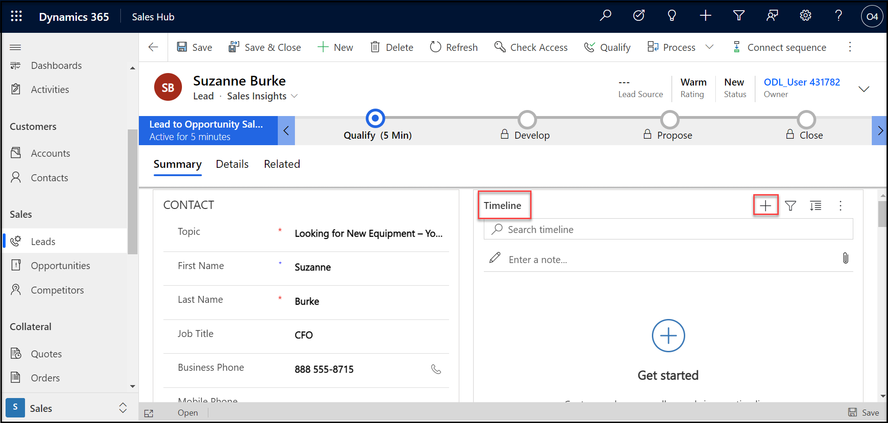

## Module 2: Learn the Fundamentals of Dynamics 365 Sales

## Practice Lab 2.1 - Create and manage a Lead in Dynamics 365 Sales

## Objectives

During this exercise, you will be capturing a sales lead for Suzanne Burke. She recently reached out to you and is interested in some of your organization’s products and services. Not only will you be capturing the lead in the system, but you will be using the tools available in Dynamics 365 Sales to work the lead through the qualification process.

  - **Estimated Time**: 15 minutes

## Lab Setup

1. Once logged into https://admin.powerplatform.microsoft.com/ using the credentials given in lab environment details tab.

    

2. Create a new environment by clicking on **+ New**

    
    
3. On the Window that opens in the right, Enter first a unique name for the environment like **sales-deploymentID** and select **Sandbox** as type and Set **Yes** for create a database for this environment and then click **Next**.

     
    
4. Scroll down and select **Enable Dynamics 365 apps** to **Yes** and inautomatically deploy these apps , select **Sales Enterprise**.

    

5. Just ensure the settings as in the image below and select **Save**.

    

6. A field will appear under environemnts with name sales and it will be in preparing state and once the environment is ready, select the environment and find and click the URL to open the Sales Hub application.

    
    
    
    
    
 
7. The apps section will appear and from the list select **Sales Hub**.

    
    
8. We will be now in the Sales hub and let it be open to perform the remaining exercises.

## Instructions

1. If it not open already, open the Dynamics 365 Sales Hub application.

1. Using the navigation on the left side of the screen, select **Leads**. 

1. From the **My Open Leads** view, Select the **New** button on the Command bar.

     

1. Complete your new lead record as follows:

	- **Topic:** Looking for New Equipment – Your Initials

	- **First Name:** Suzanne

	- **Last Name:** Burke

	- **Job Title:** CFO

	- **Business Phone:** 888 555-8715

	- **Email:** Suzanne@contososample.com

	- **Company:** Contoso - Washington

	- **Street 1:** 1989 Smith Ave

	- **City:** Seattle

	- **State/Province:** WA

	- **ZIP/Postal Code:** 98001 

     

1. Select the **Save** button on the Command Bar to save the new the Lead and leave it open. 

     

1. Notice the **Lead to Opportunity** Business Process Flow at the top of the record. Click the **Qualify Stage** to select it. Complete the stage as follows:

	- **Purchase Timeframe:** This Quarter

	- **Estimated Budget:** 25000 

	- **Purchase Process:** Individual

	- **Identify Decision Maker:** Completed

    

1. Go to the **Record Timeline** in the middle of the screen and click the **Plus Sign Icon** to add a new activity. 

    

1. From the menu that appears, select **Phone Call**.

   

1. On the **Quick Create Phone Call** screen, set the **Subject** field to **Initial Phone Call** and leave the rest of the information as is. 

1. Click the **Save and Close** button.

   

1. Notice the **Initial Phone Call** activity is now displayed on the **Record Timeline**. Over the activity and select the close activity **Check Mark Icon** to mark the phone call as completed.
 
    

1. On the **Close Phone Call** window, select the **Close** button 

   

1.  Next you will qualify the lead record. This will create a related Opportunity record[1] and move to the next stage[2] of the Lead to Opportunity sales process. On the **Command Bar**, select the **Qualify** button.
   
      

1. After the system qualifies the lead, a new Opportunity record will be created, and the business process will advance to the **Develop** stage. Select the **Qualify** stage to view the original lead record. 
