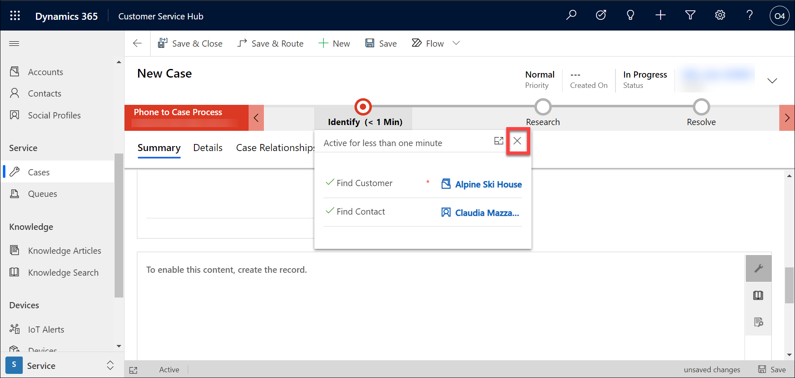

Module 3: Learn the Fundamentals of Dynamics 365 Customer Service
========================

## Practice Lab 3.2 - Create and manage Cases in Dynamics 365 Customer Service

## Lab Setup

  - **Estimated Time**: 10 minutes

## Instructions

1. If is not open already, open the **Dynamics 365 Customer Service Hub** application. 

2. Using the navigation on the left side of the screen, select **Cases**. 

3. On the **Command Bar**, select the **New Case** button to create a new case record.

    

4. Complete the new case record as follows:

	- **Case Title:** Item arrived Damaged –[DeploymentID]

	- **Customer:** Alpine Ski House (Create new)

	- **Origin:** Phone

5. Select the **Save** button to save the record and leave it open. 

    

6. Select the **X** on the **Identify** stage fly out window to remove the window so you can continue working. 

    

7. Using the **Record Timeline**, select the **Plus Sign Icon**, to create a new activity. 

    

8. From the menu that appears, select **Phone Call**.

    

9. Set the **Subject** field to **Return Call to Patrick – Your Initials** and leave the rest of the fields as is. 

10. Select the **Save and Close** button. 

    
    
    

11. On the **Phone to Case Process**, select the **Identify** stage.

12. Select the **Next Stage** button to advance to the **Research** stage. 

13. Select the **X** on the **Research** stage fly out window to remove the window so you can continue working. 

14. On the right side of the case screen, locate and select the **Knowledge** book Icon. (It will be directly below the wrench icon).

    

15. Notice that the title of the case you created is automatically provided as the search text. Locate and select the **Item Broken on Arrival** article you created earlier. 

    

16. The full contents of the article will be displayed, select the **Link this article to the current record** icon. Verify that the text **Linked to Case** appears. 

    

17. Now we will get ready to resolve the case. On the **Record Timeline**, hover over the **Return call to Patrick** Phone Call activity you created earlier. Select the mark complete **Check Mark Icon** to complete the activity. 

    

18. On the **Close Phone Call** screen, select the **Close** button. Verify the activity says **Closed**. 

    
    
    

19. On the **Phone to Case Process**, select the **Research** stage, and select **Next Stage** to advance to the **Resolve** stage. 

    

20. On the **Resolve** stage, select the **Finish** button to complete the process flow. 

    

21. On the **Command Bar** for the case record, select the **Resolve Case** button.

    

22. On the **Resolve Case** window, set the **Resolution** field to **Knowledge Article**. 

23. Select the **Resolve** button to complete the process. 

    
