---
lab:
    title: 'Lab 3.3: Dynamics 365 Customer Service capstone lab'
    module: 'Module 3: Learn the Fundamentals of Dynamics 365 Customer Service'
---

Module 3: Learn the Fundamentals of Dynamics 365 Customer Service
========================

## Practice Lab 3.3 - Dynamics 365 Customer Service capstone lab

## Lab Scenario

ABC company specializes in the manufacturing, selling, installation and servicing of security equipment. Their products include both indoor and outdoor security cameras, moisture and fire sensors, monitoring services, and more. 

ABC company uses Dynamics 365 applications to engage with all their customers across different areas of their organization from sales to service. 

**Sales and Marketing**

ABC Company markets to their residential customers directly through targeted marketing campaigns. Customers are targeted based on their city, and other factors. Marketing materials are sent through email and based on their interaction with the email are guided accordingly. 

While some of their smaller products are sold through retailers, most products are sold direct to consumers by their internal sale staff.

Internally, they focus on two key areas: 

- **Residential Customers:** Residential customers are typically looking for either individual components, or to buy a whole home solution. These sales cycles are typically shorter and originate from social media, websites, referrals, or direct contact from the prospect. Since residential customers are typically more focused on specific products or smaller installs, their sales cycles typically last a few days or weeks. 

- **Enterprise Customers:** Enterprise sellers focus on customers who need a more specialized and tailored business solutions. Enterprise sales typically span multiple locations with linked communication, and often require multiple resources to complete the project. These sales cycles are typically longer and have many more moving parts. 

It is important that all of ABC company’s sellers have the tools, resources, and guidance necessary regardless of their focus area while selling to their customers. 

**System Installation:**

The installation process for purchased security equipment varies based on the type of customer that was sold. 

- **Residential Customers:** Since residential installs typically take less than a day, they are done by internal employees. After the sale is made, a work order is created, and a qualified technician is identified and scheduled to perform the install. 

- **Enterprise Customers:** Enterprise deploys can take months, and require a project manager to oversee the day-to-day operations. This includes creating project plans, defining project teams, and scheduling resources. 

**Service and Support:**

Once the systems are installed, ABC Company provides support after the sale. If a customer has an issue, they can contact customer support. An agent will attempt to work with the customer remotely to resolve their issue. If their issue cannot be resolved remotely, the support agent can escalate the issue to a work order that will be scheduled and worked on by a qualified field technician. 

## Objectives

Many times, customers may encounter issues with their equipment. When issues are encountered, they are reported to ABC company’s help desk. Issues can be reported in multiple ways. In some cases, the equipment can proactively report issues. As issues are reported, agents attempt to resolve them remotely. If they cannot, a field technician will be dispatched to resolve the issue. Recently, you have been fixing a lot of sensors that have gone out. You noticed that it was due to a software bug. You want to create a knowledge article that other agents can reference when they encounter the same issue. 

As a help desk agent, you are responsible for working on issues that are reported by customers. You recently just took a call from Piper Smith. Piper is reporting that one of the sensors on her system is not working. You need to log the call from piper and attempt to locate a resolution to her problem. 

Upon completion of the lab, you will have completed the following:

- Created a knowledge Article 

- Managed Cases using Customer Service Hub.

- Created and log a Case. 

- Manage a case record through its lifecycle. 

## Lab Setup

  - **Estimated Time**: 45 minutes

## Instructions

## Exercise 1: Create and Publish a Knowledge Article

### Task 1: Create a Knowledge Article

1. If is not open already, open the **Dynamics 365 Customer Service Hub** application. 

2. Using the navigation on the left side of the screen, select **Knowledge Articles**. 

3. To easily see the which articles are in different stages, select the drop-down arrow next to **My Active Articles**. 

4. Select **Draft Articles**. 

5. Us the view selector to select **Approved Articles**.  

6. Use the view selector to switch back to **My Active Articles**

7. On the **Command Bar**, select the **New** button. After the new record opens, select the drop-down arrow next to the **Status reason** field in the record header at the top. Set **Language** to **English - United States**.

8. Complete the article as follows:

	- **Title:** Sensor is not working – Your Initials

	- **Keywords:** Sensor, Damaged, Not Working

	- **Description:** Helps work through scenarios where a sensor is not working. 

    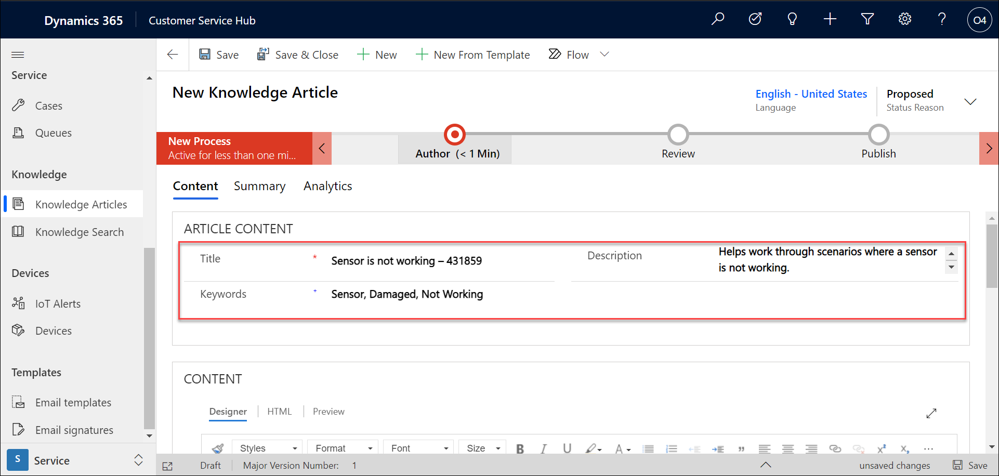
9. Enter the following text into the **Content Designer** text.   

	Sensor is not currently working

	When a sensor is not working as it should, do the following:

	1. Locate and replace the batteries on the device. 

	2. Press and hold the power button for 3 seconds. 

	3. The device will open in admin mode. 

	4. Press and hold the pair button until the light changes from red to blue. 

	5. Press reset button. 

	Once the device reboots, it will be back online. 

    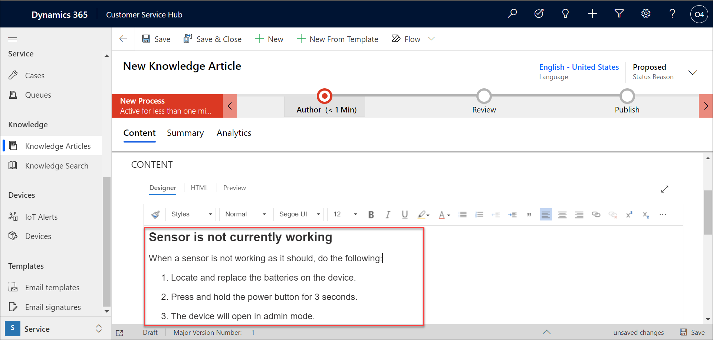

10. In the content editor, select the Sensor is not currently working text

11. Change the font size to **22** and select the **Bold** button. 

12. On the **Command Bar**, select the **Save** button to save the Knowledge Article and leave it open. 

13. On the **New Process**, select the **Author** stage, set the **Article Subject** field to **Service**. 

14. Set the **Mark for Review** field to **Completed**.

15. Select **Next Stage** button to advance to **Review** stage.

    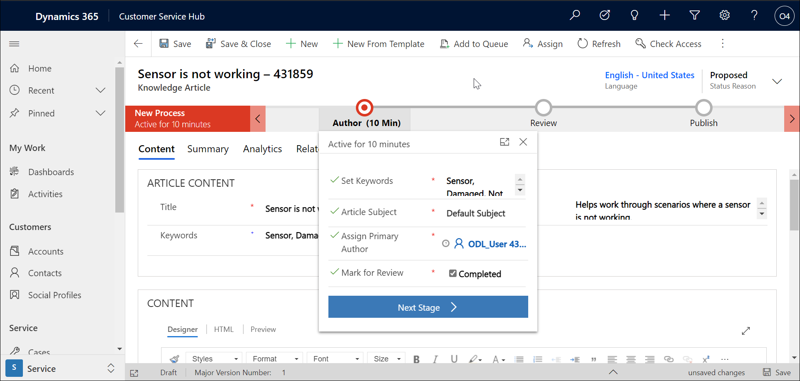

16. On the **Command Bar**, select the **Save and Close** button to save your changes and close the article.

    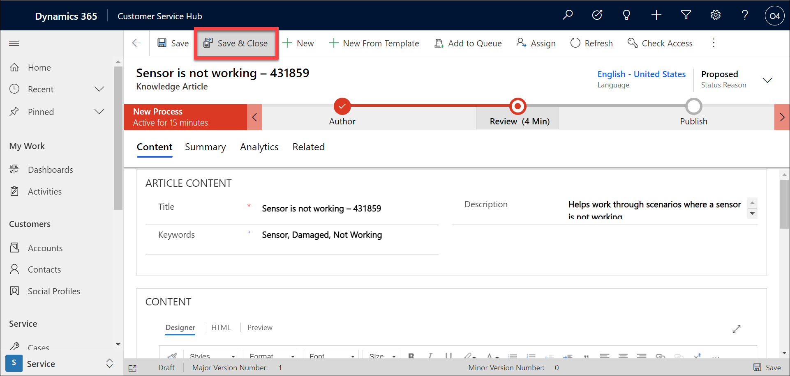

### Task 2: Manage an article through the approval process

In most organizations, after the article author creates the record, it goes through an approval process before it is live. Most of the time this is done by a different individual. In this instance, we will act as an approver. 

1. In the Knowledge Articles, switch the view to **Proposed Articles** to see which articles need your approval. 

     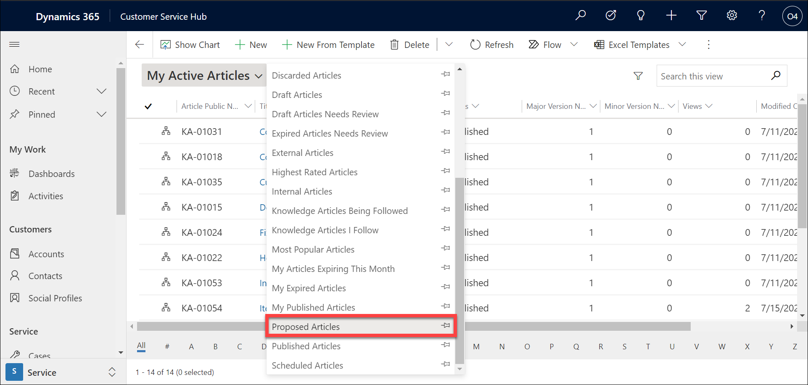

2. Open the **Sensor is not working – your initials** article you just created.

     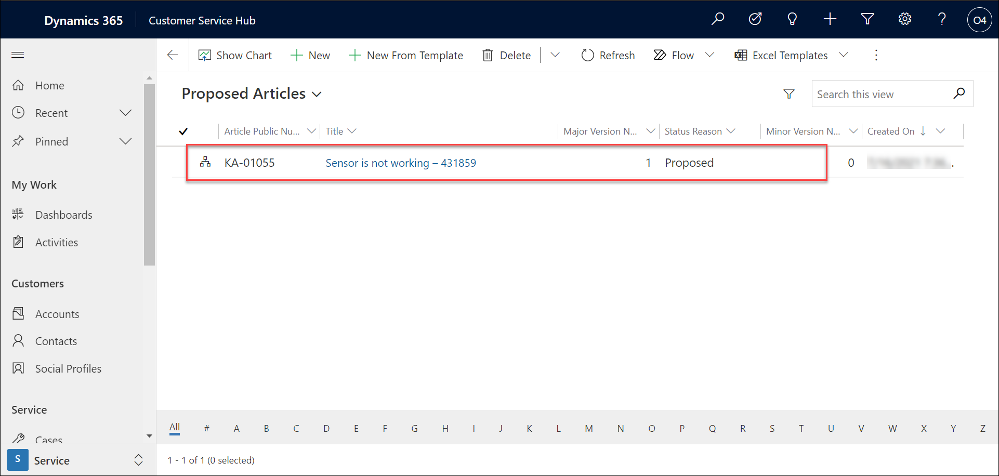

3. On the **New Process**, select the **Review** stage. Set the **Review** field to **Rejected**.

     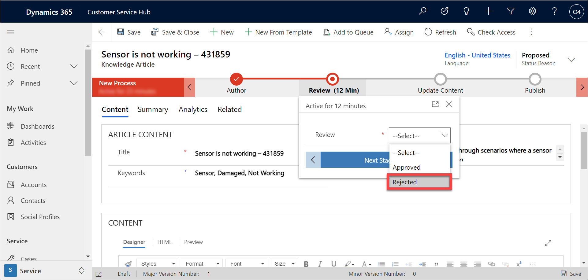

4. On the Reject knowledge Article screen, enter the text **These steps do not work, when I try to replicate it.**

5. Select the **Reject** button

     

6. Select the **Save &amp; Close** to close the article record.

     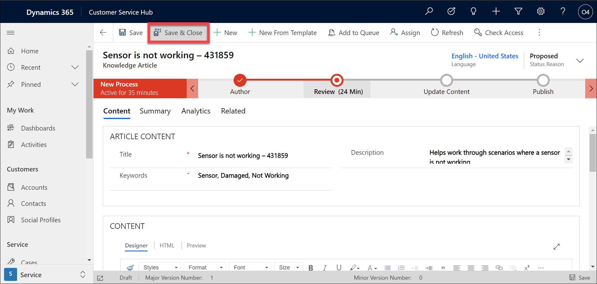

7. Using the **view selector**, change the view to **My Active Articles**. 

     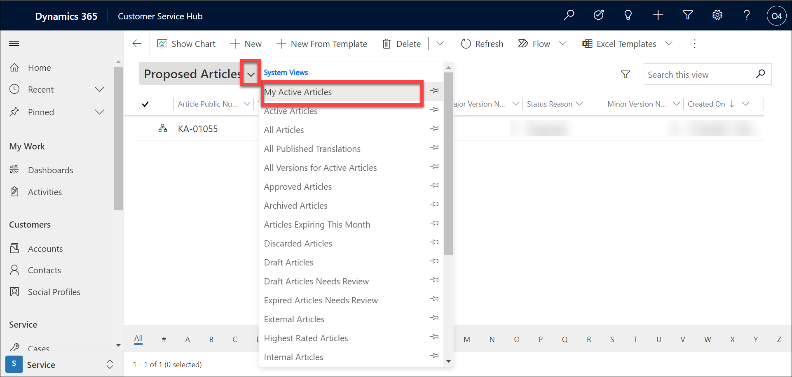

8. Open the **Sensor is not working – your initials** record.

9. Once the record is open, select the **Summary** tab.

     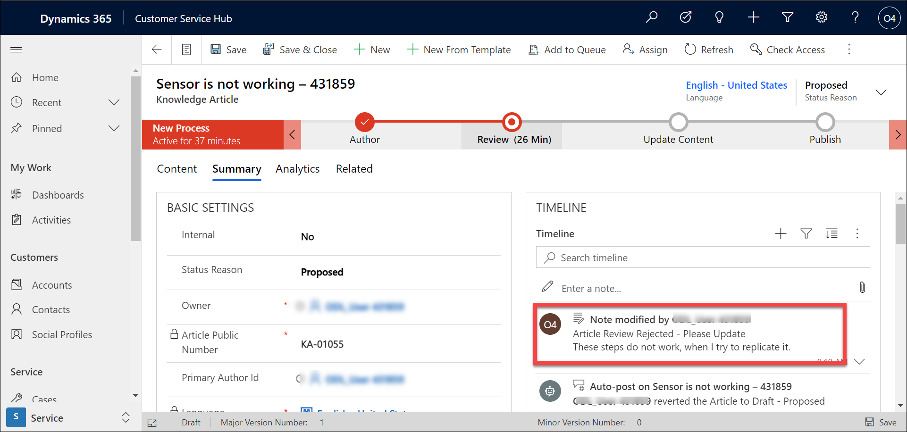

10. On the record **Timeline**, notice a note that indicated that the article was rejected and why it was rejected. 

11. Select the **Content** tab

12. In the **Content** field, place your cursor before the word **Press** on step 5. 

13. Press your **Enter** key. 

14. Enter the text "Press the confirm button." 

15. On the **Command Bar**, select the **Save &amp; Close** button.

     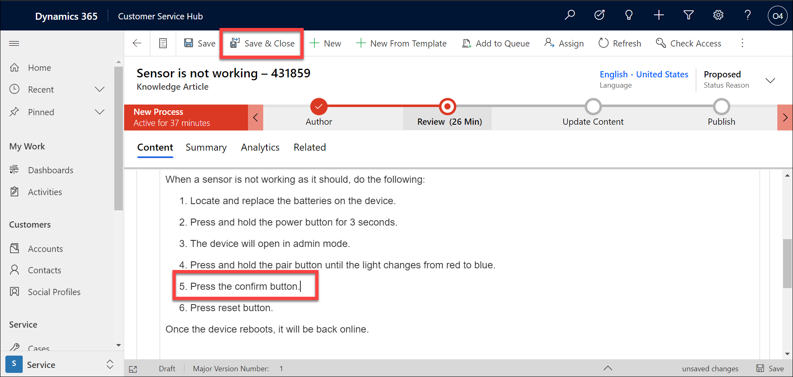

16. Use the **View Selector** and switch the view to **Proposed Articles.**

17. Open the **Sensor is not working – Your Initials** article. 

     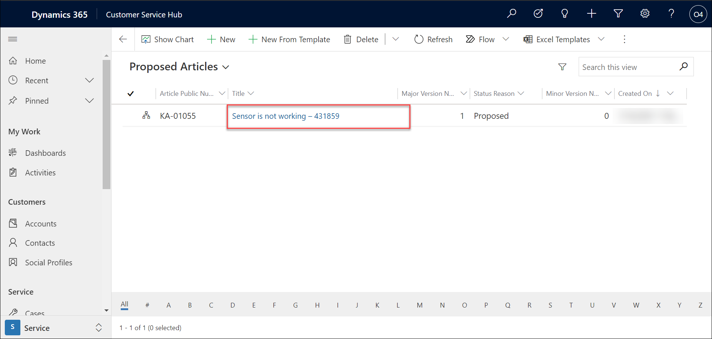

18. On the **New Process** business process flow, select the **Review** stage.

19. Change the Status to **Approved**. 

     

20. You will be asked to confirm the article approval, select **OK**. 

     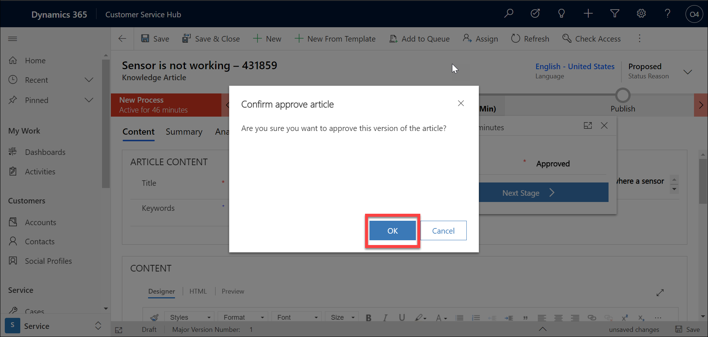

### Task 3: Approve the Knowledge Article

Now that the article has been approved, we will publish it so that it will be available for people working on cases. 

1. Select the **Next Stage** button to advance to the **Publish** stage. 

2. Mark the **Set Product Associations** as **Completed**. 

3. Set the **Expiration Date** to **one year from today at 12:00 AM**. 

4. Select the **Finish** button to complete the process. 

     

5. On the **Command Bar** for the article, select the **Publish** button. 

     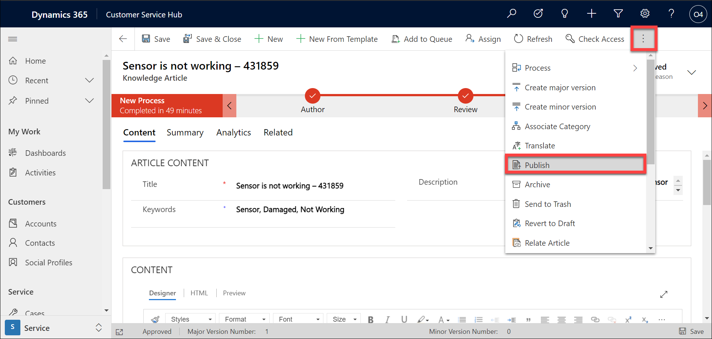

6. Confirm that the following is selected:

	- **Publish:** Now

	- **Published Status:** Published

	- **Expiration Date:** One year from today at 12:00 AM

	- **Expiration State:** Expired

	- **Expiration Status:** Expired
     
7. Select the **Publish** button to publish the article.

    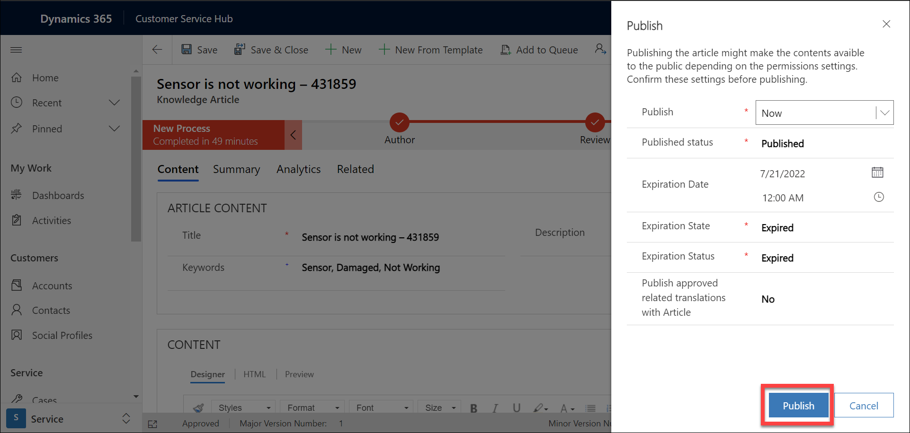

## Exercise 2: Manage a support case through its lifecycle

### Task 1: Create and manage a case

1. If is not open already, open the **Dynamics 365 Customer Service Hub** application. 

2. Using the navigation on the left side of the screen, select **Dashboards**. This will open the **Tier 1** dashboard. 

3. On the **Command Bar**, select the **Show Visual Filter** button.

    

4. Additional dashboards provide further details about the current case load. You can work with other dashboards by using the dashboard selector. Change the dashboard from **Tier 1 Dashboard** to **Tier 2 Dashboard**. 

Now that you are familiar with some of the different views and dashboards, we will create a new case record to assist Piper with her problem.

10. Using the navigation on the left side of the screen, select **Cases**. 

11. On the **Command Bar**, select the **New** button to create a new case record.

12. Complete the new case record as follows:

	- **Case Title:** Sensor is not working – Your Initials

	- **Customer:** Piper Smith

	- **Origin:** Phone

	- **Description:** Piper is reporting that one of the sensors that she received is not working properly. 

13. Select the **Save** button to save the record and leave it open. 

    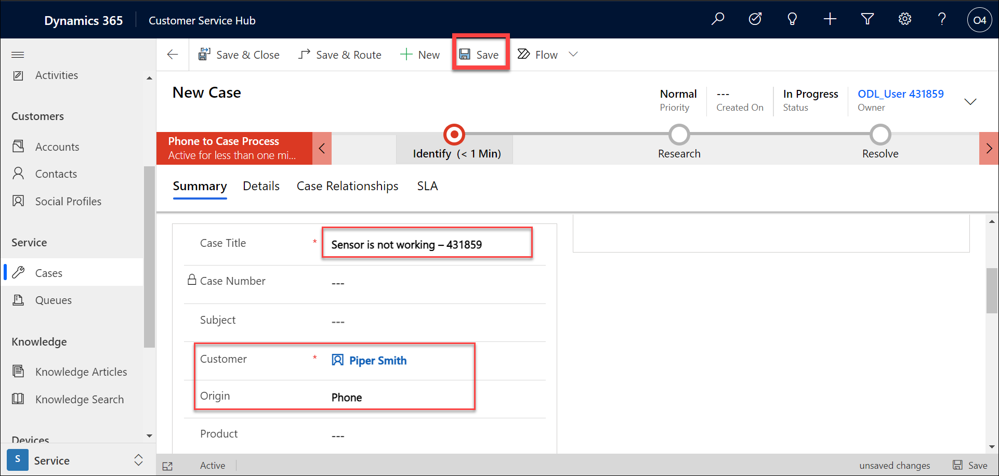

14. Using the **Record Timeline**, select the **Plus Sign Icon**, to create a new activity. 

15. From the menu that appears, select **Phone Call**.

    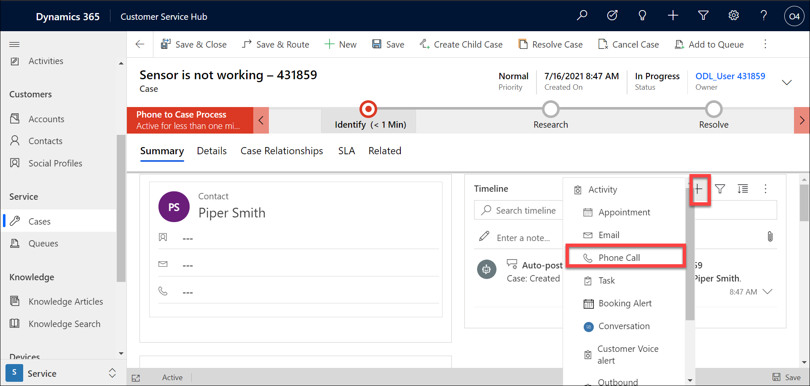

16. On the **Quick Create: Phone Call** form complete the activity as follows:

	- **Subject:** Return Call to Piper

	- **Direction:** Outgoing

	- **Phone number:**  888 555-1762

	- **Duration:** 15 minutes.

17. Select the **Save and Close** button. 

    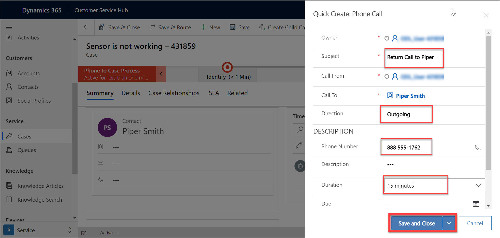

18. On the **Phone to Case Process**, select the **Identify** stage.

19. Select the **Next Stage** button to advance to the **Research** stage. 

    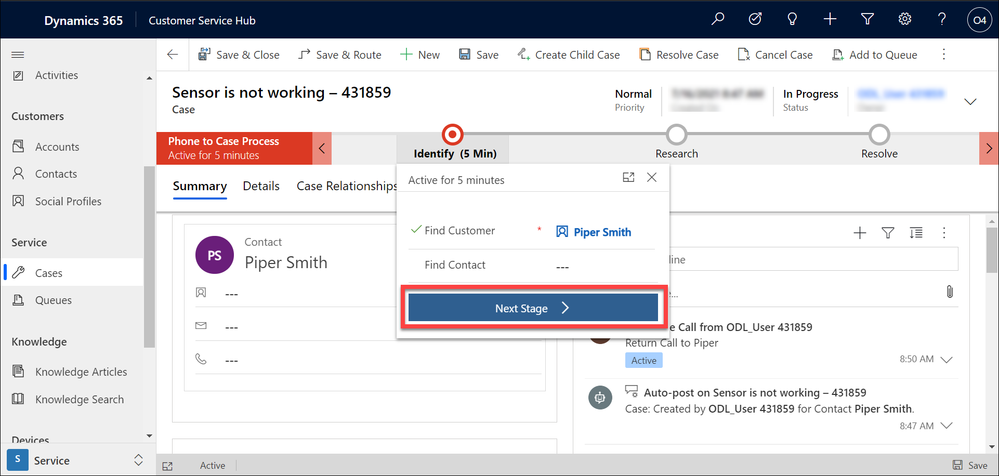

20. Select the **X** on the **Research** stage fly out window to remove the window so you can continue working.

    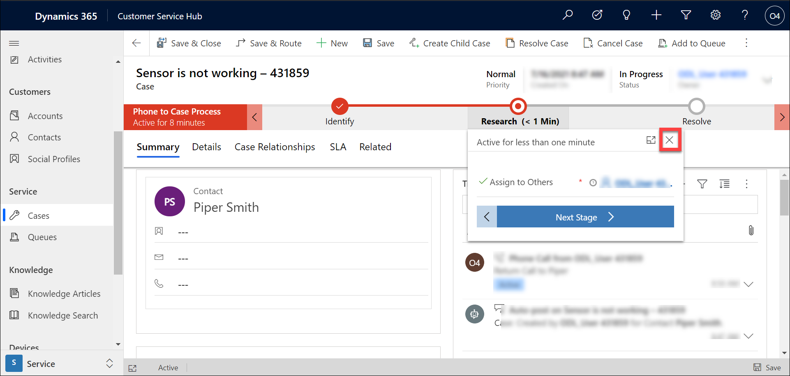

21. Using the **Record Timeline**, select the **Plus Sign Icon**, to create a new activity. 

22. From the menu that appears, select **Task**.

    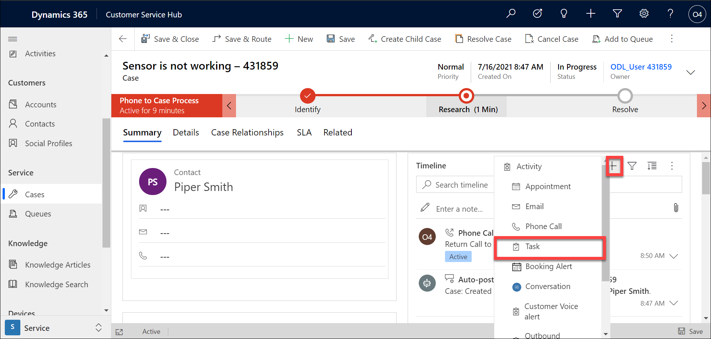

23. On the **Quick Create: Phone Call** form complete the activity as follows:

	- **Subject:** Research Pipers issue

	- **Description:** Leveraging the knowledge base to research Pipers Issue. 

	- **Duration:** 30 minutes.

24. Select the **Save and Close** button. 

    

25. On the right side of the case screen, locate and select the **Knowledge** book Icon. (It will be directly below the wrench icon).

26. Notice that the title of the case y is automatically being used as the search text. Locate and select the **Sensor is not working – your initials** article you created earlier. 

27. The full contents of the article will be displayed, select the **Thumbs Up** icon at the bottom of the article to indicate the article was helpful.

    

28. Select the **Link this article to the current record** icon. Verify that the text **Linked to Case** appears. 

### Task 2: Close the case

Now that we have identified a resolution to the customers problem, we will get ready to resolve the case. The first step in closing a case is to close any open activities that were associated with it. 

1. On the cases record **Timeline**, hover over the **Research Pipers Issue task** that you created earlier**.** Select the mark complete **Check Mark Icon** to complete the activity. 

    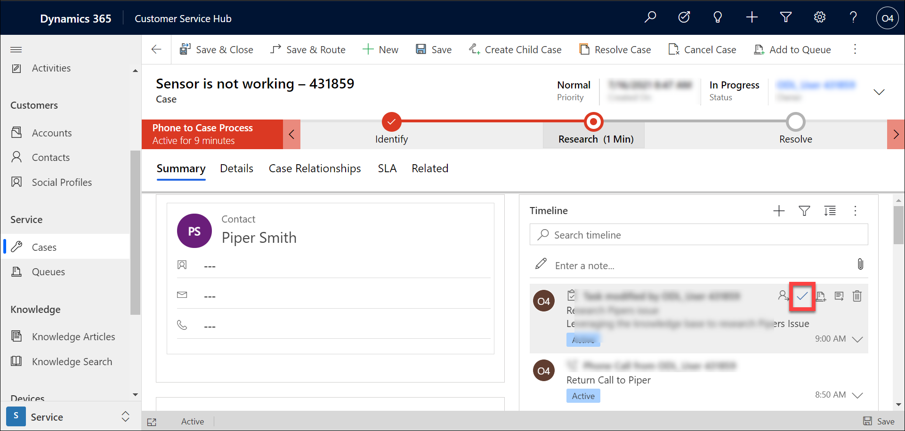

2. On the **Close Task** screen, verify the stat is Completed and select the **Close** button. The status of the task should say **Closed**. 

    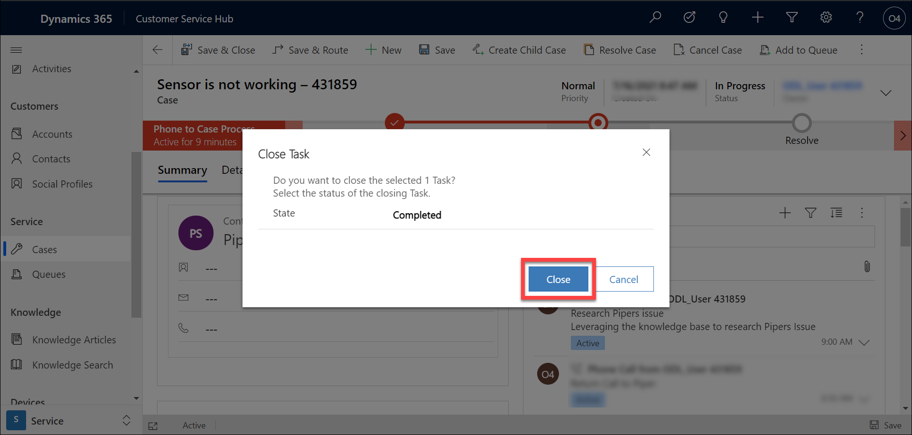

3. Hover over the **Return call to piper Phone Call** you created earlier**.** Select the mark complete **Check Mark Icon** to complete the activity. 

4. On the **Close Phone Call** screen, verify the **State** is **Completed** and the **Status** is **Made**. Select the **Close** button. Verify the activity appears as closed on the Timeline. 

    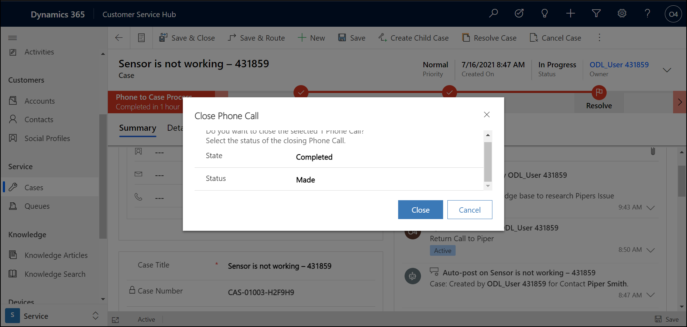
    
    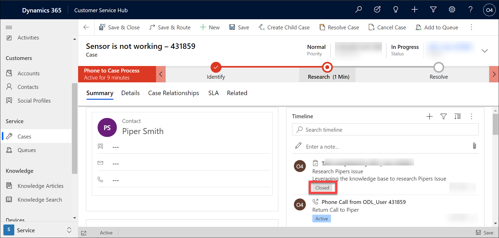

5. On the **Phone to Case Process**, select the **Research** stage, and select **Next Stage** to advance to the **Resolve** stage. 

6. On the **Resolve** stage, select the **Finish** button to complete the process flow. 

    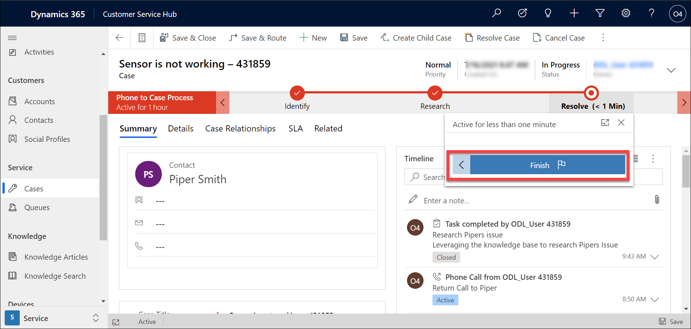

7. On the **Command Bar** for the case record, select the **Resolve Case** button.

    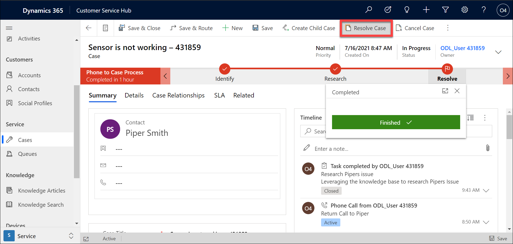

8. On the **Resolve Case** window, set the **Resolution** field to **Knowledge Article**. 

9. Verify that the **Total Time** and **Billable Time** fields are set to **45 minutes** (This represents the total time spent on both the Phone Call and Task activities added to the record.) 

10. Select the **Resolve** button to complete the process. 

