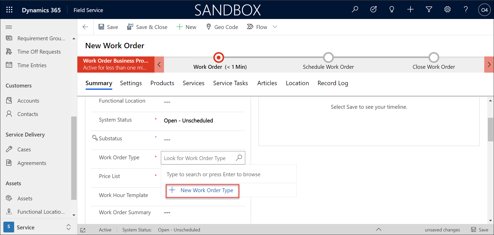
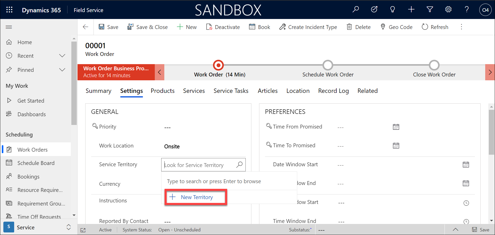
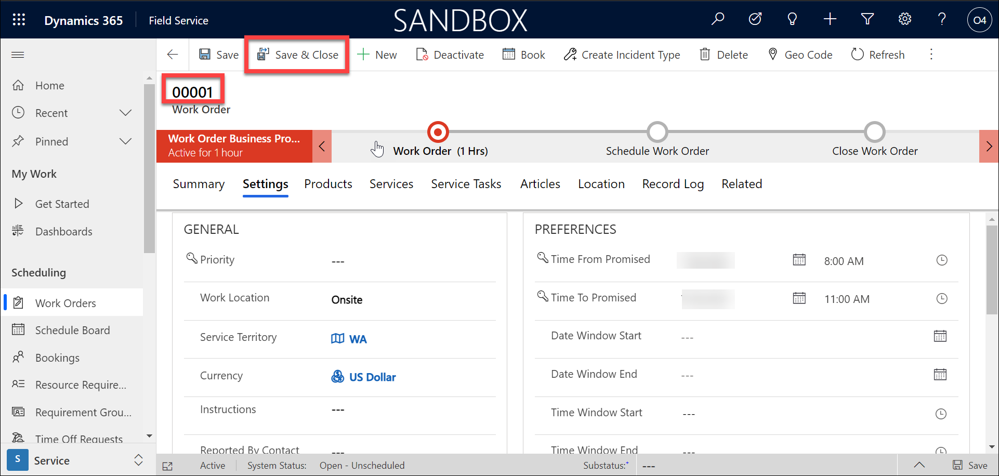

## Module 4: Learn the Fundamentals of Dynamics 365 Field Service

## Practice Lab 4.1 - Creating Work Orders in Dynamics 365 Field Service

## Lab Setup

  - **Estimated Time**: 10 minutes

## Setup the lab environment

1. Once logged into https://admin.powerplatform.microsoft.com/ using the credentials given in lab environment details tab.

2. Create a new environment by clicking on **+ New**

    
    
3. On the Window that opens in the right, Enter first a unique name for the environment like **sales-field-deploymentID** and select **Sandbox** as type and Set **Yes** for create a database for this environment and then click **Next**.

    
    
4. Scroll down and select **Enable Dynamics 365 apps** to **Yes** and inautomatically deploy these apps , select **Field Service** and **Sales Enterprise**.

    

5. Just ensure the settings as in the image below and select **Yes**.

    

6. Once the environment is ready, select the environment and find and click the URL to open the field Service application.

## Instructions

1. Using the navigation on the left, select **Work Orders**.

2. On the **Command Bar**, select the **New** button to create a new Work Order.

    

3. Complete the Work Order details as follows:

	- **Service Account:** Adventure Works Cycles

	- **Work Order Type**: Service (Create new)
           
	   

	- **Price List:** CRM Service USA (sample, Create New)
            
	    

4. Save the Work Order.

    

5. Select the **Settings** tab.

    

6. Set the **Service Territory** field to **WA**. (Create new)

    
    
    
    
    

7. Under **Preferences**, configure the time preferences as follows:

	- **Time from Promised:** Today @ 9:00 AM

	- **Time to Promised:** Today @ 11:00 AM

8. Select **Save**.

    

9. Note the work order number and write it down. 

10. Select **Save and Close** to save you changes and exit the new work order.

    
