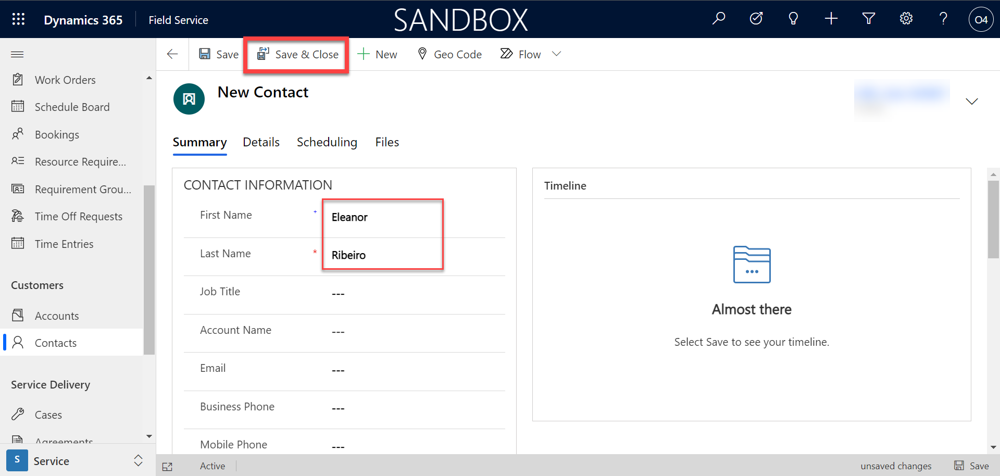
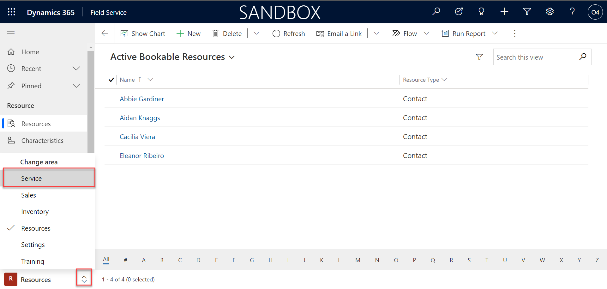
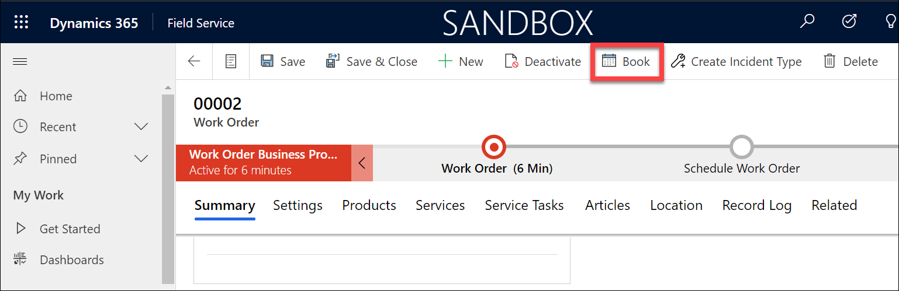
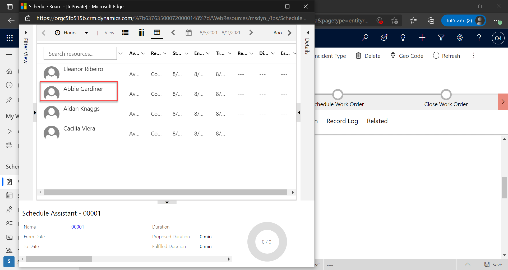

## Module 4: Learn the Fundamentals of Dynamics 365 Field Service

## Practice Lab 4.2 - Schedule Items in Dynamics 365 Field Service

## Lab Setup

  - **Estimated Time**: 20 minutes

  **Note:** The Booking Requirements pane cannot be opened in Internet Explorer. Please use Microsoft Edge or Google Chrome to complete this exercise.
  
## Instructions

1. Open the **Dynamics 365 Field Service** application. 

2. Go to contacts under customers from the left navigation pane and add new contact with name **Eleanor Ribeiro**. and click **Save & Close**.

    
    
    
    
3. Similarly create other contacts with names **Abbie Gardiner** , **Cacilia Viera** , **Aidan Knaggs**
    
3. Using the navigation on the left, select the **Resources** area, then select **Resources**.

    

4. On the **Command Bar**, select the **New** button to create a new Bookable Resource.

    

	- **Resource Type:** Contact
	   

	- **Contact:** Eleanor Ribeiro (you can search the name and select **eleanor** which we created earlier)
	 
4. On the **Command Bar**, select the **Save & Close** button.

    

5. Repeat the steps to create three more Bookable Resource.

	- **Resource Type:** Contact

	- **Contact:** Abbie Gardiner

	- **Resource Type:** Contact

	- **Contact:** Aidan Knaggs
	
	- Click the save button after entering the name for Aidan and then other options are available from it, Select the Related tab and add a new Related Resource Territory - WA (check below images to add one)
	    
	    
	    If the territory is not there, create a new one by clicking on **+ new territory** and enter **WA** and then click **Save and close**.
	    
	    
	    After selecting the territory, then click **Save and Close**
	    
	    Once completed click **Save and close**
	    

	- **Resource Type:** Contact

	- **Contact:** Cacilia Viera
	
	- Select the Related tab and add a new Related Territory - WA

6. On the **Command Bar**, select the **Save & Close** button.

7. Using the navigation on the left, select the **Service** area, then select **Work Orders**.

    

8. On the **Command Bar**, select the **New** button to create a new Work Order.

    

9. Complete the Work Order details as follows:

	- **Service Account:** Adatum Corporation (create new)
	
     
	 
     

	- **Work Order Type:** Service
     
     

	- **Price List:** CRM Service USA (sample)
	       
     

10. Select **Save** to save you changes.

     

11. Scroll down to fill **Primary Incident Type:** Unit Overheating. (create new) Click **+ new incident type**
     
     
        
	- Add name as Unit Overheating and then add a description(optional) and then click Save and close
           
     
	   
     

11. On the **Command Bar** of the **Work Order**, select the **Book** button. This will open the **Schedule Assistant.** 

    

12. You should be presented with options for scheduling the item. Select the **Abbie Gardiner** record.

    

13. In the **Create Resource Booking** window, set the **Start Time** to the top of the next hour i.e. if its 3:30 AM , then select 4:00 AM or 4:30 AM, just need to be the next hour.(specify time in UTC)

14. Set the **End Time** to the **2.5 hours** after that. 

15. Select the **Book &amp; Exit** button to book the item and leave the scheduling window. 

    

16. Once back on the Work Order, select the **Save and Close** button from the Command Bar. 

    

17. Using the left navigation, select **Work Orders**. Select the **Unscheduled Work Orders** view, by clicking on the arrow next to active work orders and change the view.

    

18. Select the **Adventure Works** Work Order you created earlier using the work order number you wrote down. From the options that appear select **Book**. 

    
    
    

19. This will open the **Schedule Assistant.** 

20. You should be presented with options for scheduling the item. Select the Aidan Knaggs record.

    

21. In the **Create Resource Booking** window, set the **Start Time** to the top of the next hour.

22. Set the **End Time** to the **2.5 hours** after that. 

23. Select the **Book &amp; Exit** button to book the item and leave the scheduling window. 

    

24. Following steps are optional , please read through them to understand how to handle such situations.

25. At times, you may need to reschedule a work order based on technician conflicts or other items. This can be easily done by dispatchers leveraging the schedule board. 

26. Select the search resources box on the schedule board (Located right above the resource name column), enter Abbie and locate the work order that is scheduled for Abbie later today. 

27. Right-click on the work order, and from the menu that appears, select **Substitute Resource**, select the **Find Substitution** button**.**

