Module 4: Learn the Fundamentals of Dynamics 365 Field Service
========================

## Practice Lab 4.3 - Dynamics 365 Field Service capstone lab

## Lab Scenario

ABC company specializes in the manufacturing, selling, installation and servicing of security equipment. Their products include both indoor and outdoor security cameras, moisture and fire sensors, monitoring services, and more. 

ABC company uses Dynamics 365 applications to engage with all their customers across different areas of their organization from sales to service. 

**Sales and Marketing**

ABC Company markets to their residential customers directly through targeted marketing campaigns. Customers are targeted based on their city, and other factors. Marketing materials are sent through email and based on their interaction with the email are guided accordingly. 

While some of their smaller products are sold through retailers, most products are sold direct to consumers by their internal sale staff.

Internally, they focus on two key areas: 

- **Residential Customers:** Residential customers are typically looking for either individual components, or to buy a whole home solution. These sales cycles are typically shorter and originate from social media, websites, referrals, or direct contact from the prospect. Since residential customers are typically more focused on specific products or smaller installs, their sales cycles typically last a few days or weeks. 

- **Enterprise Customers:** Enterprise sellers focus on customers who need a more specialized and tailored business solutions. Enterprise sales typically span multiple locations with linked communication, and often require multiple resources to complete the project. These sales cycles are typically longer and have many more moving parts. 

It is important that all of ABC company’s sellers have the tools, resources, and guidance necessary regardless of their focus area while selling to their customers. 

**System Installation:**

The installation process for purchased security equipment varies based on the type of customer that was sold. 

- **Residential Customers:** Since residential installs typically take less than a day, they are done by internal employees. After the sale is made, a work order is created, and a qualified technician is identified and scheduled to perform the install. 

- **Enterprise Customers:** Enterprise deploys can take months, and require a project manager to oversee the day-to-day operations. This includes creating project plans, defining project teams, and scheduling resources. 

**Service and Support:**

Once the systems are installed, ABC Company provides support after the sale. If a customer has an issue, they can contact customer support. An agent will attempt to work with the customer remotely to resolve their issue. If their issue cannot be resolved remotely, the support agent can escalate the issue to a work order that will be scheduled and worked on by a qualified field technician. 

## Objectives

Typically, ABC Company will dispatch field technicians onsite to work on customer items one of three scenarios. 

- When a new security system is purchased and needs to be installed.

- When a help desk agent is unable to resolve a customer issue remotely.

- When a customer contacts use directly to request onsite service. 

Recently a corporate customer Active Transport, Inc. contacted support about an issue they were having with a camera on their security system. The help desk technician was unable to resolve their issue remotely so a field technician will need to be dispatched. In this scenario, you will be doing the following:

- Converting a Case record into a work order

- Scheduling a work order

- Resolving a work order using the mobile app. 

## Lab Setup

  - **Estimated Time**: 45 minutes

## Instructions

## Exercise 1: Create a Case and Escalate to a Work Order 

### Task 1: Create a Case record

1. If is not open already, open the **Dynamics 365 Field Service** application. 

2. Using the navigation on the left side of the screen, select **Cases**. 

3. On the **Command Bar**, select the **New** button to create a new case record.

    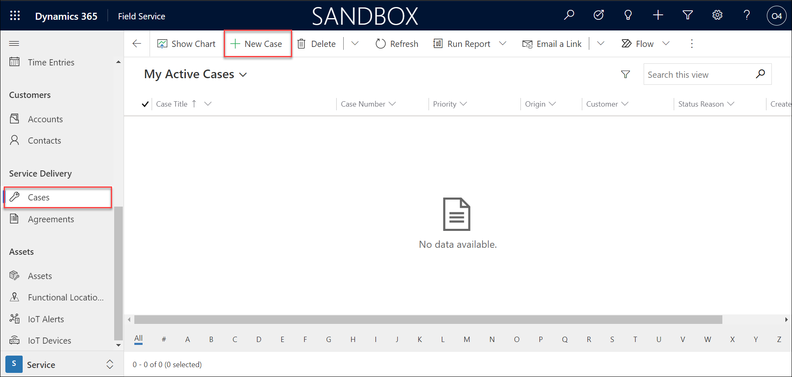

4. Complete the new case record as follows:

	- **Case Title:** Camera Down

	- **Customer:** Best For You Organics Company (Add new customer click on **+ New Record**, then click **Accounts** and enter the name and click **Save and close**)
	    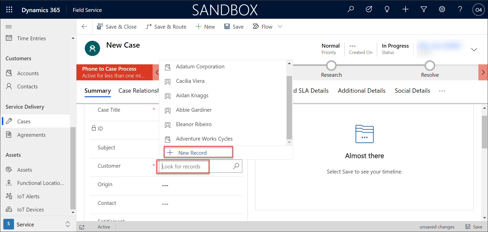
	    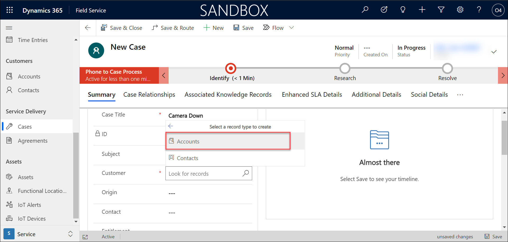

	- **Origin:** Phone

	Save the record.

    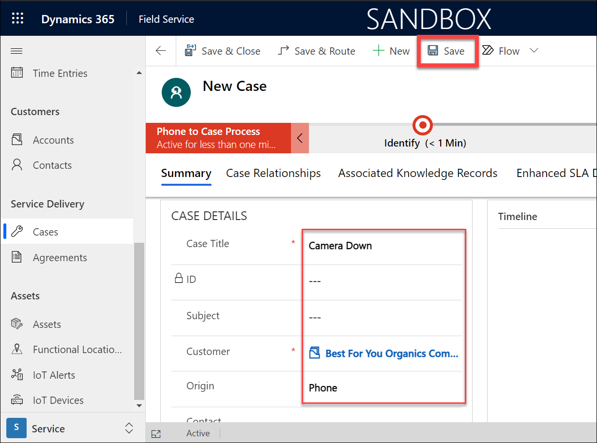

5. Select the **Field Service** tab. (Click on the ellinois button if you dont see it.)

    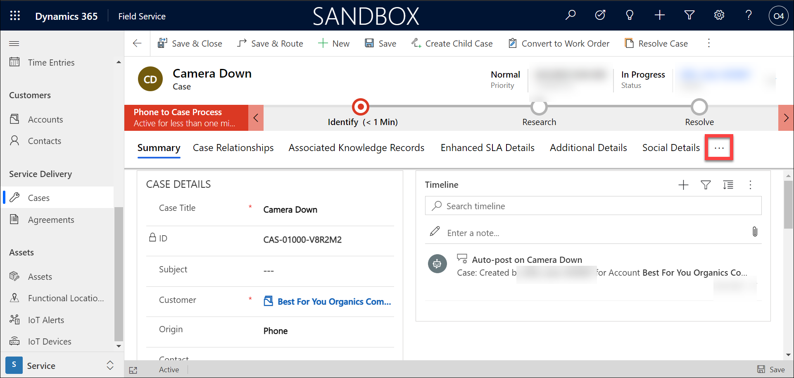
    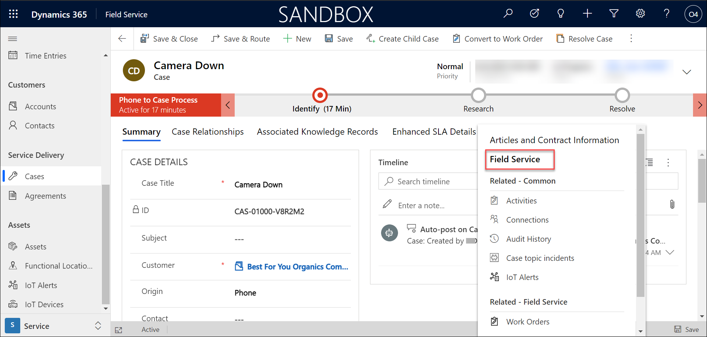

6. Set the **Incident Type** field to **Camera Down**. (create new by clicking on **+New incident type** and add this incident)

    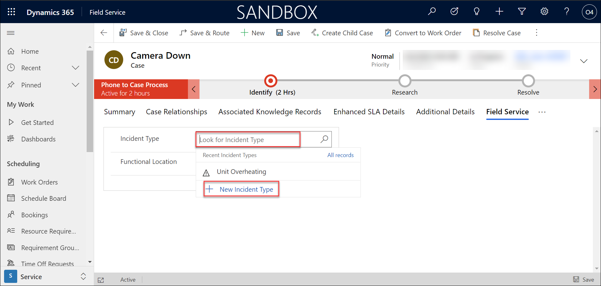
    
    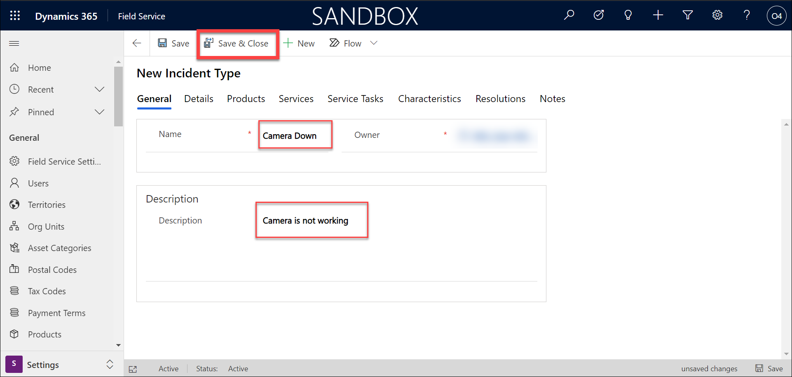

7. On the **Command bar**, select the **Save and Close** button to save and close the case record. 

    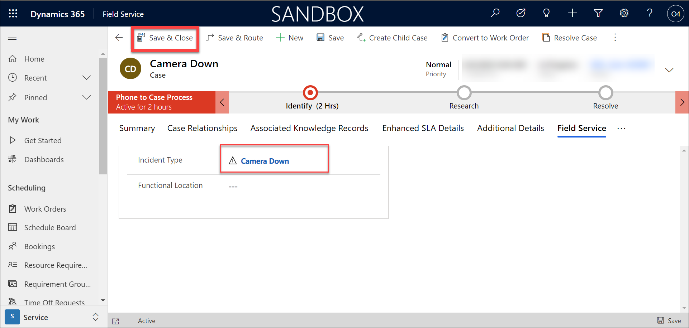

### Task 2: Manually create a Word Order

We will come back to your created case record later. Next, let’s examine how to manually create a work order record. 

1. Using the navigation on the left, select **Work Orders**.

2. On the **Command Bar**, select the **New** button to create a new Work Order.

3. Complete the Work Order details as follows:

	- **Service Account:** Margie's Travel (Create new by clicking on new account and add this account and then click save and close)
              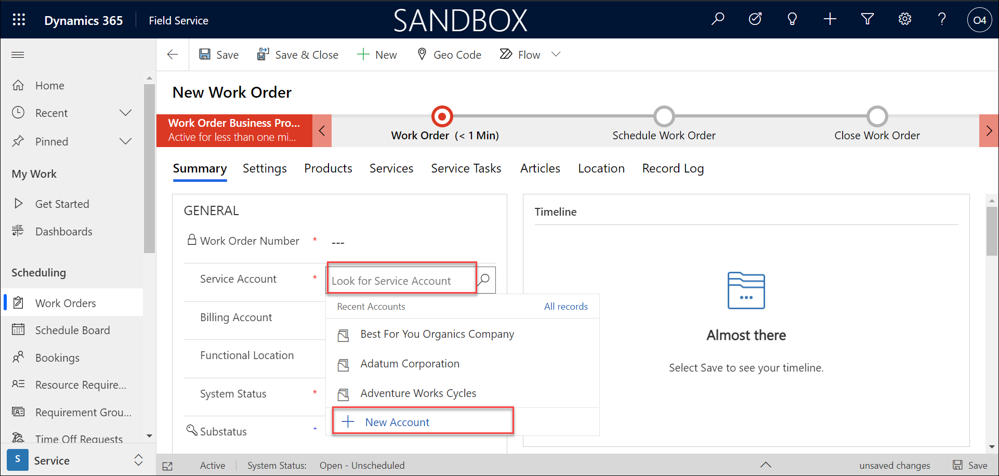
	      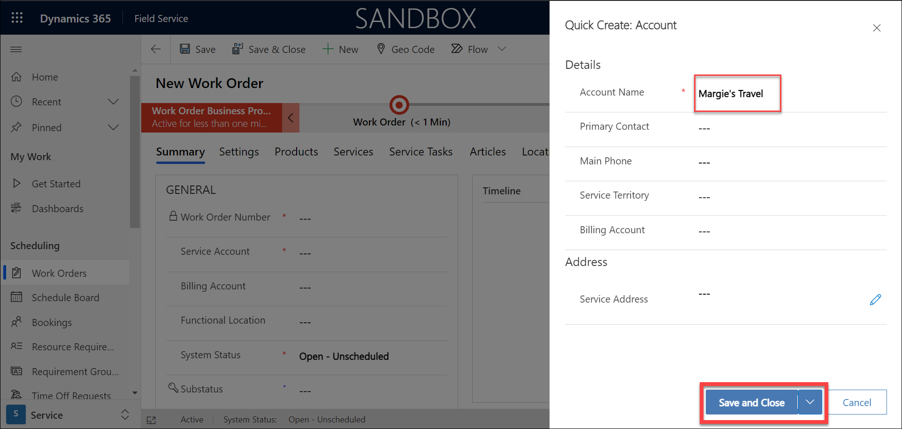

	- **Price List:** Office 365 US (sample)

	- **Work Order Type:** Service
	      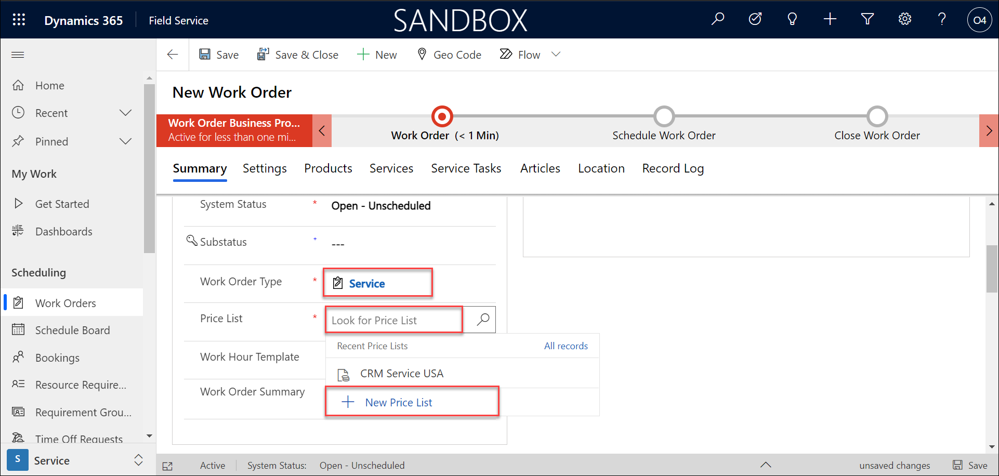
	      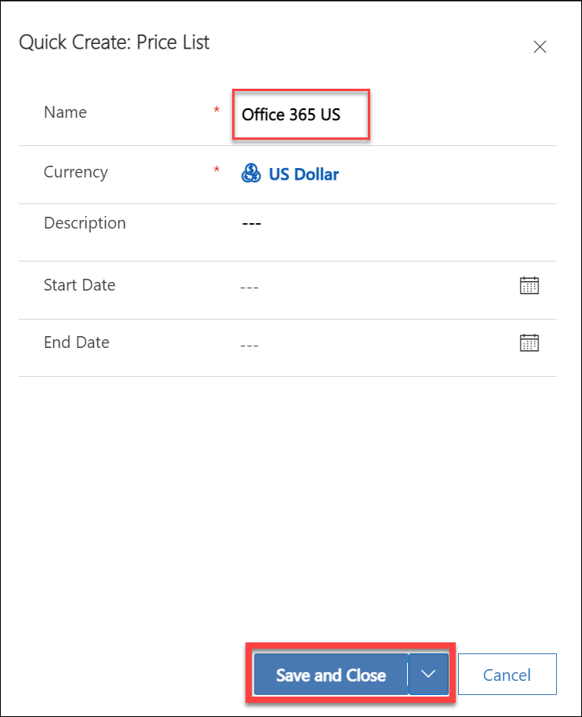

	Save the record and assign the Primary Incident Type
	      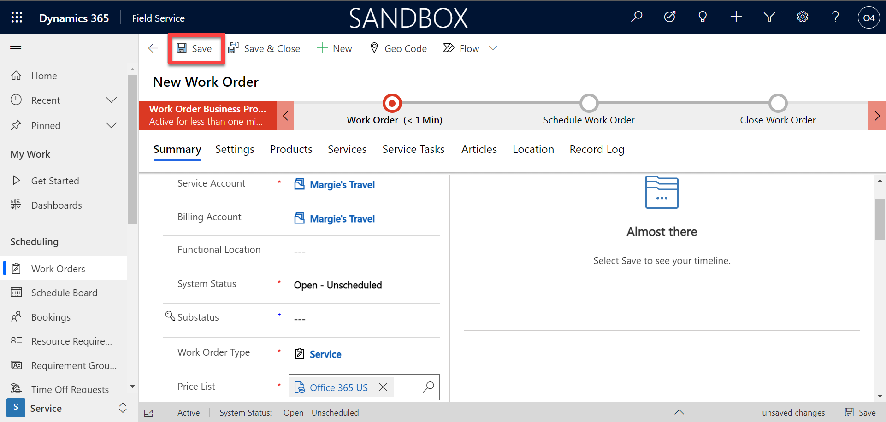

	- **Primary Incident Type:** Fan Out (create new by clicking on **+New incident type** and add this incident)
              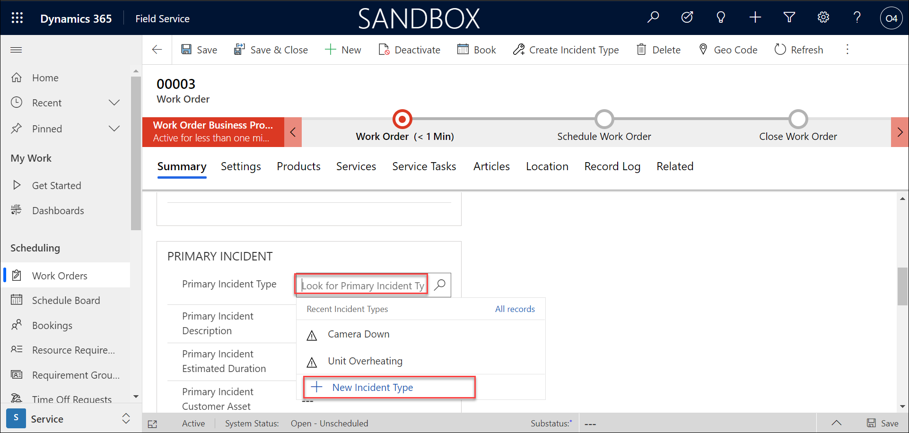
	      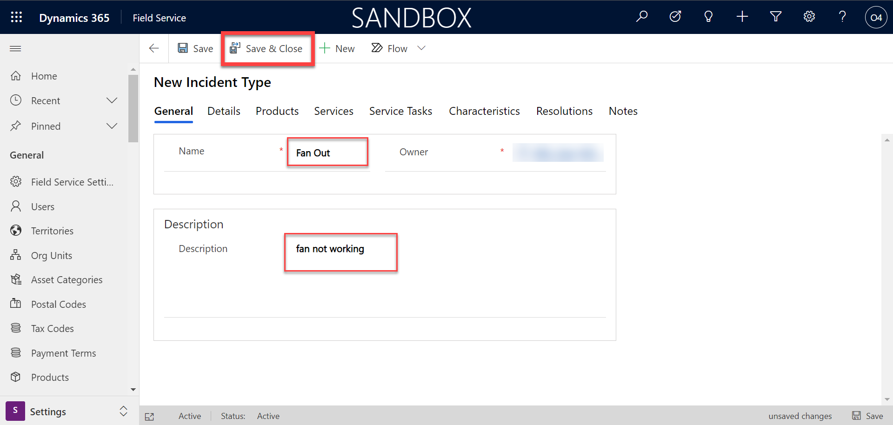
	      
4. Note the Work Order Number to ensure that you are working with the correct work order later.

    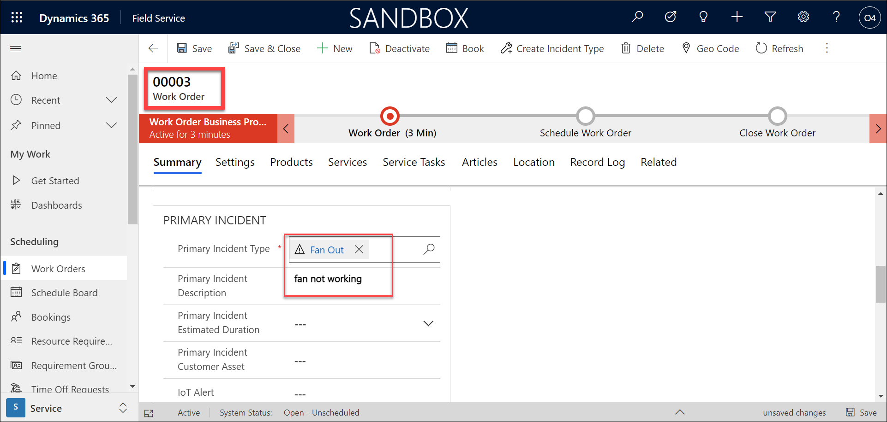

5. Select the **Settings** tab.

6. Set the **Service Territory** field to **WA**.

7. Under **Preferences**, configure the time preferences as follows:

	- **Time from Promised:** Today @ 9:00 AM

	- **Tom to Promised:** Today @ 11:00 AM

8. Select **Save and Close** to save you changes and exit the new work order.

    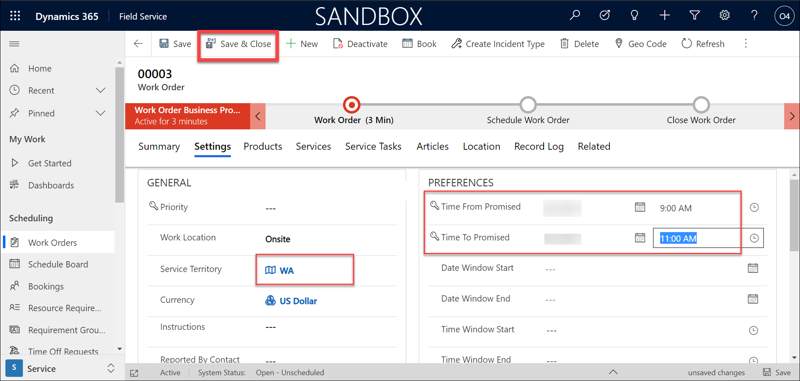

### Task 3: Generate a Work Order from a Case

Another way to generate work orders is by escalating case records. In this example, we will escalate the Camera Down case record we created earlier. 

1. Using the left navigation, select **Cases**. 

2. Open the **Camera Down** case you created earlier. 

3. On the **Command Bar**, select the **Convert to Work Order** button. 

4. After the work order creation has completed, select the **OK** button on the pop-up screen to view the Work Order details. 

Both of your newly created work orders are ready to be scheduled. 

## Exercise 2: Schedule Items with Dynamics 365 Field Service  

### Task 1: Schedule Directly from a Work Order

1. Using the left navigation, select **Schedule Board**.

    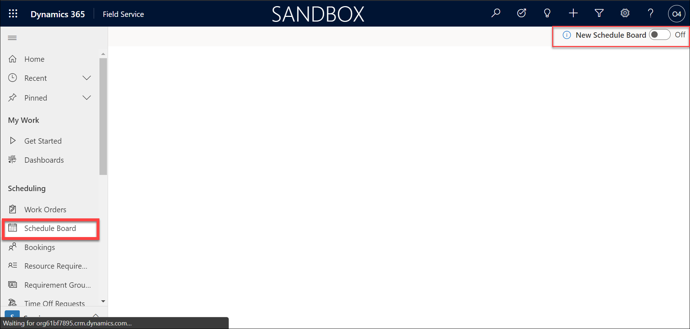

2. In the upper right-hand corner of the screen, set the **New Schedule Board** experience to **ON**. 

3. Using the **Search resources** lookup field, enter Aidan Knaggs. 

4. At the bottom of the screen in the requirements panel, select **Unscheduled Work Orders**.  (If the requirements panel is not displayed, select the arrow at the bottom of the screen to expand it.) 

5. Locate the **Adventures** Work Order you created from the case record. (Remember the work order number). 

    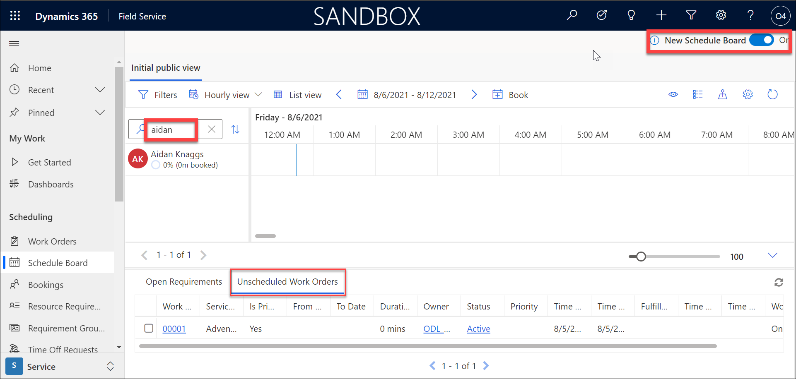

6. Drag the **Adventures** record and place it at an open slot between 9 AM and 11 AM for Aidan's contact record.

    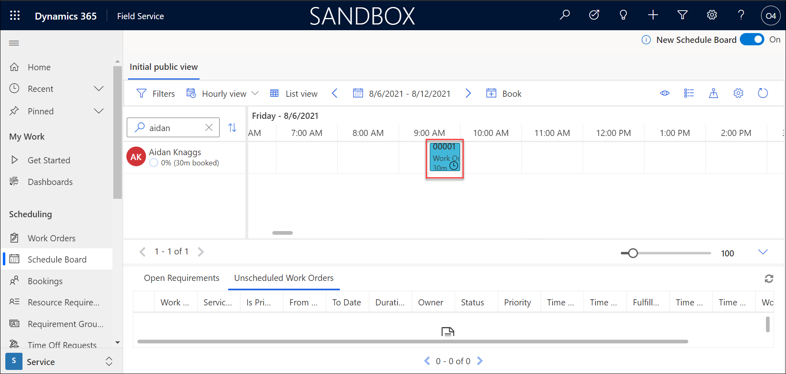

7. At times, you may need to reschedule a work order based on technician conflicts or other items. This can be easily done by dispatchers leveraging the schedule board.
