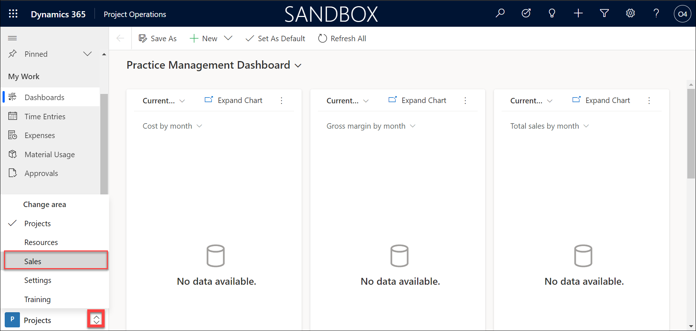
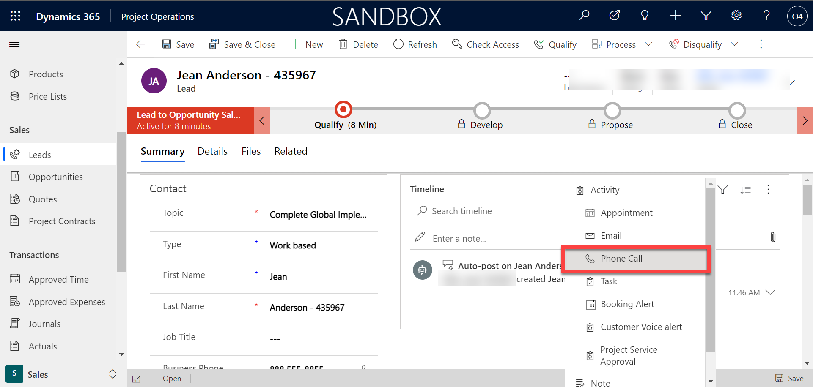

## Module 5: Learn the Fundamentals of Dynamics 365 Project Operations

## Practice Lab 5.1: Create a Project-based Lead

## Lab Scenario

ABC company specializes in the manufacturing, selling, installation and servicing of security equipment. Their products include both indoor and outdoor security cameras, moisture and fire sensors, monitoring services, and more. 

ABC company uses Dynamics 365 applications to engage with all their customers across different areas of their organization from sales to service. 

**Sales and Marketing**

ABC Company markets to their residential customers directly through targeted marketing campaigns. Customers are targeted based on their city, and other factors. Marketing materials are sent through email and based on their interaction with the email are guided accordingly. 

While some of their smaller products are sold through retailers, most products are sold direct to consumers by their internal sale staff.

Internally, they focus on two key areas: 

- **Residential Customers:** Residential customers are typically looking for either individual components, or to buy a whole home solution. These sales cycles are typically shorter and originate from social media, websites, referrals, or direct contact from the prospect. Since residential customers are typically more focused on specific products or smaller installs, their sales cycles typically last a few days or weeks. 

- **Enterprise Customers:** Enterprise sellers focus on customers who need a more specialized and tailored business solutions. Enterprise sales typically span multiple locations with linked communication, and often require multiple resources to complete the project. These sales cycles are typically longer and have many more moving parts. 

It is important that all of ABC company’s sellers have the tools, resources, and guidance necessary regardless of their focus area while selling to their customers. 

**System Installation:**

The installation process for purchased security equipment varies based on the type of customer that was sold. 

- **Residential Customers:** Since residential installs typically take less than a day, they are done by internal employees. After the sale is made, a work order is created, and a qualified technician is identified and scheduled to perform the install. 

- **Enterprise Customers:** Enterprise deploys can take months, and require a project manager to oversee the day-to-day operations. This includes creating project plans, defining project teams, and scheduling resources. 

**Service and Support:**

Once the systems are installed, ABC Company provides support after the sale. If a customer has an issue, they can contact customer support. An agent will attempt to work with the customer remotely to resolve their issue. If their issue cannot be resolved remotely, the support agent can escalate the issue to a work order that will be scheduled and worked on by a qualified field technician. 
## Objectives

ABC Company’s enterprise sellers focus their attention on customers who security needs require more specialized and tailored business solutions. For this reason, their enterprise sales typically span multiple locations with linked communication, and often require multiple resources to complete the project. ABC companies’ enterprise sales cycles can take many months and require multiple moving part to execute. 

Once an enterprise customer is sold a system, it can take months to implement the project. Each project is assigned to a project manager who oversee the project planning and day to day operations. This includes creating project plans, defining project teams, and scheduling resources. 

As an enterprise seller, you are responsible for selling high end customized security solutions to customers. You recently fielded a call from a company called Consolidated Sample. They would like to have a completely integrated security solution that spans all their locations. You are going to enter the lead for Consolidated Sample into the system, advance them through the project selling cycle and create a corresponding project. 

Upon completion of the lab, you will have completed the following:

- Enter a project lead into Dynamics 365 Sales

## Lab Setup

1. Once logged into https://admin.powerplatform.microsoft.com/ using the credentials given in lab environment details tab.

2. Create a new environment by clicking on **+ New**

    
    
3. On the Window that opens in the right, Enter first a unique name for the environment like **project-operations-deploymentID** and select **Sandbox** as type and Set **Yes** for create a database for this environment and then click **Next**.

    
    
4. Scroll down and select **Enable Dynamics 365 apps** to **Yes** and inautomatically deploy these apps , select **Project Operations**.

    

5. Just ensure the settings as in the image below and select **Save**.

    

6. A field will appear under environments with name customer and it will be in preparing state and once the environment is ready, select the environment and find and click the URL to open the Project operations application.

    
    
    
    
    
    
        
 
7. Let it be open to perform the remaining exercises.

## Instructions

## Exercise 1: Create A Project-based Lead

### Task 1: Create a new Lead

1. When prompted, log in with the user credentials provided to you by the instructor. 

2. Open **Project Service**.

3. Using the navigation on the left side of the screen, select the **Sales** Area. 

    

4. Using the navigation, select **Leads**. 

5. Next, we will create a new lead for a company called Consolidated Sample, from the **My Open Leads** view, Select the **New** button on the Command bar.

    

6. Complete your new lead record as follows:

	- **Topic:** Complete Global Implementation – Your Initials

	- **Type:** Work based

	- **First Name:** Jean

	- **Last Name:** Anderson - Your Initials

	- **Business Phone:** 888 555-8855

	- **Email:** jean@sample.com

	- **Company:** Consolidated Sample – Your Initials

	- **Street 1:** 219 91st Ave N

	- **City:** Seattle

	- **State/Province:** WA

	- **ZIP/Postal Code:** 98001

	- **Country/Region:** United States

    
7. Select the **Save** button on the Command Bar to save the new the Lead and leave it open.

    

8. Notice the **Lead to Opportunity** Business Process Flow at the top of the record. Select the **Qualify Stage** to select it. Complete the stage as follows:

	- **Purchase Timeframe:** This Quarter

	- **Estimated Budget:** 25000  

	- **Purchase Process:** Committee

	- **Identify Decision Maker:** Completed

9. Select the **X** on the stage window to close the window. 

    

10. Go to the **Record Timeline** in the middle of the screen and select the **Plus Sign Icon** to add a new activity. 

    

15. From the menu that appears, select **Phone Call**.

    

16. On Quick Create Phone Call Screen, complete the phone call as follows:

	- **Subject:** Initial Qualification Call – Your Initials  

	- **Phone Number:** 888 555-8855

	- **Direction:** Outgoing

	- **Description:** Initial conversation with Jean to determine initial qualification. 

17. Select the **Save and Close** button.

    

18. Notice the **Initial Qualification Call** activity is now displayed on the **Record Timeline**. Hover over the activity and select the close activity **Check Mark Icon** to mark the phone call as completed. 

    
    
    

19. On the **Close Phone Call** window, verify the state is set to **Completed**, and select the **Close** button.

    
 

### Task 2: Qualify the Lead and convert to Opportunity for further qualification

1. On the **Command Bar**, select the **Qualify** button. 

    

2. After the system qualifies the lead, a new Opportunity record will be created, and the business process will advance to the **Develop** stage. Select the **Qualify** stage to view the original lead record. 

    

3. Select the **Develop** stage to return to the opportunity.

4. Select the **Save &amp; Close** button to close the Opportunity record that was created. 

    

