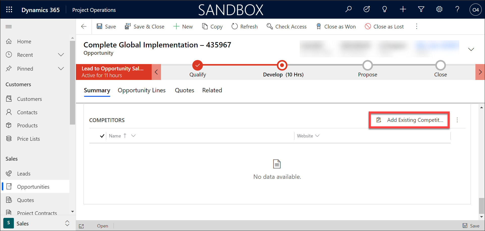

## Module 5: Learn the Fundamentals of Dynamics 365 Project Operations

## Practice Lab 5.2 - Manage a Project-based Opportunity

## Lab Scenario

ABC company specializes in the manufacturing, selling, installation and servicing of security equipment. Their products include both indoor and outdoor security cameras, moisture and fire sensors, monitoring services, and more. 

ABC company uses Dynamics 365 applications to engage with all their customers across different areas of their organization from sales to service. 

**Sales and Marketing**

ABC Company markets to their residential customers directly through targeted marketing campaigns. Customers are targeted based on their city, and other factors. Marketing materials are sent through email and based on their interaction with the email are guided accordingly. 

While some of their smaller products are sold through retailers, most products are sold direct to consumers by their internal sale staff.

Internally, they focus on two key areas: 

- **Residential Customers:** Residential customers are typically looking for either individual components, or to buy a whole home solution. These sales cycles are typically shorter and originate from social media, websites, referrals, or direct contact from the prospect. Since residential customers are typically more focused on specific products or smaller installs, their sales cycles typically last a few days or weeks. 

- **Enterprise Customers:** Enterprise sellers focus on customers who need a more specialized and tailored business solutions. Enterprise sales typically span multiple locations with linked communication, and often require multiple resources to complete the project. These sales cycles are typically longer and have many more moving parts. 

It is important that all of ABC company’s sellers have the tools, resources, and guidance necessary regardless of their focus area while selling to their customers.  

**System Installation:**

The installation process for purchased security equipment varies based on the type of customer that was sold. 

- **Residential Customers:** Since residential installs typically take less than a day, they are done by internal employees. After the sale is made, a work order is created, and a qualified technician is identified and scheduled to perform the install. 

- **Enterprise Customers:** Enterprise deploys can take months, and require a project manager to oversee the day-to-day operations. This includes creating project plans, defining project teams, and scheduling resources. 

**Service and Support:**

Once the systems are installed, ABC Company provides support after the sale. If a customer has an issue, they can contact customer support. An agent will attempt to work with the customer remotely to resolve their issue. If their issue cannot be resolved remotely, the support agent can escalate the issue to a work order that will be scheduled and worked on by a qualified field technician. 
## Objectives

ABC Company’s enterprise sellers focus their attention on customers who security needs require more specialized and tailored business solutions. For this reason, their enterprise sales typically span multiple locations with linked communication, and often require multiple resources to complete the project. ABC companies’ enterprise sales cycles can take many months and require multiple moving part to execute. 

Once an enterprise customer is sold a system, it can take months to implement the project. Each project is assigned to a project manager who oversee the project planning and day to day operations. This includes creating project plans, defining project teams, and scheduling resources. 

As an enterprise seller, you are responsible for selling high end customized security solutions to customers. You recently fielded a call from a company called Consolidated Sample. They would like to have a completely integrated security solution that spans all their locations. You are going to enter the lead for Consolidated Sample into the system, advance them through the project selling cycle and create a corresponding project. 

Upon completion of the lab, you will have completed the following:

- Qualify and convert a lead into a project opportunity.

## Lab Setup

  - **Estimated Time**: 20 minutes
  
## Exercise 1: Manage a Project-based Opportunity 

Now that you have successfully created a project opportunity based on a project0based lead, you will now use the opportunity to define high-level details related to the project. This will include defining products and work items, as well as defining sales related estimates. 

### Task 1: Manage a Sales Opportunity 

1. Using the navigation on the left side of the screen, select **Opportunities**. 

2. From the list of My Open project Service Opportunities, Open the **Complete Global Implementation– DeploymentID** opportunity that was created when you qualified the lead earlier. Notice the record is already in the **Develop** phase since it was created from a previously qualified Lead.

    
    
    

3. On the **Complete Global Implementation – DeploymentID** opportunity header at the top of the record, select the down arrow next to the owner field. 

    

4. Complete as follows:

	- **Est. Close Date:** Tomorrow

	- **Est Revenue:** 250,000.00

    

5. On the Lead to Opportunity business process flow, select the **Develop** Stage. Notice that you need to Identify Stakeholders and Competitors.

    

6. Select the **X** on the stage window to close it so you can continue working. 

7. In the **Stakeholders** sub-grid, notice **Jean** is already defined as a stakeholder. 

    

8. On the Competitors sub-grid, select **Add Existing Competitors**. (If you do not see the **Add Existing Competitors** button, select the **Vertical Ellipsis**, and from the menu that appears select **Add Existing Competitors**.) 
    
    

9. Search for and select **Coho Security.** (If Coho Security does not exist, select **New Record**, and then select **Competitors,**) 

    
    
    

10. In the Quick Create: **Competitor** screen, set the **Name** field to **Coho Security – DeploymentID**.

    

11. Select the **Save and Close** button.

12. Select Coho Security record you just created in a previous exercise (it should be automatically selected), select the **Add** button. 

    

13. Select the **Develop** stage on the **Lead to Opportunity** business process flow set both the **Identify Stakeholders** and **Identify Competitors** steps to **Completed**. 

    

14. Select the **Next Stage** button to advance to the **Propose** stage.

15. On the **Propose** stage, mark **Identify Sales Team** as **Completed**.

16. Select the **X** on the Propose stage to close the stage window. 

    

17. On the opportunity record, select the **Opportunity Lines** tab.

    

18. From the Project-based Lines sub-grid, select the Add New Opportunity Line button. Configure the new Opportunity Line item as follows:

	- **Product Type:** Project-based Service

	- **Opportunity:** Complete Global Implementation - DeploymentID

	- **Name:** System Development

	- **Customer Budget:** 25,000

	- **Billing Method:** Fixed Price

19. Select **Save &amp; Close**

    

20. From the **Project-based Lines** sub-grid, select the **Add New Opportunity Line** button again to add another line item.   
‎Configure the new Opportunity Line item as follows:

- **Product Type:** Project-based Service

	- **Opportunity:** Complete Global Implementation - DeploymentID

	- **Name:** System Implementation 

	- **Customer Budget:** 100000 

	- **Billing Method:** Time and Material

21. Select **Save &amp; Close**

    
