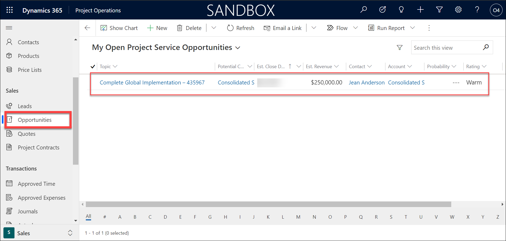
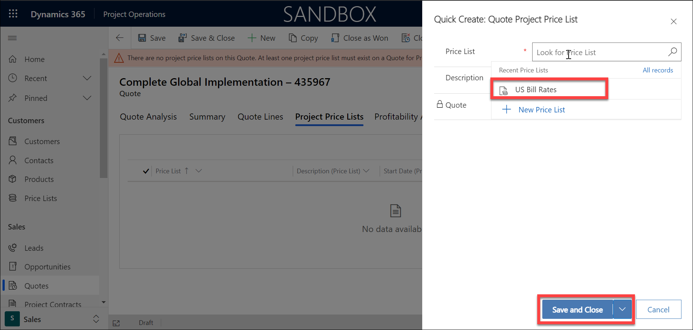
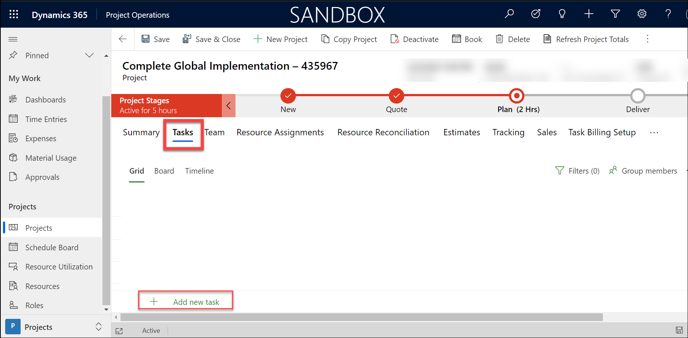

## Module 5: Learn the Fundamentals of Dynamics 365 Project Operations

## Practice Lab 5.3 - Dynamics 365 Project Operations capstone lab

## Lab Scenario

ABC company specializes in the manufacturing, selling, installation and servicing of security equipment. Their products include both indoor and outdoor security cameras, moisture and fire sensors, monitoring services, and more. 

ABC company uses Dynamics 365 applications to engage with all their customers across different areas of their organization from sales to service. 

**Sales and Marketing**

ABC Company markets to their residential customers directly through targeted marketing campaigns. Customers are targeted based on their city, and other factors. Marketing materials are sent through email and based on their interaction with the email are guided accordingly. 

While some of their smaller products are sold through retailers, most products are sold direct to consumers by their internal sale staff.

Internally, they focus on two key areas: 

- **Residential Customers:** Residential customers are typically looking for either individual components, or to buy a whole home solution. These sales cycles are typically shorter and originate from social media, websites, referrals, or direct contact from the prospect. Since residential customers are typically more focused on specific products or smaller installs, their sales cycles typically last a few days or weeks. 

- **Enterprise Customers:** Enterprise sellers focus on customers who need a more specialized and tailored business solutions. Enterprise sales typically span multiple locations with linked communication, and often require multiple resources to complete the project. These sales cycles are typically longer and have many more moving parts. 

It is important that all of ABC company’s sellers have the tools, resources, and guidance necessary regardless of their focus area while selling to their customers. 

**System Installation:**

The installation process for purchased security equipment varies based on the type of customer that was sold. 

- **Residential Customers:** Since residential installs typically take less than a day, they are done by internal employees. After the sale is made, a work order is created, and a qualified technician is identified and scheduled to perform the install. 

- **Enterprise Customers:** Enterprise deploys can take months, and require a project manager to oversee the day-to-day operations. This includes creating project plans, defining project teams, and scheduling resources. 

**Service and Support:**

Once the systems are installed, ABC Company provides support after the sale. If a customer has an issue, they can contact customer support. An agent will attempt to work with the customer remotely to resolve their issue. If their issue cannot be resolved remotely, the support agent can escalate the issue to a work order that will be scheduled and worked on by a qualified field technician. 
## Objectives

ABC Company’s enterprise sellers focus their attention on customers who security needs require more specialized and tailored business solutions. For this reason, their enterprise sales typically span multiple locations with linked communication, and often require multiple resources to complete the project. ABC companies’ enterprise sales cycles can take many months and require multiple moving part to execute. 

Once an enterprise customer is sold a system, it can take months to implement the project. Each project is assigned to a project manager who oversee the project planning and day to day operations. This includes creating project plans, defining project teams, and scheduling resources. 

As an enterprise seller, you are responsible for selling high end customized security solutions to customers. You recently fielded a call from a company called Consolidated Sample. They would like to have a completely integrated security solution that spans all their locations. You are going to enter the lead for Consolidated Sample into the system, advance them through the project selling cycle and create a corresponding project. 

Upon completion of the lab, you will have completed the following:

- Manage daily activities associated with a project opportunity. 

- Add create and define a project quote. 

- Generate a project contract. 

- Create a Project and define a Project Team. 

## Lab Setup

  - **Estimated Time**: 45 minutes

## Instructions

## Exercise 1: Create a Project Quote & Project Estimate

The Project Opportunity is used to capture high level details about a potential project. As more and more details about the project emerge, you can create a Project Quote. The project quote often includes details related to different roles, timelines, and pricing. The project quote is what is presented to the customer. The project quote is also where you can begin to create a project plan that is associated with the project you are selling. This save time after the project is sold, because much of the details related to the project are already captured.

In this exercise you will be creating a project and defining detailed related to the project quote. 

### Task 1: Create a Project Quote.  

1. With the Project Opportunity open, select the **Quotes** tab. 

  
  
2. On the Quotes sub-grid, select the **New Quote** button.

  

3. After the new quote record open, set the **Project Price List** field on the quote to **US Bill Rates**. For this we need to follow the below steps to create a new price list and add that to the project price list and then add the quote. 
  
  i)  Navigate to **Project Price Lists** and then click on **Add New Project Price Lists**
     
  
  ii) Click on **New Price List** and will ask to leave the page and select **OK**.
     
     
  
  iii)It will navigate to the New price list section and then Add a new Price list with name **US Bill Rates** and click **Save and Close** 
     
  
  iv) Now navigate back to Quotes and click on **Project Price Lists** tab and then  click on **Add New Project Price Lists**.
     
     
  v) Add the Price List **US Bill Rates** and Click on **Save and Close**.
     
 
4. Select the **Quote Lines** Tab. Select and open the **System Implementation** line item. (May need to double click to open it) 

 

5. In the **Project** field, select **New Project.** 

 

6. On the **Quick Create Project** screen, complete the project as follows:

	- **Name:** Complete Global Implementation – DeploymentID

	- **Project Manager:** Select you user record

	- **Calendar template:** Default Work Template

	- **Contracting Unit:** Fabrikam US (Create New and you will be asked to exit and come back to create the project again)
           
	   
	   

	- **Estimated Start Date:** One week from today

	- **Estimated Labor Cost:** $ 175,000

	- **Estimated Expense Cost:** $ 50,000

	- **Estimated Total Cost:** $ 225,000 (will not have the option to enter but will be generated automatically once saved) 
	
	>**Note**: The estimated cost will be automatically shown when you select save and close button.

7. Select **Save and Close** button.

    

8. Next, we will define the if we can charge for specific roles that are assigned to the project. Select the **Chargeable Roles** tab. But we need to add the roles for the project.

   i) Change the area and select **Resources**.
     
   ii)Select Roles from the left pane navigation and select **New**
     
   iii)Add role **Robotics Engineer** and change billing type to **Chargeable**. then click **Save and close**
     
   iv) Similarly add roles - **Network Technician** , **Software Engineer**

9. Select and open the **Robotics Engineer** role and set the billing type to Non-Chargeable.(in the image it is different role just change the robotics engineer to Non Chargeable)

11. On the **Command Bar**, select the **Save** button. 

    

11. Select the **Quote Line Details** tab.

    

12. On the sub-grid, select the **New Quote Line Detail** button.

13. Complete the **Quote line detail** item as follows:

	- **Description:** Communication Line Run – DeploymentID

	- **Transaction Class:** Time

	- **Role:** Network Technician

	- **Category:** Time

	- **Start Date:** One Month form today

	- **End Date:** Two months from today

	- **Resourcing Unit:** Fabrikam US

	- **Unit:** Hour

    

14. Select the **Save and Close** button to close the line detail item. 

    

15. On the **Command Bar**, select the **Save and Close** button. 

    

**Note:** Leave the Project Quote open so it can be used in the next task. 

### Task 2: Close the Project Quote and create a Project Contract.

In this task you will be closing the project quote that you created and converting it into a project contract. The Project Contract can be used and leveraged while the project is being executed. 

1. With the **Complete Global Implementation – DeploymentID** Project Quote record open, select the **Close as Won** button on the Command Bar. 

    

2. On the **Are you sure you want to close the quote** screen, select **OK**.

    
    
    

3. Once the quote is closed, the newly created **Complete Global Implementation – DeploymentID** Project Contract will be displayed. Navigate to Project Contracts to see it.

     

**Note:** Leave the Project Contact open so it can be used in the next task. 

## Exercise 2: Manage a Project

One of the advantages of leveraging the project selling capabilities of Project Operations, is the ability to create a project during the sales process. The created project will be accessible from different sales related records such as Project Quotes and Project Contracts. 

In this exercise, you will be managing some of the initial tasks related to a project such as defining project details, defining a project team, and outlining project tasks. 

### Task 1: Manage basic project data. 

1. With the **Complete Global Implementation - DeploymentID** Project Contract open, select the **Related** tab. 

2. From the menu that appears, select **Projects.**

    

3. Open the **Complete Global Implementation - DeploymentID** Project. 

    

4. On the **Project Service** Business Process Flow, select the **New** Stage, and select the **Next Stage** button to advance to the **Quote** stage. 

    

5. In the **Quote** stage, set the **Estimated Finish Date** field to **six months from today**. 

6. Select the **Next Stage** button to advance to the **Plan** stage. 

    

 
### Task 2: Create a Project Team.

Each project will have a team of members that will assist in the execution of the project. In this task we will be defining the resources that will make up the project team members. 

## SubTask 1: Add Contacts and Resources
1. Change area to **Sales** and navigate to **Contacts** from left-pane navigation

    
    
    
    
2. Add new contact , enter **Allison Dickson - DeploymentID**. enter first name as allison and last name as Dickson - DeploymentID and account name set as consolidated sample - deployment ID.

    

3. Similarly enter the following contacts - Bob Kozak - DeploymentID , Dianna Woodward - DeploymentID and after creating them will see the contact list as below.

    
    
4. Add these contacts as resources, change area to Resources and click on resources from left pan navigation and click on **+ New**.

    
    
5. **New Bookable Resource** tab will open and need to enter the following to add a resource.

	- **Resource Type:** Contact

	- **Contact:** Allison Dickson - DeploymentID

	- **Name:** will generate automatically 

	-  **Time Zone:** Leave default

    

6. Similarly add the following resources for Bob Kozak - DeploymentID , Dianna Woodward - DeploymentID and after creating them will see the resource list as below.

    

## SubTask 2: Add resources
 
1. With the **Complete Global Security Implementation – DeploymentID** project record open, select the **Team** tab

    

2. On the **All Team Members** sub-grid, select the **+ New** button.

    

3. Configure the team member record as follows:

	- **Position Name:** Robotics Engineer – DeploymentID

	- **Bookable Resource:** Allison Dickson – DeploymentID

	- **Role:** Robotics Engineer

4. Select the arrow next to the Save and Close button. From the menu that appears, select **Save and Create New.**

    

5. Configure the next team member record as follows:

	- **Position Name:** Software Engineer – DeploymentID

	- **Bookable Resource:** Bob Kozak – DeploymentID

	- **Role:** Software Engineer

6. Select the arrow next to the Save and Close button. From the menu that appears, select **Save and Create New.**

    

7. Configure the team member record as follows:

	- **Position Name:** Network Technician – DeploymentID

	- **Bookable Resource:** Dianna Woodward – DeploymentID

	- **Role:** Network Technician

8. Select the **Save &amp; Close** button.

### Task 3: Define a Project Schedule.

Another important part of defining a project is to define the project tasks and schedule for the project. In this task we are adding some project tasks and associating them will different roles. 

1. With the **Complete Global Implementation – DeploymentID** project open, select the **tasks** tab. 

2. On the toolbar in the Tasks sub-grid, select the **+ Add new task** button. 

    

3. In the row that appears, set the **Name** field to **System Development**.

4. On the toolbar in the tasks sub-grid, select the **+ Add new task** button again to add another item. 

5. Configure the Item as follows:

	- **Name:** Create System Layout

	- **Duration:** 25

6. On the toolbar in the tasks sub-grid, select the **+ Add new task** button again to add another item. 

7. Configure the Item as follows:

	- **Name:** Design Cameras

	- **Depends on** Create System Layout (click on add column and then add the parameter **Depends on** to enter this field)
	    
	    click on the tab corresponding to this task and select Create System Layout
	    
	    

	- **Effort:** 50

8. On the toolbar in the schedule sub-grid, select the **+ Add button** again to a finial task. 

9. Configure the Item as follows:

	- **Name:** Verify and Approve design

	- **Depends on** Design Cameras

	- Effort: 8 

 
**Note:** Stay on the schedule tab as we will be making some additional modifications in the next task. 

### Task 4: Associate resources with a project.

As part of defining a project schedule, you can specify the types of resources that will be used to fill the staffing requirements. These can be actual named resources, or generic resources that will be replaced by named resources in the future. In this task you will be defining both named and generic resources for the project tasks you created. 

1. If necessary, open the **Complete Global Implementation – DeploymentID** project, and select the **Tasks** tab. 

2. Locate the **Create System Layout** task you added earlier and select in the **Assigned to** field. 

3. Select the Project Team Member as follows

	- **Bookable Resource:** Allison Dickson

	- **Role:** Robotics Engineer

    

4. Locate the **Design Cameras** task and select the **Assigned to** field. 

5. Configure the Project team Member as follows:

	- **Bookable Resource:** Allison Dickson

	- **Role:** Robotics Engineer

6. Select the **Save and Close** button.

    

7. You can see the assignments or schedules under resource assignments.

    

Congratulations, you have successfully sold and created a project in Dynamics 365 Project Operations. For here Project Managers, can manage different aspects of the project such as scheduling resources, monitoring the project schedule, and managing time and expenses. 

 

 
